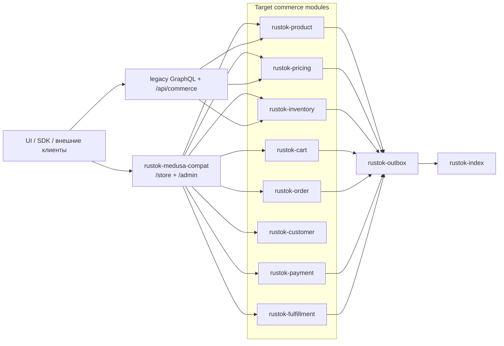

# План миграции `rustok-commerce` на Medusa-подобную архитектуру

## Статус документа

Этот документ является **переносом готового исследовательского плана** в документацию
репозитория с дополнительной сверкой по текущему коду RusToK и официальной документации
Medusa v2.

Принцип документа:

- не придумывать новую целевую стратегию поверх исследования;
- не разрешать архитектурные противоречия прямо в тексте плана;
- фиксировать противоречия как **backlog согласования и внедрения**;
- держать целевую модель такой же, как в исследовании: распил `commerce` на Medusa-подобные модули.
- считать **Medusa эталоном функциональности ecommerce-направления**: маршруты, semantics, lifecycle и
  transport behavior сверяются сначала с официальными docs Medusa, а потом адаптируются под RusToK.

Сверка Medusa docs выполнена **25 марта 2026 года** по официальным страницам `docs.medusajs.com`.

## Цель миграции

Цель миграции:

- трансформировать текущий `rustok-commerce` из одного крупного доменного модуля
  в набор отдельных модулей уровня `Product / Pricing / Inventory / Cart / Order / Customer /
  Payment / Fulfillment / Region / ...`;
- сохранить текущие RusToK-контракты на переходный период;
- добавить Medusa-подобный REST-слой под `/store/*` и `/admin/*`;
- использовать Medusa как **source of truth** для ecommerce REST-функционала, а собственные RusToK
  расширения вводить только там, где они нужны для tenancy, RBAC, runtime wiring или dual-transport модели;
- сохранить и развивать GraphQL surface RusToK параллельно REST-слою: GraphQL не заменяет Medusa parity,
  а работает как второй transport над теми же application services и доменными модулями;
- сохранить модульный монолит RusToK, CQRS read-path через `rustok-index`,
  transactional outbox и tenant isolation.

## Что уже подтверждено в коде RusToK

Ниже не предположения, а факты, уже подтвержденные в репозитории:

- в `rustok-commerce` уже есть `CatalogService`, `PricingService`, `InventoryService`;
- есть REST-контроллеры внутри `crates/rustok-commerce/src/controllers/*`;
- есть GraphQL surface внутри `crates/rustok-commerce/src/graphql/*`;
- базовый write-side сегодня покрывает каталог, цены и простые остатки;
- order lifecycle частично представлен type-safe state machine, но не завершен как полноценный order module;
- read-path каталога уже завязан на `rustok-index`;
- тестовая поддержка commerce поднимает SQLite-таблицы из entities, а не проверяет production-путь миграций Postgres;
- inventory baseline переведен на `stock_locations`, `inventory_items`, `inventory_levels`
  и `reservation_items`; read/write-path больше не опирается на `product_variants.inventory_quantity`.

## Целевая модель из исследования

Целевой модульный состав переносится из исследования без изменения направления:

| Целевой модуль | Зона ответственности | Текущее состояние в RusToK | Целевая роль |
|---|---|---|---|
| `rustok-product` | каталог, варианты, опции, изображения, публикация | реализовано внутри `rustok-commerce` | отдельный модуль |
| `rustok-pricing` | цены, price sets, rules, price calculation | реализовано частично внутри `rustok-commerce` | отдельный модуль |
| `rustok-inventory` | остатки, availability, reservations, stock levels | реализовано частично внутри `rustok-commerce` | отдельный модуль |
| `rustok-cart` | корзина и line items | почти отсутствует | новый модуль |
| `rustok-order` | заказ, line items, lifecycle, returns | есть state machine без полного storage/API | новый модуль |
| `rustok-customer` | storefront customer domain | отсутствует как отдельный домен | новый модуль |
| `rustok-payment` | payment collections, payment providers | отсутствует | новый модуль |
| `rustok-fulfillment` | shipping options, fulfillment, tracking | отсутствует | новый модуль |
| `rustok-region` / related | регионы, валюты, locale policy | частично размазано по платформе и i18n | отдельный модуль или отдельный слой |
| `rustok-medusa-compat` | Medusa-compatible `/store/*` и `/admin/*` | отсутствует | integration layer |

Целевая композиция:

## Противоречия и backlog согласования

Этот раздел фиксирует именно **противоречия**, которые нельзя замазывать формулировками.
Они должны быть закрыты отдельными задачами до или во время ранних фаз миграции.

| ID | Противоречие | Что конфликтует | Что нужно сделать |
|---|---|---|---|
| `BL-01` | Root-module topology для ecommerce family vs исходный монолитный `commerce` | исследовательский split vs старая platform topology | закрыто: принят ADR, обновлены `modules.toml`, runtime wiring и docs; дальнейший шаг — provider/capability selection поверх новой topology |
| `BL-02` | Entities vs migrations vs indexer SQL | runtime entities и production schema не полностью синхронны | провести schema hardening и добавить Postgres migration tests |
| `BL-03` | `inventory_quantity` vs inventory levels / reservations | текущая runtime-модель vs целевая Medusa-like inventory-модель | закрыто: runtime переведен на `stock_locations`, `inventory_items`, `inventory_levels`, `reservation_items`, а read/write-path, catalog responses, indexer и search больше не зависят от `inventory_quantity` |
| `BL-04` | Order state machine есть, order module как продуктового контура нет | lifecycle описан, но persistence/API не завершены | in progress: выделен `rustok-order` с storage, line items, lifecycle service и outbox events; следующий шаг — transport/API и checkout integration |
| `BL-05` | `/store/*` и `/admin/*` могут конфликтовать со встроенными UI маршрутами | target API prefix vs текущий embedded routing | определить route precedence и покрыть smoke-тестами |
| `BL-06` | Medusa-compat нужен, но scope совместимости пока не закреплен как контракт | “хотим быть совместимы” vs отсутствие точной contract boundary | зафиксировать список обязательных endpoints/semantics и гонять их против официальных docs/OpenAPI |
| `BL-07` | Customer domain в Medusa отделен от admin user, в RusToK это не разведено как commerce-модуль | Medusa customer context vs platform users/sessions | закрыто: выделен `rustok-customer` с отдельной схемой `customers`, storefront-customer boundary, optional linkage на `user_id` и migration-backed smoke tests |
| `BL-08` | Checkout flow требует идемпотентности и многошаговой транзакционной целостности | cart -> payment -> order цепочка vs текущий незавершенный runtime | зафиксировать orchestration и retry/compensation policy |

## Официальные ссылки Medusa v2 для сверки

Для реализации и проверки совместимости нужно использовать **только официальные страницы Medusa**.

- [Store API Reference](https://docs.medusajs.com/api/store)
- [Admin API Reference](https://docs.medusajs.com/api/admin)
- [Store JS SDK Methods](https://docs.medusajs.com/resources/commerce-modules/store/js-sdk)
- [Publishable API Keys in Storefront](https://docs.medusajs.com/resources/storefront-development/publishable-api-keys)
- [Storefront Localization / Translation](https://docs.medusajs.com/resources/commerce-modules/translation/storefront)
- [Medusa Core Workflows Reference](https://docs.medusajs.com/resources/medusa-workflows-reference)
- [Product Module Overview](https://docs.medusajs.com/resources/commerce-modules/product)
- [API Routes Fundamentals](https://docs.medusajs.com/learn/fundamentals/api-routes)

Что именно подтверждено по этим страницам:

- Store API действительно живет под префиксом `/store`;
- Admin API действительно живет под префиксом `/admin`;
- Store API использует `x-publishable-api-key`;
- Store API поддерживает `fields`, `limit`, `offset`, `count`, `order`;
- Store API поддерживает `locale` и `x-medusa-locale`;
- Admin API описывает metadata merge semantics и auth-модели;
- Store/Admin routes в Medusa опираются на workflows.

Правило сверки:

- Medusa является эталоном именно для ecommerce REST contract и transport behavior;
- RusToK дополнительно сохраняет GraphQL, но GraphQL должен опираться на те же application services,
  workflows и доменные модули, что и REST;
- нельзя считать GraphQL-ветку основанием для отклонения от Medusa REST semantics.

## API-совместимость: baseline для сверки

Ниже переносится baseline из исследования. Это не “все возможные endpoints Medusa”, а минимальный
пул маршрутов, с которого должна начинаться проверяемая совместимость.

| Medusa endpoint | Метод | Целевой маршрут в RusToK | Назначение |
|---|---:|---|---|
| `/store/products` | `GET` | `/store/products` | storefront list products |
| `/store/products/{id}` | `GET` | `/store/products/{id}` | storefront product details |
| `/admin/products` | `GET` | `/admin/products` | admin list products |
| `/admin/products` | `POST` | `/admin/products` | admin create product |
| `/admin/products/{id}` | `POST` | `/admin/products/{id}` | admin update product |
| `/admin/products/{id}` | `DELETE` | `/admin/products/{id}` | admin delete/archive product |
| `/admin/products/{id}/publish` | `POST` | `/admin/products/{id}/publish` | admin publish product |
| `/store/carts` | `POST` | `/store/carts` | create cart |
| `/store/carts/{id}` | `GET` | `/store/carts/{id}` | retrieve cart |
| `/store/carts/{id}/line-items` | `POST` | `/store/carts/{id}/line-items` | add line item |
| `/store/carts/{id}/line-items/{line_id}` | `POST` | `/store/carts/{id}/line-items/{line_id}` | update line item quantity |
| `/store/carts/{id}/line-items/{line_id}` | `DELETE` | `/store/carts/{id}/line-items/{line_id}` | remove line item |
| `/store/orders` | `POST` | `/store/orders` | place order |
| `/store/orders/{id}` | `GET` | `/store/orders/{id}` | retrieve order |
| `/admin/orders` | `GET` | `/admin/orders` | admin list orders |
| `/store/customers/me` | `GET` | `/store/customers/me` | retrieve authenticated customer |
| `/store/payment-collections` | `POST` | `/store/payment-collections` | payment collection flow |
| `/store/shipping-options` | `GET` | `/store/shipping-options` | shipping options |
| `/store/regions` | `GET` | `/store/regions` | region discovery |

Обязательные semantics для сверки:

- `limit`, `offset`, `count`
- `fields`
- `metadata`
- `locale` и `x-medusa-locale`
- storefront cart line items создаются из `variant_id + quantity`, а title/price резолвятся backend-ом
- predictable error mapping
- publishable API key behavior для `/store/*`
- GraphQL использует те же доменные сервисы и не вводит отдельную ecommerce semantics

## Фазовый план

### Pre-phase

Статус: `done`

Что уже сделано и подтверждено:

- собран audit текущего `rustok-commerce`;
- подтверждены текущие сервисы, маршруты, GraphQL surface, события и основные таблицы;
- подтвержден факт schema drift риска;
- подтвержден разрыв между целевой Medusa-like моделью и текущей topology платформы.

### Phase 0. Разрешение противоречий

Статус: `done`

Цель:

- не выбирать обходной путь в тексте плана;
- явно снять архитектурные противоречия из backlog `BL-01 ... BL-08`.

Задачи:

- оформить ADR по module split;
- зафиксировать, как именно новые модули входят в platform topology;
- закрепить route policy для `/store/*` и `/admin/*`;
- утвердить scope Medusa-compat;
- зафиксировать schema hardening plan;
- описать customer boundary и checkout orchestration.

Что уже сделано:

- принят ADR по split `commerce -> product / pricing / inventory`;
- принята модель `commerce` как root umbrella module семейства `ecommerce`;
- обновлены `modules.toml`, server manifest wiring и реестр модулей;
- зафиксировано, что `rustok-commerce-foundation` остается internal support crate, а не platform module.

Критерий завершения:

- backlog противоречий разобран и превращен в утвержденные решения;
- можно начинать реальный split без двусмысленностей в docs и runtime.

### Phase 1. Распил `rustok-commerce` на модули

Статус: `done (wave 1)`

Цель:

- выполнить целевой split, описанный в исследовании.

Задачи:

- выделить `rustok-product`;
- выделить `rustok-pricing`;
- выделить `rustok-inventory`;
- выделить `rustok-cart`, `rustok-order`, `rustok-customer`,
  `rustok-payment`;
- подготовить каркасы `rustok-fulfillment`;
- оставить `rustok-commerce` как root umbrella module, orchestration/compatibility facade и верхний вход в ecommerce family;
- обновить registry/runtime wiring в соответствии с решением Phase 0.

Что уже сделано:

- выделены `rustok-cart`, `rustok-customer`, `rustok-product`, `rustok-pricing`, `rustok-inventory`, `rustok-order`, `rustok-payment`;
- общий shared слой вынесен в `rustok-commerce-foundation`;
- `rustok-commerce` оставлен как umbrella/root module с compatibility surface;
- обновлены manifests, server wiring, migration aggregation, migration-backed smoke tests и базовые module tests.

Критерий завершения:

- базовая бизнес-логика каталога, pricing и inventory больше не живет как один плотный crate;
- split отражен в коде и документации.

### Phase 2. Schema hardening и доведение доменной модели

Статус: `in progress`

Цель:

- выровнять модель данных под целевую архитектуру.

Задачи:

- синхронизировать entities, migrations и indexer SQL;
- завершить inventory normalization;
- вынести pricing в отдельную storage-модель;
- ввести links/snapshots для order line items;
- утвердить единый money contract;
- подготовить backfill и switch plan.

Что уже сделано:

- добавлены migration-driven smoke tests для ecommerce schema baseline;
- убраны дубли child-migrations из `commerce` umbrella;
- выровнен catalog runtime с migrated schema для product-level multilingual;
- добавлен decimal runtime compatibility layer для `prices` поверх migrated schema.
- inventory runtime переведен на нормализованные `stock_locations / inventory_items / inventory_levels / reservation_items`;
- create/read/delete-path переведены на normalized inventory model без compatibility shadow;
- добавлены inventory regression/smoke tests, подтверждающие reservation flow и migrated-schema baseline.

Критерий завершения:

- production schema поднимается и проверяется через миграции;
- текущие read-model остаются корректными;
- доменная схема готова к cart/order/payment flows.

### Phase 3. Checkout и доменные модули заказа

Статус: `in progress`

Цель:

- закрыть недостающий Medusa-like commerce core поверх новых модулей.

Задачи:

- реализовать `rustok-cart`;
- реализовать `rustok-order`;
- реализовать `rustok-customer`;
- реализовать `rustok-payment`;
- реализовать `rustok-fulfillment`;
- закрыть region/currency/locale policy;
- определить retry/idempotency/compensation policy.

Что уже сделано:

- выделен `rustok-cart` со схемой `carts / cart_line_items` и lifecycle `active -> completed/abandoned`;
- выделен `rustok-order` со схемой `orders / order_line_items`, lifecycle и outbox events;
- выделен `rustok-customer` со схемой `customers` и storefront-customer boundary;
- выделен `rustok-payment` со схемой `payment_collections / payments` и базовым lifecycle `pending -> authorized -> captured/cancelled`;
- выделен `rustok-fulfillment` со схемой `shipping_options / fulfillments` и базовым shipment lifecycle `pending -> shipped -> delivered/cancelled`;
- в `rustok-commerce` добавлен `CheckoutService`, который собирает orchestration flow `cart -> payment -> order -> fulfillment` и включает базовую compensation policy на pre-capture стадиях;
- внешний provider layer для payment/fulfillment сознательно не вводится на текущем этапе; модули работают в built-in manual/default режиме по аналогии с ранним Medusa-style baseline;
- migration smoke подтверждает cart/order/customer/payment/fulfillment baseline на реальном server migrator.

Критерий завершения:

- есть рабочий путь `cart -> payment -> order -> fulfillment`;
- order persistence и API полноценны;
- storefront flow больше не зависит от старой “каталог-only” модели.

### Phase 4. Medusa-compatible transport layer

Статус: `in progress`

Цель:

- поднять `/store/*` и `/admin/*` как проверяемый слой совместимости.

Задачи:

- реализовать `rustok-medusa-compat`;
- покрыть baseline endpoints;
- поддержать `fields`, `metadata`, `pagination`, `locale`, error mapping;
- повесить слой за feature flag;
- привязать contract tests к официальным docs/OpenAPI.

Что уже сделано:

- поднят первый Medusa-style transport slice прямо в `rustok-commerce` под `/store/*` и `/admin/*`
  параллельно legacy `/api/commerce/*`;
- реализованы storefront routes `products`, `regions`, `shipping-options`, `carts`,
  `payment-collections`, `orders/{id}`, `customers/me`;
- добавлен явный cart-context update route `POST /store/carts/{id}` с persisted snapshot semantics;
- реализованы admin routes для `products`;
- добавлена поддержка `x-medusa-locale`;
- storefront cart line items переведены на Medusa-like shape `variant_id + quantity`, а title/price
  теперь резолвятся backend-ом из catalog/pricing;
- cart теперь хранит persisted storefront context (`region_id`, `country_code`, `locale_code`,
  `selected_shipping_option_id`, `customer_id`, `email`, `currency_code`);
- `shipping-options`, `payment-collections` и `checkout` переведены на cart-first context resolution,
  а legacy checkout overrides сначала persist'ятся обратно в cart ради compatibility path;
- добавлены contract tests на наличие route-tree и OpenAPI wiring.

Следующий обязательный checkpoint:

- усилить cart-centered semantics после persistence: закрыть shipping/billing address strategy,
  idempotency/race protection и parity tests для update-path / checkout flow;
- именно с этого пункта должна начинаться следующая сессия по ecommerce migration.

Критерий завершения:

- новый REST-слой работает параллельно legacy surface;
- ключевые store/admin flows проходят contract tests.

### Детализация следующей волны внутри Phase 4

Текущий checkpoint по cart context требует отдельной декомпозиции, чтобы следующая
сессия не начиналась с повторного переоткрытия уже согласованных вопросов.

Наблюдаемое состояние кода на момент продолжения плана:

- `StoreContextService` умеет резолвить `region / locale / currency` на request-time;
- `POST /store/carts` уже принимает `region_id`, `country_code`, `locale`, но в самой корзине
  persist'ятся только `customer_id`, `email` и `currency_code`;
- `GET /store/shipping-options`, `POST /store/carts`, `POST /store/carts/{id}/complete`
  по-прежнему зависят от request-time context resolution;
- cart пока не является полноценным носителем storefront session state в Medusa-like смысле.

Из этого следует правило следующей волны:

- cart должен стать **persisted aggregate для store context**;
- request headers и query params должны использоваться только для initial resolution или
  явного обновления cart context;
- checkout, payment collection и shipping selection должны читать context из корзины, а не
  повторно пересобирать его при каждом запросе.

#### Phase 4A. Persisted cart context

Статус: `next`

Цель:

- довести `rustok-cart` от "денежной корзины с line items" до cart session aggregate.

Что добавить в модель корзины:

- `region_id` как link на `rustok-region` без превращения `cart` в владельца region domain;
- `locale_code` как snapshot выбранной storefront locale;
- `country_code` как optional snapshot для последующего повторного region resolution и аудита;
- `selected_shipping_option_id` как optional link для checkout/shipping flow;
- задел под `shipping_address` и `billing_address`, но без обязательного ввода адресного домена
  в той же волне.

Что важно сохранить:

- `customer_id`, `email` и `currency_code` уже являются частью cart context и не должны
  дублироваться в новом side-table без необходимости;
- `currency_code` должен оставаться согласованным с выбранным регионом;
- `locale` не переезжает в `rustok-region`: platform ownership tenant locales остается прежним.

Конкретные задачи:

- расширить schema `carts` и DTO/cart responses новыми полями context snapshot;
- добавить cart-level validation: `region_id <-> currency_code`, `locale_code` against enabled tenant locales;
- определить migration/backfill policy для уже созданных cart records с `NULL`-контекстом;
- не вводить hard dependency-cycle `rustok-cart -> rustok-commerce`; orchestration и validation,
  зависящие от нескольких модулей, остаются на уровне umbrella/facade.

Критерий завершения:

- cart хранит достаточно данных, чтобы checkout не зависел от request-time locale/region resolution;
- старые carts остаются читаемыми и проходят migration path без ручного SQL.

#### Phase 4B. Cart-centered transport semantics

Статус: `next`

Цель:

- перевести storefront transport с request-centric модели на cart-centric lifecycle.

Что должно измениться в API behavior:

- `POST /store/carts` создает cart сразу с persisted context snapshot;
- нужен явный update-path для cart context, вместо передачи `region_id/country_code/locale`
  только в checkout endpoint;
- `GET /store/carts/{id}` должен возвращать не только line items и totals, но и persisted
  storefront context, либо через расширенный `CartResponse`, либо через единый store-cart envelope;
- `POST /store/payment-collections` и `GET /store/shipping-options` должны опираться на cart context,
  а не требовать повторной передачи тех же параметров;
- `POST /store/carts/{id}/complete` должен использовать cart как source of truth, а request body
  должен постепенно сузиться до checkout-specific choices и explicit overrides, если они вообще нужны.

Отдельный подзадачный блок:

- определить, нужен ли Medusa-like `POST /store/carts/{id}` как основной cart update route;
- зафиксировать response shape для store cart APIs, чтобы create/get/update/read-path не расходились;
- ввести предсказуемую precedence policy: persisted cart context > explicit cart update > request headers/query.

Критерий завершения:

- storefront cart становится долгоживущим session object, а не временным контейнером line items;
- context drift между `create cart`, `shipping options`, `payment collection` и `complete checkout`
  устранен на уровне transport contract.

#### Phase 4C. Checkout hardening после переноса context в cart

Статус: `next`

Цель:

- после persistence cart context сделать checkout менее хрупким и ближе к production-grade flow.

Конкретные задачи:

- перевести `CheckoutService` на чтение `region/locale/customer/email/shipping option` из cart snapshot;
- ввести idempotency policy минимум для `POST /store/payment-collections` и
  `POST /store/carts/{id}/complete`;
- определить, где живет статус "checkout in progress" и как блокируются повторные racey-complete вызовы;
- зафиксировать, какие failure stages компенсируются автоматически, а какие переходят в manual remediation;
- проверить order/payment/fulfillment metadata snapshot, чтобы итоговый order сохранял storefront context,
  использованный в checkout.

Отдельно не делать в этой волне:

- полноценный внешний provider/plugin layer для payment и fulfillment;
- глубокий address-management domain;
- deprecation legacy GraphQL/REST surface.

Критерий завершения:

- повторный вызов checkout не создает дублирующие order/payment записи без явной причины;
- order snapshot воспроизводимо объясняет, из какого cart/store context был оформлен заказ.

#### Phase 4D. Contract tests и rollout guardrails

Статус: `next`

Цель:

- превратить cart-context redesign в проверяемый contract, а не в скрытую внутрирепозиторную доработку.

Обязательные тесты следующей волны:

- migration tests для новых cart context columns и backfill path;
- integration tests: `create cart -> update context -> add line item -> shipping options -> payment collection -> complete`;
- negative tests на mismatch `currency_code` vs `region_id`;
- auth/customer ownership tests для cart update и checkout;
- contract tests на response shape store cart endpoints;
- regression tests, подтверждающие, что legacy `/api/commerce/*` и GraphQL не ломаются от нового cart snapshot.

Release guardrails:

- нельзя считать checkpoint закрытым, пока `complete checkout` еще принимает критичный store context
  только через request-time параметры;
- нельзя убирать fallback на request-time resolution, пока migration/backfill не покрыт тестами;
- нельзя расширять Medusa-compat scope дальше cart/order flow, пока не стабилизирован cart context contract.

### Рекомендуемый порядок выполнения после текущего checkpoint

1. Сначала расширить schema и DTO корзины, не меняя внешнее поведение checkout.
2. Затем добавить явный update-path для persisted cart context и унифицировать response shape.
3. После этого перевести shipping/payment/checkout на чтение context из cart.
4. Только затем включать idempotency, race protection и rollout telemetry для нового flow.
5. Уже после стабилизации cart context расширять Medusa-compat на следующие store/admin endpoints и
   готовить controlled deprecation legacy surface.

### Phase 5. Rollout и deprecation legacy surface

Статус: `not started`

Цель:

- ввести новый контракт без слома текущих клиентов.

Задачи:

- включить telemetry по новому и старому API;
- раскатывать через feature flag / canary;
- сохранить `/api/commerce/*` и GraphQL на переходный период;
- отдельно контролировать parity между REST и GraphQL, так как у Medusa эталонным является REST,
  а у RusToK transport-модель шире (`REST + GraphQL`);
- добавить deprecation headers и migration guide;
- убрать legacy только после подтвержденного снижения использования.

Критерий завершения:

- новая API-поверхность стабильна;
- legacy surface убирается управляемо, а не “одним коммитом”.

## Тесты и release gates

Обязательный тестовый минимум из исследования:

- unit tests для product/pricing/inventory/cart/order;
- integration tests для event publication и `rustok-index`;
- Postgres migration tests;
- contract tests для `/store/*` и `/admin/*`;
- parity tests для `REST <-> GraphQL` поверх общих application services;
- smoke tests маршрутизации;
- tenant/RBAC regression tests.

Release gates:

- нельзя считать migration phase завершенной без Postgres-проверки;
- нельзя считать Medusa-compat завершенным без сверки по официальным docs;
- нельзя выключать legacy routes без telemetry usage evidence.

## Риски

Ключевые риски переносятся из исследования без изменения:

1. `migrations != entities != indexer SQL`
2. коллизии `/admin/*` и `/store/*` с embedded UI
3. неполная Medusa-совместимость без официальной contract-сверки
4. прямые межмодульные вызовы вместо links/events
5. частичные состояния в checkout flow

## Что нужно обновлять вместе с реализацией

- `crates/rustok-commerce/README.md`
- `crates/rustok-commerce/docs/README.md`
- `docs/architecture/api.md`
- `docs/architecture/database.md`
- `docs/architecture/modules.md`
- `docs/modules/overview.md`
- `docs/modules/registry.md`
- `docs/index.md`
- ADR по module split и routing/model changes

## Критерий готовности к старту реализации

Реализацию можно начинать, когда выполнены три условия:

1. Противоречия из backlog согласования перенесены в утвержденные решения.
2. Зафиксирован baseline Medusa-compat и список обязательных routes/semantics для сверки.
3. Есть согласованный plan по schema hardening и Postgres-first validation.
