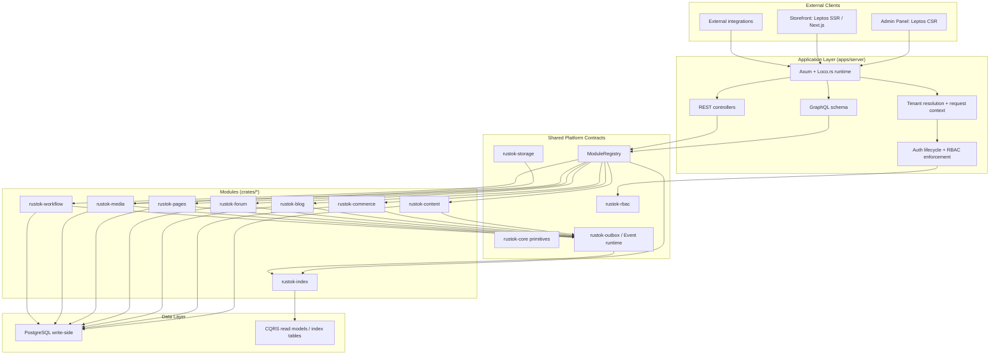

# Architecture & System Logic

RusToK is an event-driven modular monolith built around `apps/server`, shared core/library crates, and optional domain modules. The platform keeps write-side correctness in normalized tables, derives read models asynchronously, and composes product capabilities through module registration rather than per-app forks.

> Foundational vision: RusToK follows the [Matryoshka Principle](./matryoshka.md). This document focuses on the currently implemented platform/runtime architecture.

---

## High-Level Architecture

---

## Core Runtime Logic

### 1. Tenant isolation and request context

Every request is resolved into a tenant-aware request context. Current locale/tenant behavior is centralized in the request pipeline, not scattered across handlers.

Current contract:

- tenant resolution uses shared infrastructure (`TenantCacheInfrastructure`) instead of process-global caches;
- cache keys are versioned and support positive and negative caching;
- Redis pub/sub invalidation keeps multi-instance tenant cache consistent;
- locale resolution follows:
  `query -> admin locale cookie -> Accept-Language -> tenant.default_locale -> en`.

### 2. CQRS-lite: write side vs read side

RusToK keeps domain writes in normalized tables and derives denormalized read models asynchronously:

- write-side: validated transactional updates in domain modules;
- event publication: transactional outbox via `rustok-outbox`;
- read-side: `rustok-index` updates `index_content` / `index_products`.

This keeps admin/domain logic safe while allowing fast storefront and search queries.

### 3. Event-driven decoupling

Modules are integrated through events, not direct cross-module calls.

Examples:

- content changes emit domain events consumed by `rustok-index`;
- workflow listens to platform events and launches executions;
- build/runtime infrastructure consumes events for release/build progress.

The canonical transport contract is the event runtime (`memory | outbox | iggy`), with outbox as the authoritative write-side path.

### 4. Module registration and runtime composition

`ModuleRegistry` is the platform composition point:

- core modules are always present;
- optional modules are compiled through Cargo features and toggled per tenant through `tenant_modules`;
- GraphQL schema composition is feature-gated at compile time and protected by runtime module-enable checks;
- migrations remain module-owned.

---

## API Architecture

RusToK uses a hybrid API model:

- GraphQL at `/api/graphql` for UI clients and most platform/domain operations;
- REST at `/api/*` and `/api/v1/*` for integrations, operational endpoints, and selected resource flows;
- OpenAPI documents at `/api/openapi.json` and `/api/openapi.yaml`;
- health at `/health`, `/health/live`, `/health/ready`, `/health/modules`;
- Prometheus metrics at `/metrics`.

### Transport structure

Request flow is intentionally layered:

1. controllers/resolvers handle parsing, auth/session extraction, RBAC and tenant context;
2. services execute application logic;
3. domain crates own domain behavior and persistence coordination;
4. outbox/event runtime propagates downstream effects.

### Auth and RBAC

- auth flows are centralized in `AuthLifecycleService`;
- RBAC source-of-truth remains relation tables;
- live authorization runtime is Casbin-only through `rustok-rbac`;
- `apps/server` holds adapter/wiring responsibilities, not a second RBAC engine.

---

## Project Structure Overview

| Component | Path | Responsibility |
|-----------|------|----------------|
| Server | `apps/server` | Main runtime entry point, API composition, bootstrapping, operational endpoints |
| Admin | `apps/admin` | Primary Leptos admin UI |
| Storefront | `apps/storefront` / `apps/next-frontend` | Public web frontend |
| Core contracts | `crates/rustok-core` | Shared primitives: module contracts, permissions, security context, cache contracts, event re-exports |
| RBAC runtime | `crates/rustok-rbac` | Resolver contracts, permission policy, Casbin-backed authorization runtime |
| Event runtime | `crates/rustok-outbox`, `crates/rustok-events`, `crates/rustok-iggy*` | Transactional event publishing and transport |
| Storage contracts | `crates/rustok-storage` | Shared storage backend/service contract |
| Media module | `crates/rustok-media` | Media domain logic on top of storage |
| Domain modules | `crates/rustok-content`, `crates/rustok-commerce`, `crates/rustok-blog`, `crates/rustok-forum`, `crates/rustok-pages`, `crates/rustok-workflow` | Product/domain capabilities |
| Read-model module | `crates/rustok-index` | CQRS indexers and read-model upkeep |

---

## Example Flow

1. A user updates content from the admin UI through GraphQL.
2. `apps/server` resolves tenant, locale, auth context, and permissions.
3. The domain service updates normalized write-side tables in PostgreSQL.
4. The service publishes domain events via transactional outbox.
5. `rustok-index` consumes those events and refreshes read models.
6. Storefront/API readers observe the update through fast index-backed queries.

---

## Architecture Governance

Definition of done for architecture-sensitive changes:

1. Domain behavior lives in domain/library crates unless there is an explicit architectural exception.
2. Public API/runtime contracts are documented when they change.
3. `apps/server` remains a composition/integration layer, not a place for accumulating domain logic.
4. Module, runtime, and docs registries are updated together when boundaries change.

Critical domains requiring explicit architectural approval for exceptions:

- `content`
- `commerce`
- `blog`
- `forum`
- `pages`
- `index`
- `rbac`
- `tenant`

> Document status: current-state overview. Update this file together with [docs/index.md](../index.md) when platform architecture materially changes.
