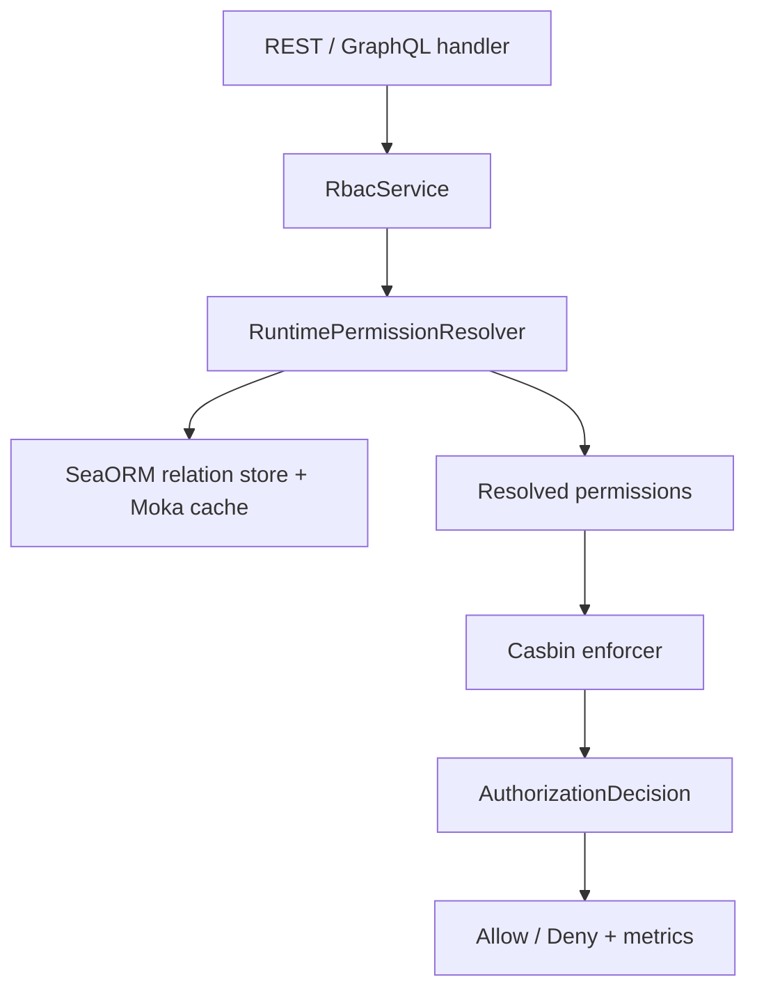

# RBAC Enforcement In RusToK

> Граница ответственности: этот документ описывает текущее RBAC runtime-решение и модульные границы.
> История migration/cutover relation -> Casbin вынесена в `docs/architecture/rbac-relation-migration-plan.md`.

## 1. Current Model

RusToK использует single-engine RBAC runtime:

- relation-таблицы `roles`, `permissions`, `user_roles`, `role_permissions` остаются source of truth для permission data;
- live authorization runtime выполняется только через библиотеку Casbin;
- модуль `crates/rustok-rbac` владеет policy/evaluator/contracts;
- `apps/server` владеет только adapter/wiring-слоем и публичным фасадом `RbacService`.

Это означает, что у платформы больше нет отдельного relation-runtime path, shadow-runtime path или parity-gate логики в live code path.

## 2. Module Boundaries

### `rustok-core`

`rustok-core` содержит типизированные RBAC primitives:

- `Permission`
- `Resource`
- `Action`
- `UserRole`
- `SecurityContext`

Именно здесь живёт canonical permission vocabulary, который используют server, extractors и модуль `rustok-rbac`.

### `crates/rustok-rbac`

`rustok-rbac` содержит:

- policy helpers (`check_permission`, `check_any_permission`, `check_all_permissions`, `has_effective_permission_in_set`);
- evaluator API и authorization API (`authorize_permission`, `authorize_any_permission`, `authorize_all_permissions`);
- Casbin model/runtime helpers (`default_casbin_model`, `build_enforcer_for_permissions`);
- resolver contracts (`PermissionResolver`, `RuntimePermissionResolver`);
- integration event contracts для role-assignment flows.

### `apps/server`

`apps/server` содержит только integration layer:

- SeaORM-backed `RelationPermissionStore`;
- Moka-backed `PermissionCache`;
- `RbacService` как публичный server-side фасад;
- transport-specific wiring для REST/GraphQL extractors;
- observability и metrics.

Server не должен дублировать policy evaluation, Casbin model construction или отдельную authorization semantics.

## 3. Permission Model

Permission задаётся как пара `resource + action` и сериализуется в canonical строку:

```text
<resource>:<action>
```

Примеры:

- `products:create`
- `products:manage`
- `orders:list`
- `blog_posts:publish`
- `workflow_executions:list`

Ключевые правила:

- `manage` работает как wildcard для набора действий ресурса;
- wildcard-семантика централизована в `rustok-rbac`, а не в отдельных handlers;
- tenant isolation обеспечивается relation store и tenant-filtered queries, а не префиксами в имени permission;
- новые permissions добавляются в типизированные enum/const contracts в `rustok-core`.

## 4. Runtime Decision Path

### Authorization contract

Текущий runtime contract:

- live runtime фиксирован на `casbin_only`;
- rollout-mode env switch больше не является частью публичного operational surface;
- любые новые интеграции должны считать Casbin единственным supported engine.

### Request Flow



Практически это означает:

1. server-resolver загружает effective permissions пользователя для tenant;
2. runtime строит Casbin-backed evaluator на основе разрешённых permissions;
3. решение возвращается как `AuthorizationDecision`;
4. server публикует cache/decision/latency metrics и логирует deny-причины.

## 5. Server Integration

Основная server-side точка входа: `apps/server/src/services/rbac_service.rs`.

Канонические use-cases:

- `RbacService::has_permission`
- `RbacService::has_any_permission`
- `RbacService::has_all_permissions`
- `RbacService::get_user_permissions`
- `RbacService::assign_role_permissions`
- `RbacService::replace_user_role`

Transport layers должны использовать именно этот фасад или общие `rustok-rbac` policy helpers, а не локальные проверки ролей.

REST RBAC extractors дополнительно используют общую wildcard-семантику через `rustok_rbac::has_effective_permission_in_set`, чтобы не дублировать permission logic в контроллерах.

## 6. Observability

Текущие canonical runtime signals:

- `rustok_rbac_permission_cache_hits`
- `rustok_rbac_permission_cache_misses`
- `rustok_rbac_permission_checks_allowed`
- `rustok_rbac_permission_checks_denied`
- `rustok_rbac_claim_role_mismatch_total`
- `rustok_rbac_engine_decisions_casbin_total`
- `rustok_rbac_engine_eval_duration_ms_total`
- `rustok_rbac_engine_eval_duration_samples`

Consistency metrics по relation data остаются допустимыми operational signals, потому что relation graph продолжает быть source of truth для permission assignments.

Parity-specific telemetry старой migration-схемы больше не является частью live runtime contract.

## 7. Removed From The Live Contract

Следующие вещи считаются историческими и не должны возвращаться в live docs/code path без нового ADR:

- отдельный `relation_only` runtime;
- `casbin_shadow` как отдельная decision branch;
- parity/mismatch rollout gates как часть production authorization path;
- staging/cutover helper scripts для relation-vs-casbin перехода;
- ссылки на `crates/rustok-core/src/rbac.rs` как на текущее место реализации enforcement-логики.

## 8. See Also

- `docs/architecture/rbac-relation-migration-plan.md`
- `crates/rustok-rbac/docs/README.md`
- `apps/server/docs/README.md`
- `crates/rustok-core/src/permissions.rs`
- `crates/rustok-rbac/src/lib.rs`
