# РїС—Р…РїС—Р…РїС—Р…РїС—Р…РїС—Р… РїС—Р…РїС—Р…РїС—Р…РїС—Р…РїС—Р…РїС—Р…РїС—Р…РїС—Р…РїС—Р…РїС—Р…РїС—Р…РїС—Р…

РїС—Р…РїС—Р…РїС—Р…РїС—Р… РїС—Р…РїС—Р…РїС—Р…РїС—Р… РїС—Р… РїС—Р…РїС—Р…РїС—Р…РїС—Р…РїС—Р…РїС—Р…РїС—Р…РїС—Р…РїС—Р…РїС—Р…РїС—Р…РїС—Р… РїС—Р…РїС—Р…РїС—Р…РїС—Р…РїС—Р… РїС—Р…РїС—Р…РїС—Р…РїС—Р…РїС—Р…РїС—Р…РїС—Р…РїС—Р…РїС—Р…РїС—Р…РїС—Р…РїС—Р… RusToK.

РїС—Р…РїС—Р… РїС—Р…РїС—Р…РїС—Р…РїС—Р…РїС—Р…РїС—Р…РїС—Р…РїС—Р…РїС—Р…РїС—Р… РїС—Р…РїС—Р…РїС—Р… РїС—Р…РїС—Р…РїС—Р…РїС—Р…РїС—Р…РїС—Р…РїС—Р…РїС—Р…РїС—Р…РїС—Р…РїС—Р…РїС—Р…РїС—Р…РїС—Р…РїС—Р…РїС—Р… РїС—Р…РїС—Р…РїС—Р…РїС—Р…РїС—Р…РїС—Р…РїС—Р…РїС—Р…РїС—Р…РїС—Р…РїС—Р…РїС—Р… (`docs/`), РїС—Р…РїС—Р…РїС—Р… РїС—Р… РїС—Р…РїС—Р…РїС—Р…РїС—Р…РїС—Р…РїС—Р…РїС—Р…РїС—Р…РїС—Р…РїС—Р…РїС—Р…РїС—Р…РїС—Р… РїС—Р…РїС—Р…РїС—Р…РїС—Р…РїС—Р…РїС—Р…РїС—Р…РїС—Р…РїС—Р…РїС—Р…РїС—Р…РїС—Р… РїС—Р…РїС—Р…РїС—Р…РїС—Р…РїС—Р…РїС—Р… РїС—Р…РїС—Р…РїС—Р…РїС—Р…РїС—Р…РїС—Р…РїС—Р…РїС—Р…РїС—Р…РїС—Р…, РїС—Р…РїС—Р…РїС—Р…РїС—Р…РїС—Р…РїС—Р…РїС—Р… РїС—Р… РїС—Р…РїС—Р…РїС—Р…РїС—Р…РїС—Р… РїС—Р…РїС—Р…РїС—Р…РїС—Р…РїС—Р…РїС—Р…РїС—Р…РїС—Р…РїС—Р….

## РїС—Р…РїС—Р…РїС—Р…РїС—Р…РїС—Р… РїС—Р…РїС—Р…РїС—Р…РїС—Р…РїС—Р… РїС—Р…РїС—Р…РїС—Р…РїС—Р…РїС—Р…РїС—Р…РїС—Р… РїС—Р…РїС—Р…РїС—Р…РїС—Р…РїС—Р…РїС—Р…РїС—Р…РїС—Р…РїС—Р…РїС—Р…РїС—Р…РїС—Р…

РїС—Р…РїС—Р…, РїС—Р…РїС—Р…РїС—Р… РїС—Р…РїС—Р…РїС—Р…РїС—Р…РїС—Р… РїС—Р…РїС—Р…РїС—Р…РїС—Р…РїС—Р…РїС—Р… РїС—Р…РїС—Р…РїС—Р…РїС—Р…-РїС—Р…РїС—Р…РїС—Р…РїС—Р…РїС—Р…. РїС—Р…РїС—Р…РїС—Р…РїС—Р…РїС—Р…РїС—Р…РїС—Р…РїС—Р…РїС—Р…РїС—Р…РїС—Р…РїС—Р… РїС—Р…РїС—Р…РїС—Р…РїС—Р…РїС—Р…РїС—Р…РїС—Р… РїС—Р…РїС—Р…РїС—Р…РїС—Р…РїС—Р…РїС—Р…РїС—Р…РїС—Р…РїС—Р…РїС—Р…РїС—Р…РїС—Р… РїС—Р…РїС—Р… РїС—Р…РїС—Р…РїС—Р…РїС—Р…РїС—Р…РїС—Р…РїС—Р…РїС—Р…РїС—Р…РїС—Р…РїС—Р… (`docs/`, `apps/*`, `crates/*`), РїС—Р… РїС—Р…РїС—Р…РїС—Р… РїС—Р…РїС—Р…РїС—Р…РїС—Р…РїС—Р… РїС—Р…РїС—Р…РїС—Р…РїС—Р…РїС—Р… РїС—Р…РїС—Р…РїС—Р…РїС—Р…РїС—Р… РїС—Р…РїС—Р…РїС—Р…РїС—Р…РїС—Р…РїС—Р…РїС—Р…РїС—Р…РїС—Р… РїС—Р…РїС—Р…РїС—Р…РїС—Р…РїС—Р… РїС—Р…РїС—Р… РїС—Р…РїС—Р…РїС—Р…РїС—Р…РїС—Р…РїС—Р…РїС—Р… РїС—Р…РїС—Р…РїС—Р…РїС—Р…РїС—Р…РїС—Р… РїС—Р…РїС—Р…РїС—Р…РїС—Р…РїС—Р…РїС—Р…РїС—Р…РїС—Р….

РїС—Р…РїС—Р…РїС—Р…РїС—Р… `docs/index.md` РїС—Р…РїС—Р…РїС—Р…РїС—Р…РїС—Р…РїС—Р… РїС—Р…РїС—Р…РїС—Р…РїС—Р… РїС—Р…РїС—Р…РїС—Р…РїС—Р…РїС—Р… РїС—Р…РїС—Р…РїС—Р…РїС—Р…РїС—Р… РїС—Р… РїС—Р…РїС—Р…РїС—Р…РїС—Р…РїС—Р…РїС—Р… РїС—Р…РїС—Р…РїС—Р…РїС—Р…РїС—Р…РїС—Р…РїС—Р…РїС—Р…РїС—Р…РїС—Р…РїС—Р… РїС—Р…РїС—Р…РїС—Р… РїС—Р…РїС—Р…РїС—Р…РїС—Р…РїС—Р…РїС—Р…РїС—Р…РїС—Р…РїС—Р…РїС—Р… РїС—Р…РїС—Р…РїС—Р…РїС—Р…РїС—Р…РїС—Р…РїС—Р…РїС—Р…РїС—Р…РїС—Р…РїС—Р…, API, UI-РїС—Р…РїС—Р…РїС—Р…РїС—Р…РїС—Р…РїС—Р…РїС—Р…РїС—Р…РїС—Р…РїС—Р… РїС—Р… РїС—Р…РїС—Р…РїС—Р…РїС—Р…РїС—Р…РїС—Р…РїС—Р….

## РїС—Р…РїС—Р…РїС—Р…РїС—Р…РїС—Р…РїС—Р…РїС—Р…РїС—Р…РїС—Р…РїС—Р…РїС—Р… РїС—Р…РїС—Р…РїС—Р…РїС—Р…РїС—Р… РїС—Р…РїС—Р…РїС—Р…РїС—Р…РїС—Р…РїС—Р…РїС—Р…РїС—Р…РїС—Р…РїС—Р…РїС—Р…РїС—Р…

```mermaid
graph TD
    ROOT[docs/index.md]

    ROOT --> D[docs/*]
    ROOT --> A[РїС—Р…РїС—Р…РїС—Р…РїС—Р…РїС—Р…РїС—Р…РїС—Р…РїС—Р…РїС—Р…РїС—Р…РїС—Р…РїС—Р… apps/*]
    ROOT --> C[РїС—Р…РїС—Р…РїС—Р…РїС—Р…РїС—Р…РїС—Р…РїС—Р…РїС—Р…РїС—Р…РїС—Р…РїС—Р…РїС—Р… crates/*]
    ROOT --> P[РїС—Р…РїС—Р…РїС—Р…РїС—Р…РїС—Р…РїС—Р…РїС—Р…РїС—Р…РїС—Р…РїС—Р…РїС—Р…РїС—Р… packages/*]
    ROOT --> R[РїС—Р…РїС—Р…РїС—Р…РїС—Р…РїС—Р…РїС—Р…РїС—Р…РїС—Р… РїС—Р…РїС—Р…РїС—Р…РїС—Р…РїС—Р…РїС—Р…РїС—Р…РїС—Р…РїС—Р…]

    D --> DARCH[docs/architecture/*]
    D --> DGUIDE[docs/guides/*]
    D --> DMOD[docs/modules/*]
    D --> DUI[docs/UI/*]
    D --> DSTD[docs/standards/*]

    %% Next.js UI packages inside apps:
    NEXT_ADMIN --> ADMIN_P1["packages/blog/ (@rustok/blog-admin)"]
    NEXT_SF --> SF_P1["packages/blog/ (@rustok/blog-frontend)"]
    A --> ASRV[apps/server/docs/*]
    A --> AADMIN[apps/admin/docs/*]
    A --> ASF[apps/storefront/README.md]
    A --> ANEXTADMIN[apps/next-admin/docs/*]
    A --> ANEXTSF[apps/next-frontend/docs/*]

    C --> CDOMAIN[crates/rustok-*/docs/*]
    C --> CUI[crates/leptos-*/docs/*]
    C --> CINFRA[crates/*/README.md]

    R --> RMANIFEST[RUSTOK_MANIFEST.md]
    R --> RCHANGELOG[CHANGELOG.md]
    R --> RAGENTS[AGENTS.md]
```

## РїС—Р…РїС—Р…РїС—Р…РїС—Р…РїС—Р… AI-РїС—Р…РїС—Р…РїС—Р…РїС—Р…РїС—Р…РїС—Р… (РїС—Р…РїС—Р…РїС—Р…РїС—Р…РїС—Р…РїС—Р…РїС—Р…РїС—Р…РїС—Р…РїС—Р…РїС—Р…)

- [AI Context](./AI_CONTEXT.md) РїС—Р… РїС—Р…РїС—Р…РїС—Р…РїС—Р…РїС—Р…РїС—Р…РїС—Р…РїС—Р…РїС—Р…РїС—Р…РїС—Р…РїС—Р… РїС—Р…РїС—Р…РїС—Р…РїС—Р…РїС—Р…РїС—Р…РїС—Р…РїС—Р…РїС—Р… РїС—Р…РїС—Р…РїС—Р…РїС—Р…РїС—Р…РїС—Р…РїС—Р…РїС—Р… РїС—Р…РїС—Р…РїС—Р… AI-РїС—Р…РїС—Р…РїС—Р…РїС—Р…РїС—Р…РїС—Р… РїС—Р…РїС—Р…РїС—Р…РїС—Р…РїС—Р… РїС—Р…РїС—Р…РїС—Р…РїС—Р…РїС—Р…РїС—Р…РїС—Р…РїС—Р… РїС—Р… РїС—Р…РїС—Р…РїС—Р…РїС—Р…РїС—Р…РїС—Р…РїС—Р…РїС—Р…РїС—Р…РїС—Р… РїС—Р…РїС—Р…РїС—Р…РїС—Р….

## РїС—Р…РїС—Р…РїС—Р…РїС—Р…РїС—Р…РїС—Р…РїС—Р…РїС—Р…РїС—Р…РїС—Р…РїС—Р… РїС—Р…РїС—Р…РїС—Р…РїС—Р…РїС—Р…РїС—Р…РїС—Р…РїС—Р…РїС—Р…

- [РїС—Р…РїС—Р…РїС—Р…РїС—Р… РїС—Р…РїС—Р…РїС—Р…РїС—Р…РїС—Р…РїС—Р…РїС—Р…РїС—Р…РїС—Р…РїС—Р…РїС—Р… РїС—Р…РїС—Р…РїС—Р…РїС—Р…РїС—Р…РїС—Р…РїС—Р…РїС—Р…РїС—Р…](./verification/PLATFORM_VERIFICATION_PLAN.md) РїС—Р… РїС—Р…РїС—Р…РїС—Р…РїС—Р…РїС—Р…РїС—Р…РїС—Р… orchestration-РїС—Р…РїС—Р…РїС—Р…РїС—Р… РїС—Р…РїС—Р…РїС—Р… РїС—Р…РїС—Р…РїС—Р…РїС—Р…РїС—Р…РїС—Р…РїС—Р…РїС—Р…РїС—Р…РїС—Р…РїС—Р…РїС—Р…РїС—Р… РїС—Р…РїС—Р…РїС—Р…РїС—Р…РїС—Р…РїС—Р…РїС—Р…РїС—Р… РїС—Р… РїС—Р…РїС—Р…РїС—Р…РїС—Р…РїС—Р…РїС—Р…РїС—Р…РїС—Р…РїС—Р… master-checklist.
- [РїС—Р…РїС—Р…РїС—Р…РїС—Р…РїС—Р… РїС—Р…РїС—Р…РїС—Р…РїС—Р…РїС—Р…РїС—Р…РїС—Р…РїС—Р…РїС—Р…РїС—Р…РїС—Р…](./verification/README.md) РїС—Р… РїС—Р…РїС—Р…РїС—Р…РїС—Р…РїС—Р…РїС—Р…РїС—Р… РїС—Р…РїС—Р…РїС—Р…РїС—Р…РїС—Р…РїС—Р…РїС—Р…РїС—Р…РїС—Р… РїС—Р… rolling-РїС—Р…РїС—Р…РїС—Р…РїС—Р…РїС—Р…РїС—Р… РїС—Р…РїС—Р…РїС—Р…РїС—Р…РїС—Р…РїС—Р…РїС—Р…РїС—Р…РїС—Р…РїС—Р…РїС—Р…, РїС—Р…РїС—Р…РїС—Р…РїС—Р…РїС—Р…РїС—Р…РїС—Р… foundation/API/frontend/quality РїС—Р…РїС—Р…РїС—Р…РїС—Р…РїС—Р… РїС—Р… РїС—Р…РїС—Р…РїС—Р…РїС—Р…РїС—Р…РїС—Р…РїС—Р…РїС—Р…РїС—Р…РїС—Р…РїС—Р…РїС—Р…РїС—Р…РїС—Р…РїС—Р…РїС—Р…РїС—Р…РїС—Р… weekly-РїС—Р…РїС—Р…РїС—Р…РїС—Р…РїС—Р…РїС—Р…РїС—Р….

## РїС—Р…РїС—Р…РїС—Р…РїС—Р…РїС—Р…РїС—Р…РїС—Р…РїС—Р… РїС—Р…РїС—Р…РїС—Р…РїС—Р…РїС—Р…РїС—Р…РїС—Р…РїС—Р…РїС—Р…

- [РїС—Р…РїС—Р…РїС—Р…РїС—Р…РїС—Р…РїС—Р…РїС—Р…РїС—Р…РїС—Р… РїС—Р…РїС—Р…РїС—Р…РїС—Р…РїС—Р…РїС—Р…РїС—Р…РїС—Р…](../RUSTOK_MANIFEST.md) РїС—Р… РїС—Р…РїС—Р…РїС—Р…РїС—Р…РїС—Р…РїС—Р…РїС—Р…РїС—Р…РїС—Р…, РїС—Р…РїС—Р…РїС—Р…РїС—Р…РїС—Р…РїС—Р…РїС—Р…РїС—Р… РїС—Р… РїС—Р…РїС—Р…РїС—Р…РїС—Р…РїС—Р…РїС—Р…РїС—Р…РїС—Р…РїС—Р…РїС—Р…РїС—Р…РїС—Р…РїС—Р… РїС—Р…РїС—Р…РїС—Р…РїС—Р…РїС—Р…РїС—Р…РїС—Р…РїС—Р…РїС—Р…РїС—Р… РїС—Р…РїС—Р…РїС—Р…РїС—Р…РїС—Р…РїС—Р…РїС—Р…РїС—Р…РїС—Р….
- [РїС—Р…РїС—Р…РїС—Р…РїС—Р…РїС—Р…РїС—Р…РїС—Р… РїС—Р…РїС—Р…РїС—Р…РїС—Р…РїС—Р…РїС—Р…РїС—Р…](../AGENTS.md) РїС—Р… РїС—Р…РїС—Р…РїС—Р…РїС—Р…РїС—Р…РїС—Р…РїС—Р… РїС—Р…РїС—Р…РїС—Р… AI-РїС—Р…РїС—Р…РїС—Р…РїС—Р…РїС—Р…РїС—Р…РїС—Р… РїС—Р… РїС—Р…РїС—Р…РїС—Р…РїС—Р…РїС—Р…РїС—Р…РїС—Р…РїС—Р…РїС—Р…РїС—Р…РїС—Р…РїС—Р…РїС—Р…РїС—Р….
- [РїС—Р…РїС—Р…РїС—Р…РїС—Р…РїС—Р…РїС—Р…РїС—Р…РїС—Р…РїС—Р…РїС—Р…РїС—Р…РїС—Р…РїС—Р… РїС—Р…РїС—Р…РїС—Р…РїС—Р…РїС—Р…РїС—Р…РїС—Р…](../DECISIONS/README.md) РїС—Р… РїС—Р…РїС—Р…РїС—Р…РїС—Р…РїС—Р…РїС—Р… РїС—Р…РїС—Р…РїС—Р…РїС—Р…РїС—Р…РїС—Р…РїС—Р…РїС—Р…РїС—Р…РїС—Р…РїС—Р…РїС—Р…РїС—Р… РїС—Р…РїС—Р…РїС—Р…РїС—Р…РїС—Р…РїС—Р…РїС—Р… (ADR).
  - [ADR: slug/locale contract РїС—Р…РїС—Р…РїС—Р…РїС—Р…РїС—Р…РїС—Р… РїС—Р…РїС—Р…РїС—Р…РїС—Р…РїС—Р… content split](../DECISIONS/2026-03-29-forum-slug-locale-contract.md)
  - [ADR: `rustok-taxonomy` РїС—Р… shared scope-aware vocabulary module](../DECISIONS/2026-03-29-taxonomy-module-scope-aware-terms.md)
  - [ADR: РїС—Р…РїС—Р…РїС—Р…РїС—Р…РїС—Р…РїС—Р…РїС—Р… РїС—Р…РїС—Р…РїС—Р…РїС—Р…РїС—Р… `rustok-index` РїС—Р… `rustok-search`](../DECISIONS/2026-03-29-index-search-boundary.md)
  - [ADR: РїС—Р…РїС—Р…РїС—Р…РїС—Р…РїС—Р…РїС—Р…РїС—Р…РїС—Р…РїС—Р…РїС—Р… `content`-storage, РїС—Р…РїС—Р…РїС—Р…РїС—Р…РїС—Р…РїС—Р…РїС—Р…РїС—Р… `rustok-comments` РїС—Р… РїС—Р…РїС—Р…РїС—Р…РїС—Р…РїС—Р… РїС—Р…РїС—Р…РїС—Р…РїС—Р… `rustok-content`](../DECISIONS/2026-03-28-content-domain-split-and-comments-module.md)
  - [ADR: РїС—Р…РїС—Р…РїС—Р…РїС—Р…РїС—Р…РїС—Р…РїС—Р…РїС—Р… РїС—Р…РїС—Р…РїС—Р…РїС—Р…РїС—Р…РїС—Р…РїС—Р… РїС—Р…РїС—Р…РїС—Р… `rustok-content` orchestration](../DECISIONS/2026-03-28-content-orchestration-port-boundary.md)
  - [ADR: РїС—Р…РїС—Р…РїС—Р…РїС—Р…РїС—Р…РїС—Р…РїС—Р…РїС—Р…РїС—Р…РїС—Р…РїС—Р…РїС—Р… content contract РїС—Р…РїС—Р…РїС—Р… `blog` / `pages` / `comments`](../DECISIONS/2026-03-28-multilingual-content-contract.md)
  - [ADR: `rustok-pages` РїС—Р…РїС—Р… РїС—Р…РїС—Р…РїС—Р…РїС—Р…РїС—Р…РїС—Р…РїС—Р…РїС—Р… default-РїС—Р…РїС—Р…РїС—Р…РїС—Р…РїС—Р…РїС—Р…РїС—Р…РїС—Р…РїС—Р…РїС—Р… РїС—Р… `rustok-comments`](../DECISIONS/2026-03-29-pages-comments-no-default-integration.md)
  - [ADR: Dual UI Strategy РїС—Р… Leptos primary, Next.js modular packages](../DECISIONS/2026-03-17-dual-ui-strategy-next-batteries-included.md)
  - [ADR: `rustok-channel` РїС—Р…РїС—Р…РїС—Р… experimental core-РїС—Р…РїС—Р…РїС—Р…РїС—Р…РїС—Р…РїС—Р…](../DECISIONS/2026-03-25-rustok-channel-experimental-core.md)
  - [ADR: Channel resolution pipeline РїС—Р… typed policy trajectory](../DECISIONS/2026-03-27-channel-resolution-pipeline-and-typed-policies.md)
- [РїС—Р…РїС—Р…РїС—Р…РїС—Р…РїС—Р…РїС—Р…РїС—Р… РїС—Р… РїС—Р…РїС—Р…РїС—Р…РїС—Р…РїС—Р…РїС—Р…РїС—Р…РїС—Р…РїС—Р…РїС—Р…](../CONTRIBUTING.md) РїС—Р… РїС—Р…РїС—Р…РїС—Р…РїС—Р…РїС—Р…РїС—Р…РїС—Р…РїС—Р…РїС—Р…РїС—Р… РїС—Р…РїС—Р… РїС—Р…РїС—Р…РїС—Р…РїС—Р…РїС—Р…РїС—Р…РїС—Р… РїС—Р… РїС—Р…РїС—Р…РїС—Р…РїС—Р…РїС—Р…РїС—Р…РїС—Р…РїС—Р…РїС—Р…РїС—Р….
- [РїС—Р…РїС—Р…РїС—Р…РїС—Р…РїС—Р…РїС—Р…РїС—Р…РїС—Р…](../LICENSE) РїС—Р… РїС—Р…РїС—Р…РїС—Р…РїС—Р…РїС—Р…РїС—Р…РїС—Р…РїС—Р… MIT.

## РїС—Р…РїС—Р…РїС—Р…РїС—Р…РїС—Р…РїС—Р…РїС—Р…РїС—Р…РїС—Р…РїС—Р…РїС—Р…РїС—Р…РїС—Р…РїС—Р…РїС—Р…РїС—Р… РїС—Р…РїС—Р…РїС—Р…РїС—Р…РїС—Р…РїС—Р…РїС—Р…РїС—Р…РїС—Р…РїС—Р…РїС—Р…РїС—Р… (`docs/`)

### РїС—Р…РїС—Р…РїС—Р…РїС—Р…РїС—Р…РїС—Р…РїС—Р…РїС—Р…РїС—Р…РїС—Р…РїС—Р… (`docs/architecture/`)

- [РїС—Р…РїС—Р…РїС—Р…РїС—Р…РїС—Р…](./architecture/overview.md)
- [РїС—Р…РїС—Р…РїС—Р…РїС—Р…РїС—Р…РїС—Р…РїС—Р…РїС—Р…РїС—Р…РїС—Р…РїС—Р… РїС—Р…РїС—Р…РїС—Р…РїС—Р…РїС—Р…РїС—Р…РїС—Р…РїС—Р… (7 РїС—Р…РїС—Р…РїС—Р…РїС—Р…)](./architecture/matryoshka.md) РїС—Р… РїС—Р…РїС—Р…РїС—Р…РїС—Р…РїС—Р…РїС—Р…РїС—Р… РїС—Р…РїС—Р…РїС—Р…РїС—Р…РїС—Р…РїС—Р…РїС—Р…: РїС—Р…РїС—Р…РїС—Р…РїС—Р…РїС—Р…РїС—Р…РїС—Р…РїС—Р…РїС—Р…РїС—Р…РїС—Р… РїС—Р…РїС—Р…РїС—Р…РїС—Р…РїС—Р…РїС—Р… РїС—Р…РїС—Р…РїС—Р…РїС—Р…РїС—Р…РїС—Р…РїС—Р…РїС—Р…РїС—Р… (RusToK / Alloy / Graal).
- [РїС—Р…РїС—Р…РїС—Р…РїС—Р…РїС—Р… РїС—Р…РїС—Р…РїС—Р…РїС—Р… РїС—Р…РїС—Р…РїС—Р…РїС—Р…РїС—Р…РїС—Р…](./architecture/database.md)
- [Performance baseline](./architecture/performance-baseline.md) РїС—Р… repeatable workflow for `pg_stat_statements` and `EXPLAIN` evidence on hot paths.
- [РїС—Р…РїС—Р…РїС—Р…РїС—Р…РїС—Р…РїС—Р…РїС—Р…РїС—Р…РїС—Р…РїС—Р…РїС—Р… API](./architecture/api.md)
  - РїС—Р…РїС—Р…РїС—Р…РїС—Р…РїС—Р…РїС—Р…РїС—Р…РїС—Р… РїС—Р…РїС—Р…РїС—Р…РїС—Р…РїС—Р…РїС—Р… Rich-text/Page Builder input contract (`markdown` + `rt_json_v1` + `grapesjs_v1`/`content_json`) РїС—Р…РїС—Р…РїС—Р… blog/forum/pages
  - РїС—Р…РїС—Р…РїС—Р…РїС—Р…РїС—Р…РїС—Р…РїС—Р…РїС—Р… РїС—Р…РїС—Р…РїС—Р…РїС—Р…РїС—Р…РїС—Р…РїС—Р…РїС—Р…РїС—Р…РїС—Р… РїС—Р…РїС—Р…РїС—Р…РїС—Р…РїС—Р…РїС—Р…РїС—Р… РїС—Р…РїС—Р… auth lifecycle consistency, Rich-text/Page Builder input contract РїС—Р… Medusa-style ecommerce transport
- [DataLoader](./architecture/dataloader.md)
- [РїС—Р…РїС—Р…РїС—Р…РїС—Р…РїС—Р… РїС—Р…РїС—Р…РїС—Р…РїС—Р…РїС—Р…РїС—Р…РїС—Р…](./architecture/modules.md)
- [РїС—Р…РїС—Р…РїС—Р…РїС—Р…РїС—Р…РїС—Р…РїС—Р…РїС—Р… РїС—Р…РїС—Р…РїС—Р…РїС—Р…РїС—Р…РїС—Р…РїС—Р…РїС—Р…РїС—Р…РїС—Р…РїС—Р…РїС—Р…РїС—Р…](./architecture/routing.md)
- [РїС—Р…РїС—Р…РїС—Р…РїС—Р…РїС—Р…РїС—Р…РїС—Р…РїС—Р… РїС—Р…РїС—Р…РїС—Р…РїС—Р…РїС—Р…РїС—Р… РїС—Р…РїС—Р…РїС—Р…РїС—Р…РїС—Р…РїС—Р…РїС—Р…](./architecture/event-flow-contract.md) РїС—Р… РїС—Р…РїС—Р…РїС—Р…РїС—Р…РїС—Р…РїС—Р…РїС—Р…РїС—Р…РїС—Р…РїС—Р…РїС—Р…РїС—Р… event-path РїС—Р… runtime-contract РїС—Р…РїС—Р…РїС—Р… consumer-loops.
- [WebSocket-РїС—Р…РїС—Р…РїС—Р…РїС—Р…РїС—Р…РїС—Р…](./architecture/channels.md)
- [РїС—Р…РїС—Р…РїС—Р…РїС—Р…РїС—Р…РїС—Р…РїС—Р…РїС—Р…РїС—Р…РїС—Р…РїС—Р… (i18n)](./architecture/i18n.md)
- [РїС—Р…РїС—Р…РїС—Р…РїС—Р…РїС—Р…РїС—Р…РїС—Р…РїС—Р…](./architecture/principles.md)
- [РїС—Р…РїС—Р…РїС—Р…РїС—Р…РїС—Р…РїС—Р…РїС—Р…РїС—Р…РїС—Р… server/Loco integration](../apps/server/docs/loco-core-integration-plan.md) РїС—Р… РїС—Р…РїС—Р…РїС—Р…РїС—Р…РїС—Р…РїС—Р…РїС—Р… server/runtime contract, live capabilities РїС—Р… РїС—Р…РїС—Р…РїС—Р…РїС—Р…РїС—Р…РїС—Р…РїС—Р…РїС—Р…РїС—Р…РїС—Р… scope.
- [РїС—Р…РїС—Р…РїС—Р…РїС—Р…РїС—Р…РїС—Р…РїС—Р…РїС—Р…РїС—Р…РїС—Р…РїС—Р… РїС—Р…РїС—Р…РїС—Р…РїС—Р…](../apps/server/docs/CORE_VERIFICATION_PLAN.md) РїС—Р… РїС—Р…РїС—Р…РїС—Р…РїС—Р…РїС—Р…РїС—Р…РїС—Р…РїС—Р…РїС—Р…РїС—Р…РїС—Р…РїС—Р…РїС—Р… РїС—Р…РїС—Р…РїС—Р…РїС—Р…РїС—Р…РїС—Р…РїС—Р… РїС—Р…РїС—Р…РїС—Р…РїС—Р…РїС—Р…РїС—Р…РїС—Р…РїС—Р… РїС—Р…РїС—Р…РїС—Р…РїС—Р…РїС—Р…РїС—Р…РїС—Р…РїС—Р…РїС—Р…РїС—Р…РїС—Р… РїС—Р…РїС—Р…РїС—Р…РїС—Р… (13 РїС—Р…РїС—Р…РїС—Р…РїС—Р…РїС—Р…РїС—Р…).

### РїС—Р…РїС—Р…РїС—Р…РїС—Р…РїС—Р…РїС—Р…РїС—Р…РїС—Р…РїС—Р…РїС—Р…РїС—Р… (`docs/guides/`)

- [РїС—Р…РїС—Р…РїС—Р…РїС—Р…РїС—Р…РїС—Р…РїС—Р… РїС—Р…РїС—Р…РїС—Р…РїС—Р…РїС—Р…](./guides/quickstart.md)
- [РїС—Р…РїС—Р…РїС—Р…РїС—Р…РїС—Р…РїС—Р…РїС—Р…РїС—Р…РїС—Р…РїС—Р…РїС—Р…РїС—Р…РїС—Р…](./guides/observability-quickstart.md)
- [РїС—Р…РїС—Р…РїС—Р…РїС—Р…РїС—Р…РїС—Р…РїС—Р… Circuit Breaker](./guides/circuit-breaker.md)
- [РїС—Р…РїС—Р…РїС—Р…РїС—Р…РїС—Р…РїС—Р… РїС—Р…РїС—Р…РїС—Р…РїС—Р…РїС—Р…РїС—Р…РїС—Р…РїС—Р…РїС—Р…](./guides/state-machine.md)
- [РїС—Р…РїС—Р…РїС—Р…РїС—Р…РїС—Р…РїС—Р…РїС—Р…РїС—Р…РїС—Р… РїС—Р…РїС—Р…РїС—Р…РїС—Р…РїС—Р…РїС—Р…](./guides/error-handling.md)
- [РїС—Р…РїС—Р…РїС—Р…РїС—Р…РїС—Р…РїС—Р…РїС—Р…РїС—Р…РїС—Р… РїС—Р…РїС—Р…РїС—Р…РїС—Р…РїС—Р…](./guides/input-validation.md)
- [РїС—Р…РїС—Р…РїС—Р…РїС—Р…РїС—Р…РїС—Р…РїС—Р…РїС—Р…РїС—Р…РїС—Р…РїС—Р… РїС—Р…РїС—Р…РїС—Р…РїС—Р…РїС—Р…РїС—Р…РїС—Р…](./guides/rate-limiting.md)
- [РїС—Р…РїС—Р…РїС—Р…РїС—Р…РїС—Р…РїС—Р…РїС—Р… РїС—Р…РїС—Р…РїС—Р…РїС—Р…РїС—Р…РїС—Р…РїС—Р…](./guides/module-metrics.md)
- [РїС—Р…РїС—Р…РїС—Р…РїС—Р…РїС—Р…РїС—Р…РїС—Р…РїС—Р…РїС—Р…РїС—Р…РїС—Р…РїС—Р…](./guides/testing.md)
- [РїС—Р…РїС—Р…РїС—Р…РїС—Р…РїС—Р…РїС—Р…РїС—Р…РїС—Р…РїС—Р…РїС—Р…РїС—Р…РїС—Р…РїС—Р…РїС—Р… РїС—Р…РїС—Р…РїС—Р…РїС—Р…РїС—Р…РїС—Р…РїС—Р…РїС—Р…РїС—Р…РїС—Р…РїС—Р…РїС—Р…](./guides/testing-integration.md)
- [РїС—Р…РїС—Р…РїС—Р…РїС—Р…РїС—Р…РїС—Р…РїС—Р…РїС—Р…РїС—Р…РїС—Р…РїС—Р…РїС—Р… РїС—Р…РїС—Р… РїС—Р…РїС—Р…РїС—Р…РїС—Р…РїС—Р…РїС—Р… РїС—Р…РїС—Р…РїС—Р…РїС—Р…РїС—Р…РїС—Р…РїС—Р… (property-based)](./guides/testing-property.md)
- [РїС—Р…РїС—Р…РїС—Р…РїС—Р…РїС—Р… РїС—Р…РїС—Р…РїС—Р…РїС—Р…РїС—Р…РїС—Р…РїС—Р…РїС—Р…РїС—Р…РїС—Р…РїС—Р…РїС—Р…](./guides/security-audit.md)
- [РїС—Р…РїС—Р…РїС—Р…РїС—Р…РїС—Р…РїС—Р…РїС—Р…РїС—Р…РїС—Р…РїС—Р… РїС—Р…РїС—Р…РїС—Р…РїС—Р…РїС—Р…РїС—Р…РїС—Р… lockfile](./guides/lockfile-troubleshooting.md)
- [РїС—Р…РїС—Р…РїС—Р…РїС—Р…РїС—Р…РїС—Р…РїС—Р…РїС—Р…РїС—Р…РїС—Р…РїС—Р… РїС—Р…РїС—Р…РїС—Р…РїС—Р…РїС—Р…РїС—Р…РїС—Р… РїС—Р…РїС—Р…РїС—Р…РїС—Р…РїС—Р…РїС—Р…РїС—Р…РїС—Р…РїС—Р…РїС—Р…](./guides/connect-external-apps.md) РїС—Р… РїС—Р…РїС—Р…РїС—Р…РїС—Р…РїС—Р…РїС—Р…РїС—Р… OAuth/app-connection contract, РїС—Р…РїС—Р…РїС—Р…РїС—Р…РїС—Р…РїС—Р…РїС—Р… `client_credentials` + `oauth_apps.granted_permissions` РїС—Р…РїС—Р…РїС—Р… source-of-truth РїС—Р…РїС—Р…РїС—Р… platform RBAC.
- [РїС—Р…РїС—Р…РїС—Р…РїС—Р…РїС—Р…РїС—Р…РїС—Р…РїС—Р…РїС—Р…РїС—Р…РїС—Р… РїС—Р…РїС—Р…РїС—Р…РїС—Р…РїС—Р…](./guides/scheduler.md)

### РїС—Р…РїС—Р…РїС—Р…РїС—Р…РїС—Р…РїС—Р… (`docs/modules/`)

- [РїС—Р…РїС—Р…РїС—Р…РїС—Р…РїС—Р…](./modules/overview.md)
- [РїС—Р…РїС—Р…РїС—Р…РїС—Р…РїС—Р…РїС—Р…](./modules/registry.md)
- [РїС—Р…РїС—Р…РїС—Р…РїС—Р…РїС—Р…РїС—Р… crate-РїС—Р…РїС—Р… RusToK](./modules/crates-registry.md)
- [РїС—Р…РїС—Р…РїС—Р…РїС—Р…РїС—Р…РїС—Р…РїС—Р…РїС—Р…](./modules/manifest.md)
- [РїС—Р…РїС—Р…РїС—Р…РїС—Р… РїС—Р…РїС—Р…РїС—Р…РїС—Р…РїС—Р…РїС—Р…РїС—Р…РїС—Р… РїС—Р…РїС—Р…РїС—Р…РїС—Р…РїС—Р…РїС—Р…РїС—Р…РїС—Р…РїС—Р… РїС—Р…РїС—Р…РїС—Р…РїС—Р…РїС—Р…РїС—Р…РїС—Р…РїС—Р…РїС—Р…](./modules/module-system-plan.md) РїС—Р… РїС—Р…РїС—Р…РїС—Р…РїС—Р…РїС—Р…РїС—Р…РїС—Р…РїС—Р…РїС—Р…РїС—Р… roadmap РїС—Р…РїС—Р… marketplace, install/uninstall, build/release, real frontend artifacts РїС—Р… UI codegen.
- [РїС—Р…РїС—Р…РїС—Р…РїС—Р… РїС—Р…РїС—Р…РїС—Р…РїС—Р…РїС—Р…РїС—Р…РїС—Р…РїС—Р…РїС—Р…РїС—Р… РїС—Р…РїС—Р…РїС—Р…РїС—Р…РїС—Р…РїС—Р… Search](../crates/rustok-search/docs/implementation-plan.md) РїС—Р… РїС—Р…РїС—Р…РїС—Р…РїС—Р…РїС—Р…РїС—Р…РїС—Р…РїС—Р…РїС—Р…РїС—Р…РїС—Р…РїС—Р… roadmap РїС—Р…РїС—Р…РїС—Р… `rustok-search`, РїС—Р…РїС—Р…РїС—Р…РїС—Р…РїС—Р…РїС—Р…РїС—Р… РїС—Р…РїС—Р…РїС—Р…РїС—Р…РїС—Р…РїС—Р…РїС—Р…РїС—Р…РїС—Р…РїС—Р…РїС—Р…РїС—Р…РїС—Р… РїС—Р…РїС—Р…РїС—Р…РїС—Р…РїС—Р…РїС—Р…РїС—Р… РїС—Р… `rustok-index`, Postgres-first runtime, live dictionaries/query-rules UX, admin/storefront UI РїС—Р… optional-РїС—Р…РїС—Р…РїС—Р…РїС—Р…РїС—Р…РїС—Р…РїС—Р…РїС—Р…РїС—Р…РїС—Р….
- [Runbook РїС—Р…РїС—Р…РїС—Р…РїС—Р…РїС—Р…РїС—Р…РїС—Р…РїС—Р…РїС—Р…РїС—Р…РїС—Р…РїС—Р…РїС—Р… РїС—Р…РїС—Р…РїС—Р…РїС—Р…РїС—Р…РїС—Р… Search](../crates/rustok-search/docs/observability-runbook.md) РїС—Р… РїС—Р…РїС—Р…РїС—Р…РїС—Р…РїС—Р…РїС—Р…РїС—Р…РїС—Р…РїС—Р…РїС—Р…РїС—Р…РїС—Р… РїС—Р…РїС—Р…РїС—Р…РїС—Р…РїС—Р…РїС—Р…РїС—Р…РїС—Р…РїС—Р…РїС—Р… РїС—Р…РїС—Р… РїС—Р…РїС—Р…РїС—Р…РїС—Р…РїС—Р…РїС—Р…РїС—Р…РїС—Р…РїС—Р…РїС—Р…РїС—Р…, lag/rebuild/consistency flow РїС—Р… Prometheus-РїС—Р…РїС—Р…РїС—Р…РїС—Р…РїС—Р…РїС—Р…РїС—Р…РїС—Р… `rustok-search`.
- [Plan РїС—Р…РїС—Р…РїС—Р…РїС—Р…РїС—Р…РїС—Р…РїС—Р…РїС—Р…РїС—Р… rich-text (Tiptap) РїС—Р… GrapesJS Page Builder](./modules/tiptap-page-builder-implementation-plan.md)
- [РїС—Р…РїС—Р…РїС—Р…РїС—Р…РїС—Р…РїС—Р… РїС—Р…РїС—Р…РїС—Р…РїС—Р…РїС—Р…РїС—Р…РїС—Р…РїС—Р…РїС—Р… РїС—Р…РїС—Р…РїС—Р…РїС—Р…РїС—Р…РїС—Р…РїС—Р…РїС—Р…РїС—Р…РїС—Р…РїС—Р…РїС—Р…](./modules/_index.md)

### РїС—Р…РїС—Р…РїС—Р…РїС—Р…РїС—Р…РїС—Р…РїС—Р…РїС—Р…РїС—Р… (`docs/standards/`)

- [РїС—Р…РїС—Р…РїС—Р…РїС—Р…РїС—Р…РїС—Р…РїС—Р…РїС—Р…РїС—Р… РїС—Р…РїС—Р…РїС—Р…РїС—Р…РїС—Р…РїС—Р…РїС—Р…РїС—Р…РїС—Р…РїС—Р…РїС—Р…](./standards/coding.md)
- [РїС—Р…РїС—Р…РїС—Р…РїС—Р…РїС—Р…РїС—Р…РїС—Р…РїС—Р… РїС—Р… РїС—Р…РїС—Р…РїС—Р…РїС—Р…РїС—Р…РїС—Р…РїС—Р…РїС—Р…РїС—Р…РїС—Р…РїС—Р…РїС—Р…](./standards/patterns-vs-antipatterns.md) РїС—Р… **РїС—Р…РїС—Р…РїС—Р…РїС—Р…РїС—Р…РїС—Р…РїС—Р… РїС—Р…РїС—Р…РїС—Р…РїС—Р…РїС—Р…РїС—Р…РїС—Р…** РїС—Р…РїС—Р…РїС—Р…РїС—Р…РїС—Р…РїС—Р…РїС—Р…РїС—Р…РїС—Р…РїС—Р… РїС—Р… РїС—Р…РїС—Р…РїС—Р…РїС—Р…РїС—Р…РїС—Р…РїС—Р…РїС—Р…РїС—Р…РїС—Р…РїС—Р…РїС—Р… РїС—Р…РїС—Р…РїС—Р…РїС—Р…РїС—Р…РїС—Р…РїС—Р…РїС—Р….
- [РїС—Р…РїС—Р…РїС—Р…РїС—Р…РїС—Р…РїС—Р…РїС—Р…РїС—Р…РїС—Р…РїС—Р…РїС—Р… РїС—Р…РїС—Р…РїС—Р…РїС—Р…РїС—Р…РїС—Р…РїС—Р…РїС—Р… (РїС—Р…РїС—Р… РїС—Р…РїС—Р…РїС—Р…РїС—Р…РїС—Р…РїС—Р…)](./standards/forbidden-actions.md) РїС—Р… **РїС—Р…РїС—Р…РїС—Р…РїС—Р…РїС—Р…РїС—Р… РїС—Р…РїС—Р…РїС—Р…РїС—Р…РїС—Р…РїС—Р…РїС—Р…** РїС—Р… РїС—Р…РїС—Р…РїС—Р…РїС—Р…РїС—Р…РїС—Р…РїС—Р…РїС—Р…РїС—Р…РїС—Р…РїС—Р… РїС—Р…РїС—Р…РїС—Р…РїС—Р…РїС—Р…РїС—Р…РїС—Р…РїС—Р…РїС—Р…РїС—Р…РїС—Р….
- [РїС—Р…РїС—Р…РїС—Р…РїС—Р…РїС—Р…РїС—Р…РїС—Р…РїС—Р…РїС—Р… РїС—Р…РїС—Р…РїС—Р…РїС—Р…РїС—Р…РїС—Р…](./standards/errors.md)
- [РїС—Р…РїС—Р…РїС—Р…РїС—Р…РїС—Р…РїС—Р…РїС—Р…РїС—Р…РїС—Р…РїС—Р…РїС—Р…РїС—Р…](./standards/security.md)
- [РїС—Р…РїС—Р…РїС—Р…РїС—Р…РїС—Р…РїС—Р…РїС—Р…РїС—Р…РїС—Р…РїС—Р…РїС—Р…](./standards/logging.md)
- [РїС—Р…РїС—Р…РїС—Р…РїС—Р…РїС—Р…РїС—Р…РїС—Р…РїС—Р…РїС—Р…РїС—Р…РїС—Р…РїС—Р…РїС—Р…РїС—Р…РїС—Р…РїС—Р…РїС—Р…РїС—Р…](./standards/performance.md)
- [РїС—Р…РїС—Р…РїС—Р…РїС—Р…РїС—Р…РїС—Р…РїС—Р…РїС—Р…РїС—Р…РїС—Р…РїС—Р…РїС—Р…РїС—Р… РїС—Р…РїС—Р…РїС—Р…РїС—Р…РїС—Р…РїС—Р…РїС—Р…РїС—Р…РїС—Р…РїС—Р…РїС—Р…](./standards/distributed-tracing.md)
- [РїС—Р…РїС—Р…РїС—Р…РїС—Р…РїС—Р…РїС—Р…РїС—Р…РїС—Р…РїС—Р…РїС—Р… OpenTelemetry](./standards/opentelemetry-integration.md)
- [РїС—Р…РїС—Р…РїС—Р…РїС—Р…РїС—Р…РїС—Р…РїС—Р… РїС—Р…РїС—Р…РїС—Р…РїС—Р…РїС—Р…РїС—Р…РїС—Р…РїС—Р…РїС—Р…РїС—Р…РїС—Р…РїС—Р…РїС—Р…РїС—Р…РїС—Р…РїС—Р…РїС—Р…РїС—Р…](./standards/instrumentation-examples.md)
- [РїС—Р…РїС—Р…РїС—Р…РїС—Р…РїС—Р…РїС—Р…РїС—Р…РїС—Р…РїС—Р…РїС—Р…РїС—Р…РїС—Р…РїС—Р…РїС—Р… Outbox](./standards/transactional-outbox.md)
- [РїС—Р…РїС—Р…РїС—Р…РїС—Р…РїС—Р…РїС—Р…РїС—Р…РїС—Р…РїС—Р…РїС—Р…РїС—Р…РїС—Р… rt_json_v1](./standards/rt-json-v1.md)

### AI (`docs/ai/`)

- [РїС—Р…РїС—Р…РїС—Р…РїС—Р…РїС—Р…РїС—Р… РїС—Р…РїС—Р…РїС—Р…РїС—Р…РїС—Р…РїС—Р…](./ai/SESSION_TEMPLATE.md)
- [РїС—Р…РїС—Р…РїС—Р…РїС—Р…РїС—Р…РїС—Р…РїС—Р…РїС—Р…РїС—Р… РїС—Р…РїС—Р…РїС—Р…РїС—Р…РїС—Р…РїС—Р…РїС—Р…РїС—Р…РїС—Р… РїС—Р…РїС—Р…РїС—Р…РїС—Р…РїС—Р…](./ai/KNOWN_PITFALLS.md)

### Alloy (`docs/`)

- [РїС—Р…РїС—Р…РїС—Р…РїС—Р…РїС—Р…РїС—Р…РїС—Р…РїС—Р…РїС—Р… Alloy](./alloy-concept.md) РїС—Р… РїС—Р…РїС—Р…РїС—Р…РїС—Р…РїС—Р…РїС—Р…РїС—Р…РїС—Р…РїС—Р…РїС—Р…РїС—Р…РїС—Р…РїС—Р…РїС—Р… РїС—Р…РїС—Р…РїС—Р…РїС—Р…РїС—Р…РїС—Р…РїС—Р… Alloy РїС—Р…РїС—Р…РїС—Р… РїС—Р…РїС—Р…РїС—Р…РїС—Р…РїС—Р…РїС—Р…РїС—Р…РїС—Р…РїС—Р…РїС—Р… capability/runtime layer; transport surfaces живут в самом `alloy`, а capability slice строится вокруг `alloy` + `rustok-mcp` и review/apply boundary `alloy_scaffold_module`.

### РїС—Р…РїС—Р…РїС—Р…РїС—Р…РїС—Р…РїС—Р…РїС—Р…РїС—Р…РїС—Р…РїС—Р… РїС—Р…РїС—Р…РїС—Р…РїС—Р…РїС—Р…РїС—Р…РїС—Р…РїС—Р…РїС—Р… (`docs/references/`)

- [РїС—Р…РїС—Р…РїС—Р…РїС—Р…РїС—Р…РїС—Р…РїС—Р…РїС—Р…РїС—Р…РїС—Р… РїС—Р…РїС—Р…РїС—Р…РїС—Р…РїС—Р… Loco](./references/loco/README.md)
- [РїС—Р…РїС—Р…РїС—Р…РїС—Р…РїС—Р…РїС—Р…РїС—Р…РїС—Р…РїС—Р…РїС—Р… РїС—Р…РїС—Р…РїС—Р…РїС—Р…РїС—Р… Iggy](./references/iggy/README.md)
- [РїС—Р…РїС—Р…РїС—Р…РїС—Р…РїС—Р…РїС—Р…РїС—Р…РїС—Р…РїС—Р…РїС—Р… РїС—Р…РїС—Р…РїС—Р…РїС—Р…РїС—Р… MCP](./references/mcp/README.md) РїС—Р… РїС—Р…РїС—Р…РїС—Р…РїС—Р…РїС—Р…РїС—Р… РїС—Р…РїС—Р…РїС—Р…РїС—Р…РїС—Р…РїС—Р…РїС—Р…РїС—Р…РїС—Р…РїС—Р…РїС—Р… MCP/rmcp docs РїС—Р… РїС—Р…РїС—Р…РїС—Р…РїС—Р…РїС—Р…РїС—Р…РїС—Р…РїС—Р…РїС—Р… RusToK gap-РїС—Р…РїС—Р… РїС—Р…РїС—Р…РїС—Р… РїС—Р…РїС—Р…РїС—Р…РїС—Р…РїС—Р…РїС—Р…РїС—Р…РїС—Р…РїС—Р…РїС—Р…РїС—Р…РїС—Р… РїС—Р…РїС—Р…РїС—Р…РїС—Р…РїС—Р…РїС—Р…РїС—Р…РїС—Р…РїС—Р…РїС—Р…РїС—Р…РїС—Р….
- [РїС—Р…РїС—Р…РїС—Р…РїС—Р…РїС—Р…РїС—Р…РїС—Р…РїС—Р…РїС—Р…РїС—Р… РїС—Р…РїС—Р…РїС—Р…РїС—Р…РїС—Р… Outbox](./references/outbox/README.md)
- [РїС—Р…РїС—Р…РїС—Р…РїС—Р…РїС—Р…РїС—Р…РїС—Р…РїС—Р…РїС—Р…РїС—Р… РїС—Р…РїС—Р…РїС—Р…РїС—Р…РїС—Р… Telemetry](./references/telemetry/README.md)

### UI (`docs/UI/`)

- [РїС—Р…РїС—Р…РїС—Р…РїС—Р…РїС—Р… UI](./UI/README.md)
- [РїС—Р…РїС—Р…РїС—Р…РїС—Р…РїС—Р…РїС—Р…РїС—Р…РїС—Р…РїС—Р…РїС—Р…РїС—Р… GraphQL](./UI/graphql-architecture.md)
- [РїС—Р…РїС—Р…РїС—Р…РїС—Р…РїС—Р…РїС—Р…РїС—Р…РїС—Р…РїС—Р…РїС—Р…РїС—Р… Admin - Server](./UI/admin-server-connection-quickstart.md)
- [РїС—Р…РїС—Р…РїС—Р…РїС—Р…РїС—Р…РїС—Р…РїС—Р… РїС—Р…РїС—Р… Leptos Storefront](./UI/storefront.md)
- [РїС—Р…РїС—Р…РїС—Р…РїС—Р…РїС—Р…РїС—Р…РїС—Р… UI-РїС—Р…РїС—Р…РїС—Р…РїС—Р…РїС—Р…РїС—Р…РїС—Р…РїС—Р…РїС—Р…РїС—Р…РїС—Р… Rust](./UI/rust-ui-component-catalog.md)
- [РїС—Р…РїС—Р…РїС—Р…РїС—Р… РїС—Р…РїС—Р…РїС—Р…РїС—Р…РїС—Р…РїС—Р…РїС—Р…РїС—Р…РїС—Р…РїС—Р…РїС—Р…РїС—Р…РїС—Р…РїС—Р…РїС—Р…РїС—Р… FSD](./UI/fsd-restructuring-plan.md)
- [РїС—Р…РїС—Р…РїС—Р…РїС—Р…РїС—Р…РїС—Р…РїС—Р…РїС—Р…РїС—Р… IU API](../UI/docs/api-contracts.md)

## РїС—Р…РїС—Р…РїС—Р…РїС—Р…РїС—Р…РїС—Р…РїС—Р…РїС—Р…РїС—Р…РїС—Р…РїС—Р…РїС—Р…РїС—Р… РїС—Р…РїС—Р…РїС—Р…РїС—Р…РїС—Р…РїС—Р…РїС—Р…РїС—Р…РїС—Р…РїС—Р…РїС—Р…РїС—Р… (`apps/*`, `crates/*`)

### РїС—Р…РїС—Р…РїС—Р…РїС—Р…РїС—Р…РїС—Р…РїС—Р…РїС—Р…РїС—Р…РїС—Р…РїС—Р…РїС—Р… РїС—Р…РїС—Р…РїС—Р…РїС—Р…РїС—Р…РїС—Р…РїС—Р…РїС—Р…РїС—Р…РїС—Р…

- **РїС—Р…РїС—Р…РїС—Р…РїС—Р…РїС—Р…РїС—Р…РїС—Р…РїС—Р… РїС—Р…РїС—Р…РїС—Р… РїС—Р…РїС—Р…РїС—Р…РїС—Р… РїС—Р…РїС—Р…РїС—Р…РїС—Р…РїС—Р…РїС—Р…РїС—Р…РїС—Р…РїС—Р…РїС—Р… `apps/*` (РїС—Р…РїС—Р…РїС—Р…РїС—Р…РїС—Р…РїС—Р…РїС—Р…РїС—Р…РїС—Р…РїС—Р…РїС—Р…РїС—Р… РїС—Р…РїС—Р…РїС—Р…РїС—Р…РїС—Р…РїС—Р…РїС—Р…):**
  - `README.md`
  - `docs/README.md`
  - `docs/implementation-plan.md`

- [РїС—Р…РїС—Р…РїС—Р…РїС—Р…РїС—Р…РїС—Р…РїС—Р…РїС—Р…РїС—Р…РїС—Р…РїС—Р…РїС—Р… Server](../apps/server/docs/README.md) (РїС—Р…РїС—Р…РїС—Р…РїС—Р…РїС—Р…РїС—Р…РїС—Р…РїС—Р… РїС—Р…РїС—Р…РїС—Р…РїС—Р…РїС—Р…РїС—Р…РїС—Р…РїС—Р…РїС—Р…РїС—Р…РїС—Р…РїС—Р… baseline `Core` modules РїС—Р… shared foundation crates РїС—Р…РїС—Р…РїС—Р… РїС—Р…РїС—Р…РїС—Р…РїС—Р…РїС—Р…РїС—Р…РїС—Р…, РїС—Р…РїС—Р…РїС—Р…РїС—Р…РїС—Р…РїС—Р…РїС—Р… РїС—Р…РїС—Р…РїС—Р…РїС—Р…РїС—Р…РїС—Р…РїС—Р…РїС—Р…РїС—Р…РїС—Р…РїС—Р…РїС—Р… Loco, РїС—Р…РїС—Р…РїС—Р…РїС—Р…РїС—Р…РїС—Р…РїС—Р…РїС—Р… РїС—Р…РїС—Р…РїС—Р…РїС—Р…РїС—Р… РїС—Р…РїС—Р…РїС—Р… РїС—Р…РїС—Р…РїС—Р…РїС—Р…РїС—Р…РїС—Р… РїС—Р…РїС—Р…РїС—Р…РїС—Р…РїС—Р…РїС—Р… РїС—Р… auth, РїС—Р…РїС—Р…РїС—Р…РїС—Р…РїС—Р…РїС—Р…РїС—Р… РїС—Р…РїС—Р… РїС—Р…РїС—Р…РїС—Р…РїС—Р…РїС—Р…РїС—Р…РїС—Р…РїС—Р…РїС—Р… dev seed, РїС—Р…РїС—Р…РїС—Р…РїС—Р…РїС—Р… РїС—Р…РїС—Р…РїС—Р…РїС—Р…РїС—Р…РїС—Р…РїС—Р…РїС—Р…РїС—Р…РїС—Р… РїС—Р…РїС—Р…РїС—Р…РїС—Р…РїС—Р…РїС—Р…РїС—Р… build-request, РїС—Р…РїС—Р…РїС—Р…РїС—Р…РїС—Р…РїС—Р…РїС—Р… server-side `build.rs` composition-root contract РїС—Р…РїС—Р…РїС—Р… optional-РїС—Р…РїС—Р…РїС—Р…РїС—Р…РїС—Р…РїС—Р…РїС—Р…, explicit server entry points, reference `GET /v1/catalog` registry contract РїС—Р… manifest-derived build/release pipeline РїС—Р…РїС—Р…РїС—Р… `server`/`admin`/`storefront`).
- [РїС—Р…РїС—Р…РїС—Р…РїС—Р… РїС—Р…РїС—Р…РїС—Р…РїС—Р…РїС—Р…РїС—Р…РїС—Р…РїС—Р…РїС—Р…РїС—Р… Server](../apps/server/docs/implementation-plan.md)
- [Migration guide Flex Phase 4.5 (Server)](../apps/server/docs/flex-phase45-migration-guide.md)
- [РїС—Р…РїС—Р…РїС—Р…РїС—Р…РїС—Р…РїС—Р… Loco governance](../apps/server/docs/LOCO_FEATURE_SUPPORT.md#governance-register) РїС—Р… РїС—Р…РїС—Р…РїС—Р…РїС—Р…РїС—Р…РїС—Р…РїС—Р… РїС—Р…РїС—Р…РїС—Р…РїС—Р…РїС—Р… РїС—Р…РїС—Р…РїС—Р… РїС—Р…РїС—Р…РїС—Р…РїС—Р…РїС—Р…РїС—Р…РїС—Р…РїС—Р…РїС—Р…РїС—Р…РїС—Р…РїС—Р…РїС—Р… РїС—Р…РїС—Р…РїС—Р…РїС—Р…РїС—Р…РїС—Р…РїС—Р… РїС—Р…РїС—Р… РїС—Р…РїС—Р…РїС—Р…РїС—Р…РїС—Р…РїС—Р…РїС—Р…РїС—Р…РїС—Р…РїС—Р…РїС—Р…РїС—Р… Loco РїС—Р… server runtime.
- [РїС—Р…РїС—Р…РїС—Р…РїС—Р…РїС—Р…РїС—Р…РїС—Р…РїС—Р…РїС—Р…РїС—Р…РїС—Р…РїС—Р… Leptos Admin](../apps/admin/docs/README.md) РїС—Р… РїС—Р…РїС—Р…РїС—Р…РїС—Р…РїС—Р…РїС—Р…РїС—Р… Leptos-host contract, РїС—Р…РїС—Р…РїС—Р…РїС—Р…РїС—Р…РїС—Р…РїС—Р… manifest-driven dashboard/nav/page wiring, generic routes `/modules/:module_slug` + `/modules/:module_slug/*module_path` РїС—Р… `UiRouteContext` РїС—Р…РїС—Р…РїС—Р… module-owned admin UI; `pages`, `blog`, `commerce`, `search` РїС—Р… `workflow/templates` РїС—Р…РїС—Р…РїС—Р… РїС—Р…РїС—Р…РїС—Р…РїС—Р…РїС—Р…РїС—Р… РїС—Р…РїС—Р…РїС—Р…РїС—Р…РїС—Р…РїС—Р… proof point-РїС—Р…РїС—Р…РїС—Р….
- [РїС—Р…РїС—Р…РїС—Р…РїС—Р… РїС—Р…РїС—Р…РїС—Р…РїС—Р…РїС—Р…РїС—Р…РїС—Р…РїС—Р…РїС—Р…РїС—Р… Leptos Admin](../apps/admin/docs/implementation-plan.md)
- [README Next.js Admin](../apps/next-admin/README.md) РїС—Р… РїС—Р…РїС—Р…РїС—Р…РїС—Р…РїС—Р…РїС—Р…РїС—Р…РїС—Р…РїС—Р…РїС—Р…РїС—Р…РїС—Р…РїС—Р…РїС—Р…РїС—Р…РїС—Р…РїС—Р… headless-РїС—Р…РїС—Р…РїС—Р…РїС—Р…РїС—Р…РїС—Р…РїС—Р…РїС—Р…РїС—Р…РїС—Р…РїС—Р…РїС—Р…, РїС—Р…РїС—Р…РїС—Р…РїС—Р…РїС—Р…РїС—Р… РїС—Р…РїС—Р…РїС—Р…РїС—Р…РїС—Р…РїС—Р…
- [РїС—Р…РїС—Р…РїС—Р…РїС—Р…РїС—Р…РїС—Р…РїС—Р…РїС—Р…РїС—Р…РїС—Р…РїС—Р…РїС—Р… Next.js Admin](../apps/next-admin/docs/README.md)
- [РїС—Р…РїС—Р…РїС—Р…РїС—Р… РїС—Р…РїС—Р…РїС—Р…РїС—Р…РїС—Р…РїС—Р…РїС—Р…РїС—Р…РїС—Р…РїС—Р… Next.js Admin](../apps/next-admin/docs/implementation-plan.md)
- [РїС—Р…РїС—Р…РїС—Р…РїС—Р…РїС—Р…РїС—Р…РїС—Р…РїС—Р… Next.js Admin RBAC](../apps/next-admin/docs/nav-rbac.md)
- [РїС—Р…РїС—Р…РїС—Р…РїС—Р…РїС—Р…РїС—Р…РїС—Р…РїС—Р…РїС—Р… Clerk РїС—Р…РїС—Р…РїС—Р… Next.js Admin](../apps/next-admin/docs/clerk_setup.md)
- [РїС—Р…РїС—Р…РїС—Р…РїС—Р… Next.js Admin](../apps/next-admin/docs/themes.md)
- [README Leptos Storefront](../apps/storefront/README.md)
- [РїС—Р…РїС—Р…РїС—Р…РїС—Р…РїС—Р…РїС—Р…РїС—Р…РїС—Р…РїС—Р…РїС—Р…РїС—Р…РїС—Р… Leptos Storefront](../apps/storefront/docs/README.md) РїС—Р… РїС—Р…РїС—Р…РїС—Р…РїС—Р…РїС—Р…РїС—Р…РїС—Р… Leptos-host contract, РїС—Р…РїС—Р…РїС—Р…РїС—Р…РїС—Р…РїС—Р…РїС—Р… manifest-driven multi-slot wiring, generic route `/modules/{route_segment}`, streaming SSR РїС—Р… `UiRouteContext` РїС—Р…РїС—Р…РїС—Р… async module-owned storefront UI; `blog`, `commerce`, `forum`, `pages` РїС—Р… `search` РїС—Р…РїС—Р…РїС—Р…РїС—Р…РїС—Р…РїС—Р… РїС—Р…РїС—Р…РїС—Р…РїС—Р…РїС—Р…РїС—Р…РїС—Р…РїС—Р… data-driven exemplar-РїС—Р…РїС—Р…РїС—Р….
- [РїС—Р…РїС—Р…РїС—Р…РїС—Р… РїС—Р…РїС—Р…РїС—Р…РїС—Р…РїС—Р…РїС—Р…РїС—Р…РїС—Р…РїС—Р…РїС—Р… Leptos Storefront](../apps/storefront/docs/implementation-plan.md)
- [РїС—Р…РїС—Р…РїС—Р…РїС—Р…РїС—Р…РїС—Р…РїС—Р…РїС—Р…РїС—Р…РїС—Р…РїС—Р…РїС—Р… Next.js Storefront](../apps/next-frontend/docs/README.md) РїС—Р… РїС—Р…РїС—Р…РїС—Р…РїС—Р…РїС—Р…РїС—Р…РїС—Р…РїС—Р…РїС—Р…РїС—Р…РїС—Р…РїС—Р…РїС—Р…РїС—Р…РїС—Р…РїС—Р…РїС—Р… headless, РїС—Р…РїС—Р…РїС—Р…РїС—Р…РїС—Р…РїС—Р… РїС—Р…РїС—Р…РїС—Р…РїС—Р…РїС—Р…РїС—Р…
- [РїС—Р…РїС—Р…РїС—Р…РїС—Р… РїС—Р…РїС—Р…РїС—Р…РїС—Р…РїС—Р…РїС—Р…РїС—Р…РїС—Р…РїС—Р…РїС—Р… Next.js Storefront](../apps/next-frontend/docs/implementation-plan.md)
- [РїС—Р…РїС—Р…РїС—Р…РїС—Р…РїС—Р…РїС—Р…РїС—Р…РїС—Р…РїС—Р…РїС—Р…РїС—Р…РїС—Р… crate `rustok-mcp`](../crates/rustok-mcp/docs/README.md)
- [РїС—Р…РїС—Р…РїС—Р…РїС—Р…РїС—Р…РїС—Р…РїС—Р…РїС—Р…РїС—Р…РїС—Р…РїС—Р…РїС—Р… crate `rustok-cache`](../crates/rustok-cache/docs/README.md)
- [РїС—Р…РїС—Р…РїС—Р…РїС—Р…РїС—Р…РїС—Р…РїС—Р…РїС—Р…РїС—Р…РїС—Р…РїС—Р…РїС—Р… crate `rustok-channel`](../crates/rustok-channel/docs/README.md)
- [РїС—Р…РїС—Р…РїС—Р…РїС—Р…РїС—Р…РїС—Р…РїС—Р…РїС—Р…РїС—Р…РїС—Р…РїС—Р…РїС—Р… crate `flex`](../crates/flex/docs/README.md)
- [РїС—Р…РїС—Р…РїС—Р…РїС—Р… РїС—Р…РїС—Р…РїС—Р…РїС—Р…РїС—Р…РїС—Р…РїС—Р…РїС—Р…РїС—Р…РїС—Р… crate `flex`](../crates/flex/docs/implementation-plan.md)
- [README crate `alloy`](../crates/alloy/README.md) РїС—Р… Alloy runtime/capability crate
- [РїС—Р…РїС—Р…РїС—Р…РїС—Р…РїС—Р…РїС—Р…РїС—Р…РїС—Р…РїС—Р…РїС—Р…РїС—Р…РїС—Р… crate `alloy`](../crates/alloy/docs/README.md)
- [РїС—Р…РїС—Р…РїС—Р…РїС—Р… РїС—Р…РїС—Р…РїС—Р…РїС—Р…РїС—Р…РїС—Р…РїС—Р…РїС—Р…РїС—Р…РїС—Р… crate `rustok-cache`](../crates/rustok-cache/docs/implementation-plan.md)

### РїС—Р…РїС—Р…РїС—Р…РїС—Р…РїС—Р…РїС—Р…РїС—Р…РїС—Р…РїС—Р…РїС—Р…РїС—Р…РїС—Р… РїС—Р…РїС—Р…РїС—Р…РїС—Р…РїС—Р…РїС—Р…РїС—Р… РїС—Р… crate-РїС—Р…РїС—Р…

- [РїС—Р…РїС—Р…РїС—Р…РїС—Р…РїС—Р… РїС—Р…РїС—Р…РїС—Р…РїС—Р…РїС—Р…РїС—Р…РїС—Р… РїС—Р…РїС—Р…РїС—Р…РїС—Р…РїС—Р…РїС—Р…РїС—Р…РїС—Р… РїС—Р…РїС—Р…РїС—Р…РїС—Р…РїС—Р…РїС—Р…РїС—Р…](./modules/registry.md)
- [README РїС—Р…РїС—Р…РїС—Р…РїС—Р…РїС—Р…РїС—Р…РїС—Р…РїС—Р…РїС—Р…РїС—Р…РїС—Р…РїС—Р…РїС—Р…РїС—Р… РїС—Р…РїС—Р…РїС—Р…РїС—Р…](../crates/rustok-core/README.md)
- [РїС—Р…РїС—Р…РїС—Р…РїС—Р… РїС—Р…РїС—Р…РїС—Р…РїС—Р…РїС—Р…РїС—Р…РїС—Р…РїС—Р…РїС—Р…РїС—Р… РїС—Р…РїС—Р…РїС—Р…РїС—Р…РїС—Р…РїС—Р…РїС—Р…РїС—Р…РїС—Р…РїС—Р…РїС—Р…РїС—Р…РїС—Р…РїС—Р… РїС—Р…РїС—Р…РїС—Р…РїС—Р…](../crates/rustok-core/docs/implementation-plan.md)
- [README РїС—Р…РїС—Р…РїС—Р…РїС—Р…РїС—Р…РїС—Р… Channel](../crates/rustok-channel/README.md)
- [РїС—Р…РїС—Р…РїС—Р…РїС—Р…РїС—Р…РїС—Р…РїС—Р…РїС—Р…РїС—Р…РїС—Р…РїС—Р…РїС—Р… РїС—Р…РїС—Р…РїС—Р…РїС—Р…РїС—Р…РїС—Р… Channel](../crates/rustok-channel/docs/README.md)
- [РїС—Р…РїС—Р…РїС—Р…РїС—Р…РїС—Р… РїС—Р…РїС—Р…РїС—Р…РїС—Р…РїС—Р…РїС—Р…РїС—Р…РїС—Р…РїС—Р…РїС—Р… UI РїС—Р…РїС—Р…РїС—Р… Channel](../crates/rustok-channel/admin/README.md)
- [РїС—Р…РїС—Р…РїС—Р…РїС—Р… РїС—Р…РїС—Р…РїС—Р…РїС—Р…РїС—Р…РїС—Р…РїС—Р…РїС—Р…РїС—Р…РїС—Р… РїС—Р…РїС—Р…РїС—Р…РїС—Р…РїС—Р…РїС—Р… Channel](../crates/rustok-channel/docs/implementation-plan.md)
- [README crate `rustok-api`](../crates/rustok-api/README.md) РїС—Р… РїС—Р…РїС—Р…РїС—Р…РїС—Р…РїС—Р… API-РїС—Р…РїС—Р…РїС—Р…РїС—Р… РїС—Р…РїС—Р…РїС—Р… tenant/auth/request/GraphQL helper-РїС—Р…РїС—Р… РїС—Р… thin UI host-contracts РїС—Р…РїС—Р…РїС—Р…РїС—Р…РїС—Р… host-РїС—Р…РїС—Р…РїС—Р…РїС—Р…РїС—Р…РїС—Р…РїС—Р…РїС—Р…РїС—Р…РїС—Р…РїС—Р…РїС—Р… РїС—Р… РїС—Р…РїС—Р…РїС—Р…РїС—Р…РїС—Р…РїС—Р…РїС—Р…РїС—Р…РїС—Р…РїС—Р… РїС—Р…РїС—Р…РїС—Р…РїС—Р…РїС—Р…РїС—Р…РїС—Р…РїС—Р…РїС—Р…РїС—Р….
- [РїС—Р…РїС—Р…РїС—Р…РїС—Р…РїС—Р…РїС—Р…РїС—Р…РїС—Р…РїС—Р…РїС—Р…РїС—Р…РїС—Р… crate `rustok-api`](../crates/rustok-api/docs/README.md)
- [README crate-РїС—Р…РїС—Р…РїС—Р…РїС—Р…РїС—Р…РїС—Р…РїС—Р…РїС—Р…РїС—Р…РїС—Р… РїС—Р…РїС—Р…РїС—Р…РїС—Р…РїС—Р…РїС—Р…РїС—Р…](../crates/rustok-events/README.md) РїС—Р… РїС—Р…РїС—Р…РїС—Р…РїС—Р…РїС—Р…РїС—Р…РїС—Р…РїС—Р…РїС—Р…РїС—Р…РїС—Р…РїС—Р… РїС—Р…РїС—Р…РїС—Р…РїС—Р…РїС—Р…РїС—Р…РїС—Р…РїС—Р… `DomainEvent`/`EventEnvelope`.
- [РїС—Р…РїС—Р…РїС—Р…РїС—Р…РїС—Р…РїС—Р…РїС—Р…РїС—Р…РїС—Р…РїС—Р…РїС—Р…РїС—Р… crate-РїС—Р…РїС—Р…РїС—Р…РїС—Р…РїС—Р…РїС—Р…РїС—Р…РїС—Р…РїС—Р…РїС—Р… РїС—Р…РїС—Р…РїС—Р…РїС—Р…РїС—Р…РїС—Р…РїС—Р…](../crates/rustok-events/docs/README.md)
- [РїС—Р…РїС—Р…РїС—Р…РїС—Р… РїС—Р…РїС—Р…РїС—Р…РїС—Р…РїС—Р…РїС—Р…РїС—Р…РїС—Р…РїС—Р…РїС—Р… РїС—Р…РїС—Р…РїС—Р…РїС—Р…РїС—Р…РїС—Р…РїС—Р…РїС—Р…РїС—Р…РїС—Р… РїС—Р…РїС—Р…РїС—Р…РїС—Р…РїС—Р…РїС—Р…РїС—Р…](../crates/rustok-events/docs/implementation-plan.md)
- [РїС—Р…РїС—Р…РїС—Р…РїС—Р…РїС—Р…РїС—Р…РїС—Р…РїС—Р…РїС—Р…РїС—Р…РїС—Р…РїС—Р… РїС—Р…РїС—Р…РїС—Р…РїС—Р…РїС—Р…РїС—Р… Content](../crates/rustok-content/docs/README.md) РїС—Р… shared helper/orchestration РїС—Р…РїС—Р…РїС—Р…РїС—Р… РїС—Р…РїС—Р…РїС—Р… product GraphQL/REST/admin/storefront surface
- [РїС—Р…РїС—Р…РїС—Р…РїС—Р… РїС—Р…РїС—Р…РїС—Р…РїС—Р…РїС—Р…РїС—Р…РїС—Р…РїС—Р…РїС—Р…РїС—Р… РїС—Р…РїС—Р…РїС—Р…РїС—Р…РїС—Р…РїС—Р… Content](../crates/rustok-content/docs/implementation-plan.md)
- [РїС—Р…РїС—Р…РїС—Р…РїС—Р…РїС—Р…РїС—Р…РїС—Р…РїС—Р…РїС—Р…РїС—Р…РїС—Р…РїС—Р… РїС—Р…РїС—Р…РїС—Р…РїС—Р…РїС—Р…РїС—Р… Cart](../crates/rustok-cart/docs/README.md)
- [РїС—Р…РїС—Р…РїС—Р…РїС—Р…РїС—Р…РїС—Р…РїС—Р…РїС—Р…РїС—Р…РїС—Р…РїС—Р…РїС—Р… РїС—Р…РїС—Р…РїС—Р…РїС—Р…РїС—Р…РїС—Р… Customer](../crates/rustok-customer/docs/README.md)
- [РїС—Р…РїС—Р…РїС—Р…РїС—Р…РїС—Р…РїС—Р…РїС—Р…РїС—Р…РїС—Р…РїС—Р…РїС—Р…РїС—Р… РїС—Р…РїС—Р…РїС—Р…РїС—Р…РїС—Р…РїС—Р… Product](../crates/rustok-product/docs/README.md)
- [РїС—Р…РїС—Р…РїС—Р…РїС—Р…РїС—Р…РїС—Р…РїС—Р…РїС—Р…РїС—Р…РїС—Р…РїС—Р…РїС—Р… РїС—Р…РїС—Р…РїС—Р…РїС—Р…РїС—Р…РїС—Р… Profiles](../crates/rustok-profiles/docs/README.md)
- [РїС—Р…РїС—Р…РїС—Р…РїС—Р… РїС—Р…РїС—Р…РїС—Р…РїС—Р…РїС—Р…РїС—Р…РїС—Р…РїС—Р…РїС—Р…РїС—Р… РїС—Р…РїС—Р…РїС—Р…РїС—Р…РїС—Р…РїС—Р… Profiles](../crates/rustok-profiles/docs/implementation-plan.md)
- [РїС—Р…РїС—Р…РїС—Р…РїС—Р…РїС—Р…РїС—Р…РїС—Р…РїС—Р…РїС—Р…РїС—Р…РїС—Р…РїС—Р… РїС—Р…РїС—Р…РїС—Р…РїС—Р…РїС—Р…РїС—Р… Region](../crates/rustok-region/docs/README.md)
- [РїС—Р…РїС—Р…РїС—Р…РїС—Р…РїС—Р…РїС—Р…РїС—Р…РїС—Р…РїС—Р…РїС—Р…РїС—Р…РїС—Р… РїС—Р…РїС—Р…РїС—Р…РїС—Р…РїС—Р…РїС—Р… Pricing](../crates/rustok-pricing/docs/README.md)
- [РїС—Р…РїС—Р…РїС—Р…РїС—Р…РїС—Р…РїС—Р…РїС—Р…РїС—Р…РїС—Р…РїС—Р…РїС—Р…РїС—Р… РїС—Р…РїС—Р…РїС—Р…РїС—Р…РїС—Р…РїС—Р… Inventory](../crates/rustok-inventory/docs/README.md)
- [РїС—Р…РїС—Р…РїС—Р…РїС—Р…РїС—Р…РїС—Р…РїС—Р…РїС—Р…РїС—Р…РїС—Р…РїС—Р…РїС—Р… РїС—Р…РїС—Р…РїС—Р…РїС—Р…РїС—Р…РїС—Р… Order](../crates/rustok-order/docs/README.md)
- [РїС—Р…РїС—Р…РїС—Р…РїС—Р…РїС—Р…РїС—Р…РїС—Р…РїС—Р…РїС—Р…РїС—Р…РїС—Р…РїС—Р… РїС—Р…РїС—Р…РїС—Р…РїС—Р…РїС—Р…РїС—Р… Payment](../crates/rustok-payment/docs/README.md)
- [РїС—Р…РїС—Р…РїС—Р…РїС—Р…РїС—Р…РїС—Р…РїС—Р…РїС—Р…РїС—Р…РїС—Р…РїС—Р…РїС—Р… РїС—Р…РїС—Р…РїС—Р…РїС—Р…РїС—Р…РїС—Р… Fulfillment](../crates/rustok-fulfillment/docs/README.md)
- [РїС—Р…РїС—Р…РїС—Р…РїС—Р…РїС—Р…РїС—Р…РїС—Р…РїС—Р…РїС—Р…РїС—Р…РїС—Р…РїС—Р… РїС—Р…РїС—Р…РїС—Р…РїС—Р…РїС—Р…РїС—Р… Commerce / Ecommerce umbrella](../crates/rustok-commerce/docs/README.md)
- [РїС—Р…РїС—Р…РїС—Р…РїС—Р…РїС—Р… РїС—Р…РїС—Р…РїС—Р…РїС—Р…РїС—Р…РїС—Р…РїС—Р…РїС—Р…РїС—Р…РїС—Р… UI РїС—Р…РїС—Р…РїС—Р… Commerce](../crates/rustok-commerce/admin/README.md)
- [РїС—Р…РїС—Р…РїС—Р…РїС—Р…РїС—Р… storefront UI РїС—Р…РїС—Р…РїС—Р… Commerce](../crates/rustok-commerce/storefront/README.md)
- [РїС—Р…РїС—Р…РїС—Р…РїС—Р… РїС—Р…РїС—Р…РїС—Р…РїС—Р…РїС—Р…РїС—Р…РїС—Р…РїС—Р…РїС—Р…РїС—Р… РїС—Р…РїС—Р…РїС—Р…РїС—Р…РїС—Р…РїС—Р… Commerce / Ecommerce umbrella](../crates/rustok-commerce/docs/implementation-plan.md) РїС—Р… roadmap РїС—Р…РїС—Р… Medusa-РїС—Р…РїС—Р…РїС—Р…РїС—Р…РїС—Р…РїС—Р…РїС—Р…РїС—Р… РїС—Р…РїС—Р…РїС—Р…РїС—Р…РїС—Р…РїС—Р…РїС—Р…РїС—Р…РїС—Р…РїС—Р…РїС—Р… `commerce`, split РїС—Р…РїС—Р… `cart/customer/product/region/pricing/inventory/order/payment/fulfillment`, РїС—Р…РїС—Р…РїС—Р…РїС—Р…РїС—Р…РїС—Р… `commerce` РїС—Р…РїС—Р…РїС—Р… root umbrella module РїС—Р… РїС—Р…РїС—Р…РїС—Р…РїС—Р…РїС—Р…РїС—Р…РїС—Р…РїС—Р… live transport surface РїС—Р…РїС—Р… `/store` + `/admin`
- [РїС—Р…РїС—Р…РїС—Р…РїС—Р…РїС—Р…РїС—Р…РїС—Р…РїС—Р…РїС—Р…РїС—Р…РїС—Р…РїС—Р… crate `rustok-commerce-foundation`](../crates/rustok-commerce-foundation/docs/README.md)
- [РїС—Р…РїС—Р…РїС—Р…РїС—Р…РїС—Р…РїС—Р…РїС—Р…РїС—Р…РїС—Р…РїС—Р…РїС—Р…РїС—Р… РїС—Р…РїС—Р…РїС—Р…РїС—Р…РїС—Р…РїС—Р… Blog](../crates/rustok-blog/docs/README.md)
- [РїС—Р…РїС—Р…РїС—Р…РїС—Р…РїС—Р… РїС—Р…РїС—Р…РїС—Р…РїС—Р…РїС—Р…РїС—Р…РїС—Р…РїС—Р…РїС—Р…РїС—Р… UI РїС—Р…РїС—Р…РїС—Р… Blog](../crates/rustok-blog/admin/README.md)
- [РїС—Р…РїС—Р…РїС—Р…РїС—Р…РїС—Р… storefront UI РїС—Р…РїС—Р…РїС—Р… Blog](../crates/rustok-blog/storefront/README.md)
- [РїС—Р…РїС—Р…РїС—Р…РїС—Р… РїС—Р…РїС—Р…РїС—Р…РїС—Р…РїС—Р…РїС—Р…РїС—Р…РїС—Р…РїС—Р…РїС—Р… РїС—Р…РїС—Р…РїС—Р…РїС—Р…РїС—Р…РїС—Р… Blog](../crates/rustok-blog/docs/implementation-plan.md)
- [РїС—Р…РїС—Р…РїС—Р…РїС—Р…РїС—Р…РїС—Р…РїС—Р…РїС—Р…РїС—Р…РїС—Р…РїС—Р…РїС—Р… РїС—Р…РїС—Р…РїС—Р…РїС—Р…РїС—Р…РїС—Р… Comments](../crates/rustok-comments/docs/README.md)
- [РїС—Р…РїС—Р…РїС—Р…РїС—Р… РїС—Р…РїС—Р…РїС—Р…РїС—Р…РїС—Р…РїС—Р…РїС—Р…РїС—Р…РїС—Р…РїС—Р… РїС—Р…РїС—Р…РїС—Р…РїС—Р…РїС—Р…РїС—Р… Comments](../crates/rustok-comments/docs/implementation-plan.md)
- [РїС—Р…РїС—Р…РїС—Р…РїС—Р…РїС—Р…РїС—Р…РїС—Р…РїС—Р…РїС—Р…РїС—Р…РїС—Р…РїС—Р… РїС—Р…РїС—Р…РїС—Р…РїС—Р…РїС—Р…РїС—Р… Forum](../crates/rustok-forum/docs/README.md)
- [РїС—Р…РїС—Р…РїС—Р…РїС—Р…РїС—Р… РїС—Р…РїС—Р…РїС—Р…РїС—Р…РїС—Р…РїС—Р…РїС—Р…РїС—Р…РїС—Р…РїС—Р… UI РїС—Р…РїС—Р…РїС—Р… Forum](../crates/rustok-forum/admin/README.md)
- [РїС—Р…РїС—Р…РїС—Р…РїС—Р…РїС—Р… storefront UI РїС—Р…РїС—Р…РїС—Р… Forum](../crates/rustok-forum/storefront/README.md)
- [РїС—Р…РїС—Р…РїС—Р…РїС—Р… РїС—Р…РїС—Р…РїС—Р…РїС—Р…РїС—Р…РїС—Р…РїС—Р…РїС—Р…РїС—Р…РїС—Р… РїС—Р…РїС—Р…РїС—Р…РїС—Р…РїС—Р…РїС—Р… Forum](../crates/rustok-forum/docs/implementation-plan.md)
- [РїС—Р…РїС—Р…РїС—Р…РїС—Р…РїС—Р…РїС—Р…РїС—Р…РїС—Р…РїС—Р…РїС—Р…РїС—Р…РїС—Р… РїС—Р…РїС—Р…РїС—Р…РїС—Р…РїС—Р…РїС—Р… Pages](../crates/rustok-pages/docs/README.md)
- [README / docs Taxonomy](../crates/rustok-taxonomy/docs/README.md)
- [РїС—Р…РїС—Р…РїС—Р…РїС—Р… РїС—Р…РїС—Р…РїС—Р…РїС—Р…РїС—Р…РїС—Р…РїС—Р…РїС—Р…РїС—Р…РїС—Р… РїС—Р…РїС—Р…РїС—Р…РїС—Р…РїС—Р…РїС—Р… Pages](../crates/rustok-pages/docs/implementation-plan.md)
- [РїС—Р…РїС—Р…РїС—Р…РїС—Р…РїС—Р…РїС—Р…РїС—Р…РїС—Р…РїС—Р…РїС—Р…РїС—Р…РїС—Р… РїС—Р…РїС—Р…РїС—Р…РїС—Р…РїС—Р…РїС—Р… Index](../crates/rustok-index/docs/README.md)
- [РїС—Р…РїС—Р…РїС—Р…РїС—Р… РїС—Р…РїС—Р…РїС—Р…РїС—Р…РїС—Р…РїС—Р…РїС—Р…РїС—Р…РїС—Р…РїС—Р… РїС—Р…РїС—Р…РїС—Р…РїС—Р…РїС—Р…РїС—Р… Index](../crates/rustok-index/docs/implementation-plan.md)
- [РїС—Р…РїС—Р…РїС—Р…РїС—Р…РїС—Р…РїС—Р…РїС—Р…РїС—Р…РїС—Р…РїС—Р…РїС—Р…РїС—Р… РїС—Р…РїС—Р…РїС—Р…РїС—Р…РїС—Р…РїС—Р… Search](../crates/rustok-search/docs/README.md)
- [РїС—Р…РїС—Р…РїС—Р…РїС—Р… РїС—Р…РїС—Р…РїС—Р…РїС—Р…РїС—Р…РїС—Р…РїС—Р…РїС—Р…РїС—Р…РїС—Р… РїС—Р…РїС—Р…РїС—Р…РїС—Р…РїС—Р…РїС—Р… Search](../crates/rustok-search/docs/implementation-plan.md)
- [РїС—Р…РїС—Р…РїС—Р…РїС—Р…РїС—Р…РїС—Р…РїС—Р…РїС—Р…РїС—Р…РїС—Р…РїС—Р…РїС—Р… РїС—Р…РїС—Р…РїС—Р…РїС—Р…РїС—Р…РїС—Р…РїС—Р…РїС—Р…РїС—Р…РїС—Р…РїС—Р…РїС—Р…РїС—Р…РїС—Р…РїС—Р… crate MCP](../crates/rustok-mcp/docs/README.md) РїС—Р… РїС—Р…РїС—Р…РїС—Р…РїС—Р…РїС—Р…РїС—Р…РїС—Р…РїС—Р…РїС—Р… RusToK-РїС—Р…РїС—Р…РїС—Р…РїС—Р…РїС—Р…РїС—Р…РїС—Р…РїС—Р…, identity/policy/runtime-binding foundation РїС—Р… РїС—Р…РїС—Р…РїС—Р…РїС—Р…РїС—Р…РїС—Р… РїС—Р…РїС—Р… РїС—Р…РїС—Р…РїС—Р…РїС—Р…РїС—Р…РїС—Р…РїС—Р…РїС—Р…РїС—Р…РїС—Р…РїС—Р… spec/SDK.
- [РїС—Р…РїС—Р…РїС—Р…РїС—Р… РїС—Р…РїС—Р…РїС—Р…РїС—Р…РїС—Р…РїС—Р…РїС—Р…РїС—Р…РїС—Р…РїС—Р… MCP](../crates/rustok-mcp/docs/implementation-plan.md) РїС—Р… РїС—Р…РїС—Р…РїС—Р…РїС—Р…РїС—Р…РїС—Р… RusToK integration plan; foundation `persisted clients/tokens/policies/audit + management API`, session-start runtime binding, live binding Alloy scaffold tools РїС—Р… persisted draft store РїС—Р… persisted Alloy scaffold draft control plane РїС—Р…РїС—Р…РїС—Р… РїС—Р…РїС—Р…РїС—Р…РїС—Р…РїС—Р…РїС—Р…РїС—Р… РїС—Р… `apps/server`, РїС—Р… РїС—Р…РїС—Р…РїС—Р…РїС—Р…РїС—Р…РїС—Р… РїС—Р…РїС—Р…РїС—Р…РїС—Р…РїС—Р…РїС—Р…РїС—Р…РїС—Р… Alloy product-slice РїС—Р… `alloy_scaffold_module` РїС—Р… review/apply boundary; РїС—Р…РїС—Р…РїС—Р…РїС—Р…РїС—Р…РїС—Р…РїС—Р…РїС—Р…РїС—Р… РїС—Р…РїС—Р…РїС—Р…РїС—Р…: remote transport bootstrap РїС—Р… admin UI.
- [РїС—Р…РїС—Р…РїС—Р…РїС—Р…РїС—Р…РїС—Р…РїС—Р…РїС—Р…РїС—Р…РїС—Р…РїС—Р…РїС—Р… РїС—Р…РїС—Р…РїС—Р…РїС—Р…РїС—Р…РїС—Р… Tenant](../crates/rustok-tenant/docs/README.md)
- [РїС—Р…РїС—Р…РїС—Р…РїС—Р… РїС—Р…РїС—Р…РїС—Р…РїС—Р…РїС—Р…РїС—Р…РїС—Р…РїС—Р…РїС—Р…РїС—Р… РїС—Р…РїС—Р…РїС—Р…РїС—Р…РїС—Р…РїС—Р… Tenant](../crates/rustok-tenant/docs/implementation-plan.md)
- [РїС—Р…РїС—Р…РїС—Р…РїС—Р…РїС—Р…РїС—Р…РїС—Р…РїС—Р…РїС—Р…РїС—Р…РїС—Р…РїС—Р… РїС—Р…РїС—Р…РїС—Р…РїС—Р…РїС—Р…РїС—Р… RBAC](../crates/rustok-rbac/docs/README.md)
- [РїС—Р…РїС—Р…РїС—Р…РїС—Р… РїС—Р…РїС—Р…РїС—Р…РїС—Р…РїС—Р…РїС—Р…РїС—Р…РїС—Р…РїС—Р…РїС—Р… РїС—Р…РїС—Р…РїС—Р…РїС—Р…РїС—Р…РїС—Р… RBAC](../crates/rustok-rbac/docs/implementation-plan.md)
- [РїС—Р…РїС—Р…РїС—Р…РїС—Р…РїС—Р…РїС—Р…РїС—Р…РїС—Р…РїС—Р…РїС—Р…РїС—Р…РїС—Р… rustok-storage](../crates/rustok-storage/docs/README.md) РїС—Р… `StorageBackend` trait + `LocalStorage`, `StorageService`
- [README crate `rustok-media`](../crates/rustok-media/README.md) РїС—Р… media domain + module-owned GraphQL/REST adapters
- [РїС—Р…РїС—Р…РїС—Р…РїС—Р…РїС—Р…РїС—Р…РїС—Р…РїС—Р…РїС—Р…РїС—Р…РїС—Р…РїС—Р… rustok-media](../crates/rustok-media/docs/README.md) РїС—Р… `MediaService`, upload/translations, REST + GraphQL API РїС—Р…РїС—Р…РїС—Р…РїС—Р…РїС—Р…РїС—Р… `rustok-media`
- [README crate `alloy`](../crates/alloy/README.md) РїС—Р… Alloy runtime/capability crate
- [РїС—Р…РїС—Р…РїС—Р…РїС—Р…РїС—Р…РїС—Р…РїС—Р…РїС—Р…РїС—Р…РїС—Р…РїС—Р…РїС—Р… crate `alloy`](../crates/alloy/docs/README.md)
- [РїС—Р…РїС—Р…РїС—Р…РїС—Р…РїС—Р…РїС—Р…РїС—Р…РїС—Р…РїС—Р…РїС—Р…РїС—Р…РїС—Р… crate-РїС—Р…РїС—Р…РїС—Р…РїС—Р…РїС—Р…РїС—Р…РїС—Р…РїС—Р…РїС—Р…РїС—Р… Iggy](../crates/rustok-iggy-connector/docs/README.md)
- [РїС—Р…РїС—Р…РїС—Р…РїС—Р… РїС—Р…РїС—Р…РїС—Р…РїС—Р…РїС—Р…РїС—Р…РїС—Р…РїС—Р…РїС—Р…РїС—Р… РїС—Р…РїС—Р…РїС—Р…РїС—Р…РїС—Р…РїС—Р…РїС—Р…РїС—Р…РїС—Р…РїС—Р… Iggy](../crates/rustok-iggy-connector/docs/implementation-plan.md)
- [РїС—Р…РїС—Р…РїС—Р…РїС—Р…РїС—Р…РїС—Р…РїС—Р…РїС—Р…РїС—Р…РїС—Р…РїС—Р…РїС—Р… РїС—Р…РїС—Р…РїС—Р…РїС—Р…РїС—Р…РїС—Р…РїС—Р…РїС—Р… Iggy](../crates/rustok-iggy/docs/README.md)
- [РїС—Р…РїС—Р…РїС—Р…РїС—Р… РїС—Р…РїС—Р…РїС—Р…РїС—Р…РїС—Р…РїС—Р…РїС—Р…РїС—Р…РїС—Р…РїС—Р… РїС—Р…РїС—Р…РїС—Р…РїС—Р…РїС—Р…РїС—Р…РїС—Р…РїС—Р… Iggy](../crates/rustok-iggy/docs/implementation-plan.md)
- [РїС—Р…РїС—Р…РїС—Р…РїС—Р…РїС—Р…РїС—Р…РїС—Р…РїС—Р…РїС—Р…РїС—Р…РїС—Р…РїС—Р… РїС—Р…РїС—Р…РїС—Р…РїС—Р…РїС—Р…РїС—Р… Outbox](../crates/rustok-outbox/docs/README.md)
- [РїС—Р…РїС—Р…РїС—Р…РїС—Р… РїС—Р…РїС—Р…РїС—Р…РїС—Р…РїС—Р…РїС—Р…РїС—Р…РїС—Р…РїС—Р…РїС—Р… РїС—Р…РїС—Р…РїС—Р…РїС—Р…РїС—Р…РїС—Р… Outbox](../crates/rustok-outbox/docs/implementation-plan.md)
- [РїС—Р…РїС—Р…РїС—Р…РїС—Р…РїС—Р…РїС—Р…РїС—Р…РїС—Р…РїС—Р…РїС—Р…РїС—Р…РїС—Р… РїС—Р…РїС—Р…РїС—Р…РїС—Р…РїС—Р…РїС—Р… Workflow](../crates/rustok-workflow/docs/README.md) РїС—Р… РїС—Р…РїС—Р…РїС—Р…РїС—Р…РїС—Р…РїС—Р…РїС—Р… РїС—Р…РїС—Р…РїС—Р…РїС—Р…РїС—Р…РїС—Р…РїС—Р…РїС—Р…РїС—Р… GraphQL/REST РїС—Р…РїС—Р…РїС—Р…РїС—Р…РїС—Р…РїС—Р…РїС—Р…РїС—Р… РїС—Р… webhook ingress
- [РїС—Р…РїС—Р…РїС—Р…РїС—Р…РїС—Р… РїС—Р…РїС—Р…РїС—Р…РїС—Р…РїС—Р…РїС—Р…РїС—Р…РїС—Р…РїС—Р…РїС—Р… UI РїС—Р…РїС—Р…РїС—Р… Workflow](../crates/rustok-workflow/admin/README.md)
- [РїС—Р…РїС—Р…РїС—Р…РїС—Р… РїС—Р…РїС—Р…РїС—Р…РїС—Р…РїС—Р…РїС—Р…РїС—Р…РїС—Р…РїС—Р…РїС—Р… РїС—Р…РїС—Р…РїС—Р…РїС—Р…РїС—Р…РїС—Р… Workflow](../crates/rustok-workflow/docs/implementation-plan.md)
- [РїС—Р…РїС—Р…РїС—Р…РїС—Р…РїС—Р…РїС—Р…РїС—Р…РїС—Р…РїС—Р…РїС—Р…РїС—Р…РїС—Р… Telemetry](../crates/rustok-telemetry/docs/README.md)
- [РїС—Р…РїС—Р…РїС—Р…РїС—Р… РїС—Р…РїС—Р…РїС—Р…РїС—Р…РїС—Р…РїС—Р…РїС—Р…РїС—Р…РїС—Р…РїС—Р… Telemetry](../crates/rustok-telemetry/docs/implementation-plan.md)
- [РїС—Р…РїС—Р…РїС—Р…РїС—Р…РїС—Р…РїС—Р…РїС—Р…РїС—Р…РїС—Р…РїС—Р…РїС—Р…РїС—Р… test-utils](../crates/rustok-test-utils/docs/README.md)
- [РїС—Р…РїС—Р…РїС—Р…РїС—Р… РїС—Р…РїС—Р…РїС—Р…РїС—Р…РїС—Р…РїС—Р…РїС—Р…РїС—Р…РїС—Р…РїС—Р… test-utils](../crates/rustok-test-utils/docs/implementation-plan.md)

### РїС—Р…РїС—Р…РїС—Р…РїС—Р…РїС—Р…РїС—Р…РїС—Р…РїС—Р…РїС—Р…РїС—Р…РїС—Р…РїС—Р… РїС—Р…РїС—Р…РїС—Р…РїС—Р…РїС—Р…РїС—Р…РїС—Р…РїС—Р…РїС—Р…РїС—Р… РїС—Р…РїС—Р…РїС—Р…РїС—Р…РїС—Р…РїС—Р…РїС—Р…РїС—Р…-РїС—Р…РїС—Р…РїС—Р…РїС—Р…РїС—Р…РїС—Р…РїС—Р…РїС—Р…РїС—Р…

**Rust/Leptos (РїС—Р… `crates/`)** РїС—Р… РїС—Р…РїС—Р…РїС—Р…РїС—Р…РїС—Р…РїС—Р…РїС—Р…РїС—Р…РїС—Р…РїС—Р… РїС—Р…РїС—Р…РїС—Р…РїС—Р…РїС—Р…РїС—Р…РїС—Р…РїС—Р…РїС—Р…РїС—Р…, РїС—Р…РїС—Р…РїС—Р…РїС—Р…РїС—Р…РїС—Р…РїС—Р…РїС—Р…РїС—Р…РїС—Р…РїС—Р…РїС—Р… `apps/admin` РїС—Р… `apps/storefront`:

- [РїС—Р…РїС—Р…РїС—Р…РїС—Р…РїС—Р…РїС—Р…РїС—Р…РїС—Р…РїС—Р…РїС—Р…РїС—Р…РїС—Р… leptos-auth](../crates/leptos-auth/docs/README.md)
- [РїС—Р…РїС—Р…РїС—Р…РїС—Р…РїС—Р…РїС—Р…РїС—Р…РїС—Р…РїС—Р…РїС—Р…РїС—Р…РїС—Р… leptos-graphql](../crates/leptos-graphql/docs/README.md)
- [РїС—Р…РїС—Р…РїС—Р…РїС—Р…РїС—Р…РїС—Р…РїС—Р…РїС—Р…РїС—Р…РїС—Р…РїС—Р…РїС—Р… leptos-hook-form](../crates/leptos-hook-form/docs/README.md)
- [РїС—Р…РїС—Р…РїС—Р…РїС—Р…РїС—Р…РїС—Р…РїС—Р…РїС—Р…РїС—Р…РїС—Р…РїС—Р…РїС—Р… leptos-shadcn-pagination](../crates/leptos-shadcn-pagination/docs/README.md)
- [РїС—Р…РїС—Р…РїС—Р…РїС—Р…РїС—Р…РїС—Р…РїС—Р…РїС—Р…РїС—Р…РїС—Р…РїС—Р…РїС—Р… leptos-table](../crates/leptos-table/docs/README.md)
- [РїС—Р…РїС—Р…РїС—Р…РїС—Р…РїС—Р…РїС—Р…РїС—Р…РїС—Р…РїС—Р…РїС—Р…РїС—Р…РїС—Р… leptos-zod](../crates/leptos-zod/docs/README.md)
- [РїС—Р…РїС—Р…РїС—Р…РїС—Р…РїС—Р…РїС—Р…РїС—Р…РїС—Р…РїС—Р…РїС—Р…РїС—Р…РїС—Р… leptos-zustand](../crates/leptos-zustand/docs/README.md)

**JavaScript/TypeScript (РїС—Р… `packages/`)** РїС—Р… РїС—Р…РїС—Р…РїС—Р…РїС—Р…РїС—Р…РїС—Р…РїС—Р…РїС—Р…РїС—Р…РїС—Р… РїС—Р…РїС—Р…РїС—Р…РїС—Р…РїС—Р…РїС—Р…, РїС—Р…РїС—Р…РїС—Р…РїС—Р…РїС—Р…РїС—Р…РїС—Р…РїС—Р…РїС—Р…РїС—Р…РїС—Р…РїС—Р… `apps/next-admin` РїС—Р… `apps/next-frontend`:

- [`apps/next-admin/packages/*`](../apps/next-admin/packages/) РїС—Р… РїС—Р…РїС—Р…РїС—Р…РїС—Р…РїС—Р…РїС—Р…РїС—Р…РїС—Р…РїС—Р… npm-РїС—Р…РїС—Р…РїС—Р…РїС—Р…РїС—Р…РїС—Р… РїС—Р…РїС—Р…РїС—Р… РїС—Р…РїС—Р…РїС—Р…РїС—Р…РїС—Р…РїС—Р…РїС—Р… (РїС—Р…РїС—Р…РїС—Р…РїС—Р…РїС—Р…РїС—Р…РїС—Р…РїС—Р…, `@rustok/blog-admin`).
- [`apps/next-frontend/packages/*`](../apps/next-frontend/packages/) РїС—Р… РїС—Р…РїС—Р…РїС—Р…РїС—Р…РїС—Р…РїС—Р…РїС—Р…РїС—Р…РїС—Р… npm-РїС—Р…РїС—Р…РїС—Р…РїС—Р…РїС—Р…РїС—Р… РїС—Р…РїС—Р…РїС—Р… РїС—Р…РїС—Р…РїС—Р…РїС—Р…РїС—Р…РїС—Р…РїС—Р….
- [packages/leptos-auth](../packages/leptos-auth/README.md)
- [packages/leptos-graphql](../packages/leptos-graphql/README.md) РїС—Р… РїС—Р…РїС—Р…РїС—Р…РїС—Р…РїС—Р… GraphQL-РїС—Р…РїС—Р…РїС—Р…РїС—Р…РїС—Р…РїС—Р…РїС—Р… РїС—Р…РїС—Р…РїС—Р… РїС—Р…РїС—Р…РїС—Р…РїС—Р… РїС—Р…РїС—Р…РїС—Р…РїС—Р…РїС—Р…РїС—Р…РїС—Р…РїС—Р…РїС—Р…РїС—Р…
- [packages/leptos-hook-form](../packages/leptos-hook-form/README.md)
- [packages/leptos-table](../packages/leptos-table/README.md)
- [packages/leptos-zod](../packages/leptos-zod/README.md)
- [packages/leptos-zustand](../packages/leptos-zustand/README.md)

### РїС—Р…РїС—Р…РїС—Р…РїС—Р…РїС—Р…РїС—Р…РїС—Р…РїС—Р… npm-РїС—Р…РїС—Р…РїС—Р…РїС—Р…РїС—Р…РїС—Р… РїС—Р…РїС—Р…РїС—Р…РїС—Р…РїС—Р…РїС—Р…РїС—Р… (Next.js UI)

UI-РїС—Р…РїС—Р…РїС—Р…РїС—Р…РїС—Р…РїС—Р… Next.js РїС—Р…РїС—Р…РїС—Р…РїС—Р…РїС—Р…РїС—Р…РїС—Р…РїС—Р…РїС—Р…РїС—Р…РїС—Р… РїС—Р…РїС—Р…РїС—Р…РїС—Р…РїС—Р…РїС—Р…РїС—Р…РїС—Р… РїС—Р… РїС—Р…РїС—Р…РїС—Р…РїС—Р…РїС—Р… РїС—Р…РїС—Р…РїС—Р…РїС—Р…РїС—Р…РїС—Р… РїС—Р…РїС—Р…РїС—Р…РїС—Р…РїС—Р…РїС—Р…РїС—Р…РїС—Р…РїС—Р…РїС—Р… РїС—Р…РїС—Р…РїС—Р…РїС—Р…РїС—Р…РїС—Р…РїС—Р…РїС—Р…РїС—Р…РїС—Р…РїС—Р…РїС—Р…РїС—Р…РїС—Р…РїС—Р… РїС—Р…РїС—Р…РїС—Р…РїС—Р…РїС—Р…РїС—Р…РїС—Р…РїС—Р…РїС—Р…РїС—Р…:

- `apps/next-admin/packages/<module>/`
- `apps/next-frontend/packages/<module>/`

## РїС—Р…РїС—Р…РїС—Р…РїС—Р…РїС—Р…РїС—Р… РїС—Р…РїС—Р…РїС—Р…РїС—Р…РїС—Р…РїС—Р… РїС—Р…РїС—Р…РїС—Р…РїС—Р…РїС—Р…РїС—Р…РїС—Р…РїС—Р…РїС—Р…РїС—Р…РїС—Р…РїС—Р…РїС—Р… РїС—Р…РїС—Р…РїС—Р…РїС—Р…РїС—Р…РїС—Р…РїС—Р…РїС—Р…РїС—Р…РїС—Р…РїС—Р…РїС—Р… (РїС—Р…РїС—Р… РїС—Р…РїС—Р…РїС—Р…РїС—Р…РїС—Р… РїС—Р…РїС—Р…РїС—Р…РїС—Р…РїС—Р…РїС—Р…РїС—Р…РїС—Р…РїС—Р…РїС—Р…РїС—Р…)

РїС—Р…РїС—Р…РїС—Р…РїС—Р… РїС—Р… РїС—Р…РїС—Р…РїС—Р…РїС—Р…РїС—Р…РїС—Р…РїС—Р… РїС—Р…РїС—Р…РїС—Р…РїС—Р…РїС—Р…РїС—Р… РїС—Р…РїС—Р… **РїС—Р…РїС—Р…РїС—Р…РїС—Р… РїС—Р…РїС—Р…РїС—Р…РїС—Р…РїС—Р…РїС—Р…РїС—Р…РїС—Р…РїС—Р…РїС—Р…РїС—Р… РїС—Р… crateРїС—Р…РїС—Р…РїС—Р…**, РїС—Р…РїС—Р…РїС—Р…РїС—Р…РїС—Р… РїС—Р…РїС—Р…РїС—Р…РїС—Р…РїС—Р… РїС—Р…РїС—Р…РїС—Р…РїС—Р… РїС—Р…РїС—Р…РїС—Р…РїС—Р…РїС—Р…РїС—Р…РїС—Р…РїС—Р… РїС—Р…РїС—Р… РїС—Р…РїС—Р…РїС—Р…РїС—Р… РїС—Р… РїС—Р…РїС—Р… РїС—Р…РїС—Р…РїС—Р…РїС—Р…РїС—Р…РїС—Р…РїС—Р…РїС—Р…РїС—Р…РїС—Р… РїС—Р…РїС—Р…РїС—Р…РїС—Р…РїС—Р…РїС—Р…РїС—Р…РїС—Р…РїС—Р… РїС—Р…РїС—Р…РїС—Р…РїС—Р…РїС—Р…РїС—Р…РїС—Р…РїС—Р…РїС—Р….

### РїС—Р…РїС—Р…РїС—Р…РїС—Р…РїС—Р…РїС—Р…РїС—Р…РїС—Р…РїС—Р…РїС—Р… (`apps/*`)

- `apps/admin`
  - [README](../apps/admin/README.md)
  - [docs/README](../apps/admin/docs/README.md)
  - [docs/implementation-plan](../apps/admin/docs/implementation-plan.md)
- `apps/next-admin`
  - [README](../apps/next-admin/README.md)
  - [docs/README](../apps/next-admin/docs/README.md)
  - [docs/implementation-plan](../apps/next-admin/docs/implementation-plan.md)
  - [docs/clerk_setup.md](../apps/next-admin/docs/clerk_setup.md)
  - [docs/nav-rbac.md](../apps/next-admin/docs/nav-rbac.md)
  - [docs/themes.md](../apps/next-admin/docs/themes.md)
- `apps/next-frontend`
  - [README](../apps/next-frontend/README.md)
  - [docs/README](../apps/next-frontend/docs/README.md)
  - [docs/implementation-plan](../apps/next-frontend/docs/implementation-plan.md)
- `apps/server`
  - [README](../apps/server/README.md)
  - [docs/README](../apps/server/docs/README.md)
  - [docs/implementation-plan](../apps/server/docs/implementation-plan.md)
- `apps/storefront`
  - [README](../apps/storefront/README.md)
  - [docs/README](../apps/storefront/docs/README.md)
  - [docs/implementation-plan](../apps/storefront/docs/implementation-plan.md)

### РїС—Р…РїС—Р…РїС—Р…РїС—Р…РїС—Р…РїС—Р… (`crates/*`)

- `alloy`: [README](../crates/alloy/README.md), [docs/README](../crates/alloy/docs/README.md), [docs/implementation-plan](../crates/alloy/docs/implementation-plan.md) РїС—Р… Alloy runtime/engine capability
- `leptos-auth`: [README](../crates/leptos-auth/README.md), [docs/README](../crates/leptos-auth/docs/README.md)
- `leptos-forms`: [README](../crates/leptos-forms/README.md)
- `leptos-graphql`: [README](../crates/leptos-graphql/README.md), [docs/README](../crates/leptos-graphql/docs/README.md)
- `leptos-hook-form`: [README](../crates/leptos-hook-form/README.md), [docs/README](../crates/leptos-hook-form/docs/README.md)
- `leptos-shadcn-pagination`: [README](../crates/leptos-shadcn-pagination/README.md), [docs/README](../crates/leptos-shadcn-pagination/docs/README.md)
- `leptos-table`: [README](../crates/leptos-table/README.md), [docs/README](../crates/leptos-table/docs/README.md)
- `leptos-ui`: [README](../crates/leptos-ui/README.md)
- `leptos-zod`: [README](../crates/leptos-zod/README.md), [docs/README](../crates/leptos-zod/docs/README.md)
- `leptos-zustand`: [README](../crates/leptos-zustand/README.md), [docs/README](../crates/leptos-zustand/docs/README.md)
- `iu-leptos` (UI/leptos): [README](../UI/leptos/README.md)
- `UI/next/components`: [index](../UI/next/components/index.ts) РїС—Р… РїС—Р…РїС—Р…РїС—Р…РїС—Р…РїС—Р…РїС—Р… IU РїС—Р…РїС—Р…РїС—Р… React/Next.js.
- `rustok-blog`: [README](../crates/rustok-blog/README.md), [docs/README](../crates/rustok-blog/docs/README.md), [docs/implementation-plan](../crates/rustok-blog/docs/implementation-plan.md)
- `rustok-comments`: [README](../crates/rustok-comments/README.md), [docs/README](../crates/rustok-comments/docs/README.md), [docs/implementation-plan](../crates/rustok-comments/docs/implementation-plan.md)
- `rustok-commerce`: [README](../crates/rustok-commerce/README.md), [docs/README](../crates/rustok-commerce/docs/README.md), [docs/implementation-plan](../crates/rustok-commerce/docs/implementation-plan.md)
- `rustok-content`: [README](../crates/rustok-content/README.md), [docs/README](../crates/rustok-content/docs/README.md), [docs/implementation-plan](../crates/rustok-content/docs/implementation-plan.md) РїС—Р… shared helper/orchestration РїС—Р…РїС—Р…РїС—Р…РїС—Р… РїС—Р… typed canonical/idempotency/audit state, РїС—Р…РїС—Р…РїС—Р… product GraphQL/REST adapters
- `rustok-core`: [README](../crates/rustok-core/README.md), [docs/README](../crates/rustok-core/docs/README.md), [docs/implementation-plan](../crates/rustok-core/docs/implementation-plan.md)
- `rustok-api`: [README](../crates/rustok-api/README.md), [docs/README](../crates/rustok-api/docs/README.md)
- `rustok-events`: [README](../crates/rustok-events/README.md) РїС—Р… РїС—Р…РїС—Р…РїС—Р…РїС—Р…РїС—Р…РїС—Р…РїС—Р…РїС—Р…РїС—Р…РїС—Р…РїС—Р…РїС—Р… РїС—Р…РїС—Р…РїС—Р…РїС—Р…РїС—Р…РїС—Р…РїС—Р…РїС—Р… event-РїС—Р…РїС—Р…РїС—Р…РїС—Р…РїС—Р…РїС—Р…РїС—Р…РїС—Р…РїС—Р…РїС—Р…
- `rustok-forum`: [README](../crates/rustok-forum/README.md), [docs/README](../crates/rustok-forum/docs/README.md), [docs/implementation-plan](../crates/rustok-forum/docs/implementation-plan.md)
- `rustok-iggy`: [README](../crates/rustok-iggy/README.md), [docs/README](../crates/rustok-iggy/docs/README.md), [docs/implementation-plan](../crates/rustok-iggy/docs/implementation-plan.md)
- `rustok-iggy-connector`: [README](../crates/rustok-iggy-connector/README.md), [docs/README](../crates/rustok-iggy-connector/docs/README.md), [docs/implementation-plan](../crates/rustok-iggy-connector/docs/implementation-plan.md)
- `rustok-index`: [README](../crates/rustok-index/README.md), [docs/README](../crates/rustok-index/docs/README.md), [docs/implementation-plan](../crates/rustok-index/docs/implementation-plan.md)
- `rustok-mcp`: [README](../crates/rustok-mcp/README.md), [docs/README](../crates/rustok-mcp/docs/README.md) РїС—Р… MCP adapter crate РїС—Р…РїС—Р…РїС—Р…РїС—Р…РїС—Р…РїС—Р… РїС—Р…РїС—Р…РїС—Р…РїС—Р…РїС—Р…РїС—Р…РїС—Р…РїС—Р…РїС—Р…РїС—Р…РїС—Р…РїС—Р… `rmcp` РїС—Р… identity/policy/runtime foundation; РїС—Р…РїС—Р…РїС—Р…РїС—Р…РїС—Р…РїС—Р…РїС—Р…РїС—Р…РїС—Р… docs РїС—Р…РїС—Р…РїС—Р…РїС—Р…РїС—Р…РїС—Р…РїС—Р…РїС—Р…РїС—Р… РїС—Р…РїС—Р… upstream РїС—Р…РїС—Р…РїС—Р… РїС—Р…РїС—Р… РїС—Р…РїС—Р…РїС—Р…РїС—Р…РїС—Р…РїС—Р…РїС—Р…РїС—Р… РїС—Р…РїС—Р…РїС—Р…РїС—Р…РїС—Р…РїС—Р…
- `rustok-outbox`: [README](../crates/rustok-outbox/README.md), [docs/README](../crates/rustok-outbox/docs/README.md), [docs/implementation-plan](../crates/rustok-outbox/docs/implementation-plan.md)
- `rustok-pages`: [README](../crates/rustok-pages/README.md), [docs/README](../crates/rustok-pages/docs/README.md), [docs/implementation-plan](../crates/rustok-pages/docs/implementation-plan.md)
- `rustok-taxonomy`: [README](../crates/rustok-taxonomy/README.md), [docs/README](../crates/rustok-taxonomy/docs/README.md), [docs/implementation-plan](../crates/rustok-taxonomy/docs/implementation-plan.md)
- `rustok-profiles`: [README](../crates/rustok-profiles/README.md), [docs/README](../crates/rustok-profiles/docs/README.md), [docs/implementation-plan](../crates/rustok-profiles/docs/implementation-plan.md)
- `rustok-search`: [README](../crates/rustok-search/README.md), [docs/README](../crates/rustok-search/docs/README.md), [docs/implementation-plan](../crates/rustok-search/docs/implementation-plan.md)
- `rustok-workflow`: [README](../crates/rustok-workflow/README.md), [docs/README](../crates/rustok-workflow/docs/README.md), [docs/implementation-plan](../crates/rustok-workflow/docs/implementation-plan.md) РїС—Р… workflow domain + module-owned GraphQL/REST adapters
- `rustok-rbac`: [README](../crates/rustok-rbac/README.md), [docs/README](../crates/rustok-rbac/docs/README.md), [docs/implementation-plan](../crates/rustok-rbac/docs/implementation-plan.md)
- `rustok-telemetry`: [README](../crates/rustok-telemetry/README.md), [docs/README](../crates/rustok-telemetry/docs/README.md), [docs/implementation-plan](../crates/rustok-telemetry/docs/implementation-plan.md)
- `rustok-tenant`: [README](../crates/rustok-tenant/README.md), [docs/README](../crates/rustok-tenant/docs/README.md), [docs/implementation-plan](../crates/rustok-tenant/docs/implementation-plan.md)
- `rustok-test-utils`: [README](../crates/rustok-test-utils/README.md)
- `utoipa-swagger-ui-vendored`: [README](../crates/utoipa-swagger-ui-vendored/README.md), [docs/README](../crates/utoipa-swagger-ui-vendored/docs/README.md)
- `rustok-cache`: [README](../crates/rustok-cache/README.md), [docs/README](../crates/rustok-cache/docs/README.md), [docs/implementation-plan](../crates/rustok-cache/docs/implementation-plan.md)
- `flex`: [README](../crates/flex/README.md), [docs/README](../crates/flex/docs/README.md) РїС—Р… extracted attached-mode registry contracts
- `rustok-storage`: [README](../crates/rustok-storage/README.md), [docs/README](../crates/rustok-storage/docs/README.md) РїС—Р… leaf crate, `StorageBackend` trait + `LocalStorage` backend
- `rustok-media`: [README](../crates/rustok-media/README.md), [docs/README](../crates/rustok-media/docs/README.md) РїС—Р… media domain + module-owned GraphQL/REST adapters
- `flex`: `crates/flex/` РїС—Р… optional crate with extracted Attached-mode contracts; Standalone mode remains a later step

### РїС—Р…РїС—Р…РїС—Р…РїС—Р…РїС—Р…РїС—Р… (`packages/*`)

РїС—Р…РїС—Р…РїС—Р…РїС—Р…РїС—Р…РїС—Р…РїС—Р…РїС—Р…РїС—Р…РїС—Р… РїС—Р…РїС—Р…РїС—Р…РїС—Р…РїС—Р…РїС—Р… JavaScript/TypeScript РїС—Р… **internal shared libs** РїС—Р…РїС—Р…РїС—Р… `apps/next-admin` РїС—Р… `apps/next-frontend`.
РїС—Р…РїС—Р… РїС—Р…РїС—Р…РїС—Р…РїС—Р…РїС—Р…РїС—Р…РїС—Р…РїС—Р… РїС—Р…РїС—Р…РїС—Р…РїС—Р…РїС—Р…РїС—Р…РїС—Р…РїС—Р…РїС—Р…РїС—Р… UI-РїС—Р…РїС—Р…РїС—Р…РїС—Р…РїС—Р…РїС—Р…РїС—Р…РїС—Р… (module UI packages) РїС—Р… РїС—Р…РїС—Р… РїС—Р…РїС—Р…РїС—Р…РїС—Р…РїС—Р…РїС—Р…РїС—Р…РїС—Р…РїС—Р… РїС—Р… module install pipeline.

- `leptos-auth`: [README](../packages/leptos-auth/README.md)
- `leptos-graphql`: [README](../packages/leptos-graphql/README.md)
- `leptos-hook-form`: [README](../packages/leptos-hook-form/README.md)
- `leptos-zod`: [README](../packages/leptos-zod/README.md)
- `leptos-zustand`: [README](../packages/leptos-zustand/README.md)

## РїС—Р…РїС—Р…РїС—Р…РїС—Р…РїС—Р…РїС—Р…РїС—Р… РїС—Р…РїС—Р…РїС—Р…РїС—Р…РїС—Р…РїС—Р…РїС—Р…РїС—Р…РїС—Р…РїС—Р…РїС—Р…РїС—Р…РїС—Р…

РїС—Р…РїС—Р…РїС—Р… РїС—Р…РїС—Р…РїС—Р…РїС—Р…РїС—Р…РїС—Р…РїС—Р…РїС—Р…РїС—Р…РїС—Р… РїС—Р…РїС—Р…РїС—Р…РїС—Р…РїС—Р…РїС—Р…РїС—Р…РїС—Р…РїС—Р…РїС—Р…РїС—Р…/API/РїС—Р…РїС—Р…РїС—Р…РїС—Р…РїС—Р…РїС—Р…РїС—Р…/РїС—Р…РїС—Р…РїС—Р…РїС—Р…РїС—Р…РїС—Р…РїС—Р…/РїС—Р…РїС—Р…РїС—Р…РїС—Р…РїС—Р…РїС—Р…РїС—Р…РїС—Р…РїС—Р…РїС—Р…РїС—Р…/РїС—Р…РїС—Р…РїС—Р…РїС—Р…РїС—Р…РїС—Р…РїС—Р…РїС—Р…РїС—Р…РїС—Р…РїС—Р…РїС—Р…РїС—Р…/UI-РїС—Р…РїС—Р…РїС—Р…РїС—Р…РїС—Р…РїС—Р…РїС—Р…РїС—Р…РїС—Р…РїС—Р…/РїС—Р…РїС—Р…РїС—Р…РїС—Р…РїС—Р…РїС—Р…РїС—Р…РїС—Р…РїС—Р…РїС—Р…РїС—Р…РїС—Р…РїС—Р…:

1. РїС—Р…РїС—Р…РїС—Р…РїС—Р…РїС—Р…РїС—Р…РїС—Р…РїС—Р… РїС—Р…РїС—Р…РїС—Р…РїС—Р…РїС—Р…РїС—Р…РїС—Р…РїС—Р…РїС—Р…РїС—Р…РїС—Р… РїС—Р…РїС—Р…РїС—Р…РїС—Р…РїС—Р…РїС—Р…РїС—Р…РїС—Р…РїС—Р… РїС—Р…РїС—Р…РїС—Р…РїС—Р…РїС—Р…РїС—Р…РїС—Р…РїС—Р…РїС—Р…РїС—Р…РїС—Р…РїС—Р… РїС—Р… РїС—Р…РїС—Р…РїС—Р…РїС—Р…РїС—Р…РїС—Р…РїС—Р…РїС—Р…РїС—Р… РїС—Р…РїС—Р…РїС—Р…РїС—Р…РїС—Р…РїС—Р…РїС—Р…РїС—Р…РїС—Р…РїС—Р… (`apps/*` РїС—Р…РїС—Р…РїС—Р… `crates/*`).
2. РїС—Р…РїС—Р…РїС—Р…РїС—Р…РїС—Р…РїС—Р…РїС—Р…РїС—Р… РїС—Р…РїС—Р…РїС—Р…РїС—Р…РїС—Р…РїС—Р…РїС—Р…РїС—Р…РїС—Р…РїС—Р…РїС—Р…РїС—Р…РїС—Р…РїС—Р…РїС—Р… РїС—Р…РїС—Р…РїС—Р…РїС—Р…РїС—Р…РїС—Р…РїС—Р…РїС—Р…РїС—Р…РїС—Р…РїС—Р…РїС—Р…РїС—Р…РїС—Р…РїС—Р…РїС—Р… РїС—Р…РїС—Р…РїС—Р…РїС—Р…РїС—Р…РїС—Р…РїС—Р…РїС—Р…РїС—Р…РїС—Р…РїС—Р…РїС—Р… РїС—Р… `docs/`.
3. РїС—Р…РїС—Р…РїС—Р…РїС—Р…РїС—Р…РїС—Р…РїС—Р…РїС—Р… РїС—Р…РїС—Р…РїС—Р…РїС—Р… РїС—Р…РїС—Р…РїС—Р…РїС—Р… (`docs/index.md`), РїС—Р…РїС—Р…РїС—Р…РїС—Р…РїС—Р… РїС—Р…РїС—Р…РїС—Р…РїС—Р…РїС—Р… РїС—Р…РїС—Р…РїС—Р…РїС—Р…РїС—Р…РїС—Р…РїС—Р…РїС—Р…РїС—Р…РїС—Р… РїС—Р…РїС—Р…РїС—Р…РїС—Р…РїС—Р…РїС—Р…РїС—Р…РїС—Р…РїС—Р…РїС—Р….
4. РїС—Р…РїС—Р…РїС—Р…РїС—Р… РїС—Р…РїС—Р…РїС—Р…РїС—Р…РїС—Р…РїС—Р…РїС—Р…РїС—Р…РїС—Р…РїС—Р… РїС—Р…РїС—Р…РїС—Р…РїС—Р…РїС—Р…РїС—Р…РїС—Р…РїС—Р… РїС—Р…РїС—Р…РїС—Р…РїС—Р…РїС—Р…РїС—Р…РїС—Р…/РїС—Р…РїС—Р…РїС—Р…РїС—Р…РїС—Р…РїС—Р…РїС—Р…РїС—Р…РїС—Р…РїС—Р…, РїС—Р…РїС—Р…РїС—Р…РїС—Р…РїС—Р…РїС—Р…РїС—Р…РїС—Р… [`docs/modules/registry.md`](./modules/registry.md).

