# Реестр модулей и приложений

Документ фиксирует актуальную карту компонентов RusToK и разделяет три разные вещи:

- **platform modules** — архитектурные модули платформы из `modules.toml`;
- **crate** — техническую форму упаковки в Cargo;
- **library/support crates** — вспомогательные crate'ы, которые лежат рядом с модулями, но не получают статус `Core` или `Optional`.

## Главные правила

1. Для platform modules существует только два статуса: `Core` и `Optional`.
2. Источник истины по составу platform modules — `modules.toml`.
3. `ModuleRegistry`, bootstrap в `apps/server` и codegen в `build.rs` — это способы wiring, а не отдельные типы модулей.
4. `rustok-outbox` — **Core module**. То, что event runtime использует его ещё и напрямую, не меняет его архитектурный статус.

## Верхнеуровневая схема

```mermaid
graph TD
    subgraph Applications
        SERVER["apps/server"]
        ADMIN["apps/admin"]
        STOREFRONT["apps/storefront"]
        NEXT_ADMIN["apps/next-admin"]
        NEXT_FRONT["apps/next-frontend"]
    end

    subgraph CoreModules["Core modules"]
        AUTH["rustok-auth"]
        CACHE["rustok-cache"]
        EMAIL["rustok-email"]
        INDEX["rustok-index"]
        SEARCH["rustok-search"]
        OUTBOX["rustok-outbox"]
        TENANT["rustok-tenant"]
        RBAC["rustok-rbac"]
    end

    subgraph OptionalModules["Optional modules"]
        CONTENT["rustok-content"]
        COMMERCE["rustok-commerce"]
        BLOG["rustok-blog"]
        FORUM["rustok-forum"]
        PAGES["rustok-pages"]
        MEDIA["rustok-media"]
        WORKFLOW["rustok-workflow"]
    end

    subgraph SupportCrates["Libraries / support crates"]
        CORE["rustok-core"]
        API["rustok-api"]
        EVENTS["rustok-events"]
        STORAGE["rustok-storage"]
        IGGY["rustok-iggy + connector"]
        TELEMETRY["rustok-telemetry"]
        MCP["rustok-mcp"]
        ALLOY["alloy + alloy-scripting"]
        FLEX["flex"]
    end

    SERVER --> AUTH
    SERVER --> CACHE
    SERVER --> EMAIL
    SERVER --> INDEX
    SERVER --> SEARCH
    SERVER --> OUTBOX
    SERVER --> TENANT
    SERVER --> RBAC
    SERVER --> CONTENT
    SERVER --> COMMERCE
    SERVER --> BLOG
    SERVER --> FORUM
    SERVER --> PAGES
    SERVER --> MEDIA
    SERVER --> WORKFLOW

    BLOG --> CONTENT
    FORUM --> CONTENT
    PAGES --> CONTENT
    OUTBOX --> EVENTS
    OUTBOX --> IGGY
    MEDIA --> STORAGE
    SERVER --> API
    SERVER --> CORE
    SERVER --> TELEMETRY
    SERVER --> MCP
    SERVER --> ALLOY
    SERVER --> FLEX
```

## Platform modules

### Core modules

Core modules всегда включены в платформу, отражены в `modules.toml` как `required = true` и регистрируются в runtime как `ModuleKind::Core`.

| Slug | Crate | Роль |
|---|---|---|
| `auth` | `rustok-auth` | JWT lifecycle, credentials, token flows |
| `cache` | `rustok-cache` | Cache backend factory, Redis/in-memory fallback |
| `email` | `rustok-email` | SMTP transport, templates, delivery lifecycle |
| `index` | `rustok-index` | Cross-module indexing, links, denormalized read-model substrate |
| `search` | `rustok-search` | Product-facing search, engine selection, connector-ready contracts |
| `outbox` | `rustok-outbox` | Transactional event persistence, relay, retry, DLQ |
| `tenant` | `rustok-tenant` | Tenant lifecycle и module enablement |
| `rbac` | `rustok-rbac` | Permissions, authorization, role/policy runtime |

### Optional modules

Optional modules компонуются в сборку и затем могут включаться или отключаться для tenant'а через `tenant_modules`.

| Slug | Crate | Зависимости | Роль |
|---|---|---|---|
| `content` | `rustok-content` | — | Базовый контентный домен |
| `commerce` | `rustok-commerce` | — | Commerce/catalog/inventory |
| `blog` | `rustok-blog` | `content` | Блог поверх content |
| `forum` | `rustok-forum` | `content` | Форум поверх content |
| `pages` | `rustok-pages` | `content` | Страницы, блоки и меню |
| `media` | `rustok-media` | — | Media lifecycle, upload, storage-facing API |
| `workflow` | `rustok-workflow` | — | Workflow execution, templates, webhook ingress |

## Runtime wiring

Текущая реализация использует несколько механизмов подключения, и это нормально:

- `apps/server/src/modules/mod.rs` собирает `ModuleRegistry`;
- `apps/server/build.rs` генерирует wiring для optional-модулей;
- `apps/server/src/services/app_runtime.rs` и `event_transport_factory.rs` поднимают event runtime;
- `modules.toml` и `apps/server/src/modules/manifest.rs` сверяют manifest и runtime.

Важно: эти механизмы не создают отдельные типы модулей. Они лишь описывают, как модуль подключается к runtime.

## Crate-слой вне taxonomy Core/Optional

Не каждый crate в `crates/` является platform module. Рядом с модульными crate'ами живут библиотеки и support-компоненты.

### Shared library crates

| Crate | Назначение |
|---|---|
| `rustok-core` | Базовые платформенные контракты и общие типы |
| `rustok-api` | Общий host/API слой для transport-адаптеров |
| `rustok-events` | Канонический import point для event contracts |
| `rustok-storage` | Storage backend contracts |
| `rustok-test-utils` | Тестовые хелперы |

### Infrastructure / capability crates

| Crate | Назначение |
|---|---|
| `rustok-iggy` + `rustok-iggy-connector` | Streaming transport runtime |
| `rustok-telemetry` | Observability bootstrap |
| `rustok-mcp` | MCP adapter/server surface |
| `alloy` | Alloy transport/API shell |
| `alloy-scripting` | Alloy runtime/engine capability |
| `flex` | Extracted attached-mode contracts |

## Приложения

| Путь | Назначение |
|---|---|
| `apps/server` | Composition root, HTTP/GraphQL entry point, runtime wiring |
| `apps/admin` | Основная Leptos admin-панель |
| `apps/storefront` | Основная Leptos storefront-витрина |
| `apps/next-admin` | Экспериментальный headless admin |
| `apps/next-frontend` | Экспериментальный headless storefront |

## Alloy

Alloy остаётся capability-слоем и не входит в taxonomy `Core/Optional` platform modules:

- `alloy-scripting` — runtime/engine crate;
- `alloy` — transport/API shell;
- tenant lifecycle не управляет Alloy как обычным модулем;
- workflow и MCP могут использовать Alloy как capability, но не как optional module dependency.

## Правило сопровождения

При любом изменении состава модулей, их статуса или wiring:

1. Обновить этот реестр.
2. Обновить [docs/index.md](../index.md).
3. Обновить [docs/modules/overview.md](./overview.md).
4. Если поменялся runtime contract, обновить [docs/architecture/modules.md](../architecture/modules.md).
