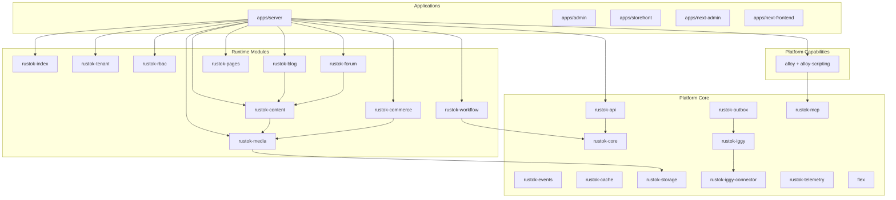

# Реестр модулей и приложений

Документ фиксирует актуальную карту компонентов RusToK и границы между:

- runtime-модулями, которые регистрируются в `ModuleRegistry`;
- platform/core crate'ами;
- module-agnostic capability-слоями, которые не являются tenant-toggle модулями.

## Верхнеуровневая схема

## Что считается runtime-модулем

Runtime-модуль в RusToK:

- реализует `RusToKModule`;
- регистрируется через `apps/server/src/modules/mod.rs`;
- может иметь `permissions()` и `dependencies()`;
- участвует в tenant module lifecycle, если это `ModuleKind::Optional`.

## Актуальный runtime registry

### Core-модули

| Slug | Crate | Статус | Назначение |
|---|---|---|---|
| `index` | `rustok-index` | `Core` | Индексация и поисковые контракты |
| `tenant` | `rustok-tenant` | `Core` | Tenant lifecycle и tenant metadata |
| `rbac` | `rustok-rbac` | `Core` | RBAC lifecycle и authorization contracts |

### Optional-модули

| Slug | Crate | Зависимости | Назначение |
|---|---|---|---|
| `content` | `rustok-content` | — | Базовый контентный домен |
| `commerce` | `rustok-commerce` | — | Commerce/catalog/inventory |
| `blog` | `rustok-blog` | `content` | Блог поверх content |
| `forum` | `rustok-forum` | `content` | Форум поверх content |
| `pages` | `rustok-pages` | — | Страницы, блоки и меню |
| `workflow` | `rustok-workflow` | — | Workflow automation, cron/webhook/manual triggers |

### Всегда-компонуемые core/platform crate'ы

| Crate | Роль |
|---|---|
| `rustok-core` | Базовые платформенные контракты и типы |
| `rustok-api` | Общий web/API слой для transport-адаптеров |
| `rustok-events` | Канонический import point для событийных контрактов |
| `rustok-outbox` | Transactional event delivery |
| `rustok-cache` | Cache/runtime infra |
| `rustok-storage` | Storage backend contracts |
| `rustok-iggy` + `rustok-iggy-connector` | Streaming transport |
| `rustok-telemetry` | Observability bootstrap |
| `rustok-mcp` | MCP adapter/server tool surface поверх официального MCP spec и Rust SDK `rmcp`, включая identity/policy foundation, session-start runtime binding hooks, pluggable scaffold draft store и первый Alloy product-slice `alloy_scaffold_module` с review/apply boundary; persisted clients/tokens/policies/audit, scaffold drafts + management API и DB-backed runtime bridge живут в `apps/server` |
| `flex` | Extracted attached-mode contracts |
| `rustok-media` | Core media runtime module, но по архитектурной роли также platform-level dependency для content/commerce |

## Alloy: правильная позиция в архитектуре

Alloy больше не трактуется как optional runtime-module.

Актуальная модель:

- `alloy-scripting` — runtime/engine capability crate;
- `alloy` — transport-shell для GraphQL/REST Alloy;
- Alloy не регистрируется в `ModuleRegistry`;
- Alloy не участвует в `tenant_modules.is_enabled("alloy")`;
- `workflow` может использовать Alloy только как capability для шага `alloy_script`, но не как runtime dependency;
- каноническая внешняя integration-surface для Alloy находится рядом с `rustok-mcp`;
- первый реальный созидательный Alloy-срез сейчас проходит через `rustok-mcp::alloy_scaffold_module` + `alloy_review_module_scaffold` + `alloy_apply_module_scaffold`, которые дают draft scaffold и явную review/apply boundary; при server-backed MCP runtime этот flow уже может работать поверх persisted draft store в `apps/server`, но всё ещё не подменяет полный codegen/publish pipeline;
- для protocol/security/authorization поведения `rustok-mcp` локальные документы должны ссылаться на официальный MCP/rmcp upstream, а не дублировать спецификацию.

## Компонентный каталог

### Приложения

| Путь | Назначение |
|---|---|
| `apps/server` | Composition root, HTTP/GraphQL entry point, runtime wiring |
| `apps/admin` | Основная Leptos admin-панель |
| `apps/storefront` | Основная Leptos storefront-витрина |
| `apps/next-admin` | Экспериментальный headless admin |
| `apps/next-frontend` | Экспериментальный headless storefront |

### Module-owned transport crates

| Crate | Что внутри |
|---|---|
| `rustok-content` | Content services + GraphQL/REST adapters |
| `rustok-commerce` | Commerce services + GraphQL/REST adapters |
| `rustok-blog` | Blog services + GraphQL/REST adapters |
| `rustok-forum` | Forum services + GraphQL/REST adapters |
| `rustok-pages` | Pages services + GraphQL/REST adapters |
| `rustok-workflow` | Workflow services + GraphQL/REST adapters + webhook ingress |
| `rustok-media` | Media services + GraphQL/REST adapters |
| `alloy` | Alloy management/API transport shell поверх `alloy-scripting` |

## Правило сопровождения

При любом изменении состава runtime-модулей, capability-слоёв или крупных crate-зависимостей:

1. Обновить этот реестр.
2. Обновить [docs/index.md](../index.md).
3. Обновить локальные README/docs в затронутых crate'ах.

