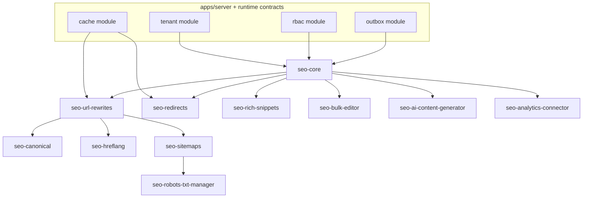
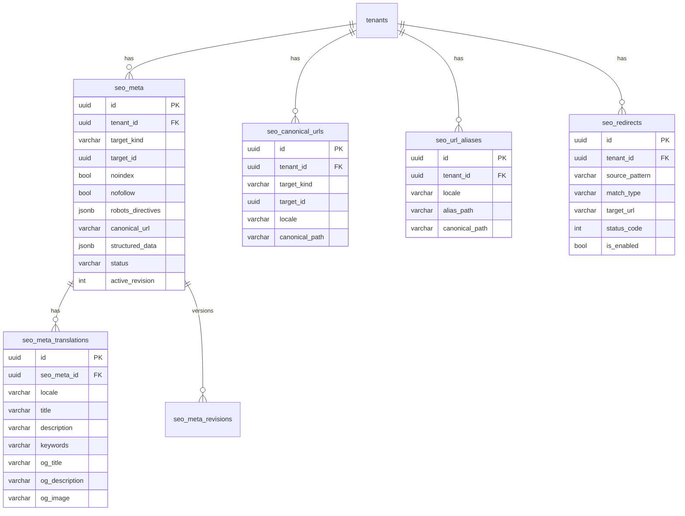

# SEO Suite для RusToK: анализ текущей архитектуры и детальный план реализации

## Executive summary

RusToK — событийная модульная платформа на Rust с multitenant-рантаймом, manifest-driven composition (`modules.toml`), гибридным API (GraphQL для UI + REST для интеграций/ops) и Postgres как основной БД. fileciteturn7file0L1-L1 fileciteturn26file0L1-L1 fileciteturn28file0L1-L1  
В репозитории уже присутствуют отдельные элементы SEO-слоя: polymorphic SEO-метаданные (`meta`, `meta_translations`) с `noindex/nofollow`, `canonical_url` и `structured_data` (JSONB), а также URL-mapping для контента (`content_canonical_urls`, `content_url_aliases`) с locale-aware резолвингом и fallback. fileciteturn9file0L1-L1 fileciteturn22file0L1-L1 fileciteturn20file0L1-L1  

Ключевое ограничение/риски сейчас: мультиязычный DB-контракт RusTok целится в BCP47-like locale теги и ширину `VARCHAR(32)` для locale-колонок (и runtime locale-chain уже стандартизирован), но часть SEO-связанных таблиц всё ещё использует узкие колонки (`VARCHAR(5)`/`VARCHAR(16)`). Это нужно выровнять до `VARCHAR(32)` при проектировании SEO Suite, иначе hreflang/локали/фоллбеки будут ломаться на «длинных» тегах (`en-US`, `pt-BR`, `zh-Hant`, и т.д.) и на tenant-level locale policy. fileciteturn13file0L1-L1 fileciteturn11file0L1-L1 fileciteturn14file0L1-L1 fileciteturn9file0L1-L1 fileciteturn22file0L1-L1  

Рекомендуемый целевой дизайн: **модульный SEO Suite** как набор optional-модулей (в терминах RusTok: optional modules с tenant enablement через `tenant_modules`) с ядром, которое стандартизирует хранение SEO-параметров и API, и подключаемыми подмодулями (redirects / sitemaps / hreflang / rich snippets / bulk editor / AI). Tenant-уровневое включение/настройки уже поддержаны платформой таблицей `tenant_modules (enabled, settings jsonb)` и guard’ом `RequireModule`. fileciteturn48file0L1-L1 fileciteturn49file0L1-L1  

По best practices SEO Suite (Amasty / аналоги) критичны: шаблоны мета-тегов, управление каноникалами, редиректы (с производительной реализацией и кэшированием для больших наборов), XML/HTML sitemap, hreflang (в HTML head и/или sitemap), rich snippets/JSON-LD, page SEO analysis/toolbar и AI-генерация/«исправление» метаданных. citeturn0search0turn0search1turn2search0turn3search0turn3search1turn3search5  
В RusTok уже есть мощный AI control-plane (`rustok-ai`) с multi-provider поддержкой (OpenAI-compatible/Anthropic/Gemini), RBAC-first доступом, task profiles и UI пакетами (Leptos + Next.js). Это позволяет сделать AI-часть SEO Suite «нативной» для платформы, а не отдельным самописным контуром. fileciteturn36file0L1-L1 fileciteturn38file0L1-L1  

## Контекст RusTok: архитектура, БД и мультиязычность, важные для SEO Suite

### Архитектура и модульность

RusTok позиционируется как **modular monolith** с composition root в `apps/server`, сборкой через `modules.toml`, per-tenant enablement optional modules и событийным разделением write/read путей (outbox + индекс/поиск). fileciteturn7file0L1-L1  
`modules.toml` описывает core и optional модули, их crate’ы и зависимости. Сейчас SEO-модуля как отдельного optional module нет. fileciteturn26file0L1-L1  

Tenant enablement реализован через таблицу `tenant_modules` (уникальность по `tenant_id + module_slug`, настройки в JSONB), а доступ к certain endpoints может проверяться guard’ом `RequireModule<M>`. fileciteturn48file0L1-L1 fileciteturn49file0L1-L1  

### API surfaces, которые нужны SEO Suite

Платформа использует гибридный transport layer: `/api/graphql` (+ subscriptions через `/api/graphql/ws`) как UI-facing контракт и `/api/v1/...` как REST для интеграций/ops; также есть OpenAPI endpoints. fileciteturn28file0L1-L1  
Для Leptos UI действует «dual-path»: native `#[server]` functions как preferred internal data layer и параллельно GraphQL как обязательный контракт для Next.js/headless/fallback. Это важно для UX SEO Suite: админские экраны могут быть Leptos-native-first, но API должно жить в GraphQL/REST параллельно. fileciteturn29file0L1-L1  

### База данных и существующие SEO-артефакты

Платформа ведёт «summary» карту таблиц и подчёркивает инварианты: `tenant_id` — главный изоляционный boundary; write-side — source of truth; JSONB допустим для settings/config, но не как каноничная форма локализованного бизнес-текста. fileciteturn16file0L1-L1  

Уже есть **polymorphic мета-хранилище**:  
- `meta`: `tenant_id`, `(target_type, target_id)`, `noindex`, `nofollow`, `canonical_url`, `structured_data` (jsonb) и уникальный индекс по `(target_type, target_id)`.  
- `meta_translations`: связь с `meta`, `locale`, `title/description/keywords`, OpenGraph поля, уникальный индекс `(meta_id, locale)`. fileciteturn9file0L1-L1  

Есть **URL mapping для content-family**:  
- `content_canonical_urls` (canonical URL на `(target_kind, target_id, locale)`) + уникальные индексы на target+locale и на canonical URL.  
- `content_url_aliases` (alias → canonical) + индексы. fileciteturn22file0L1-L1  
Сервис `CanonicalUrlService` сначала ищет alias по `alias_url`, и если найден — требует редирект; иначе резолвит canonical, используя locale normalization и locale fallback. fileciteturn20file0L1-L1  

В доменных translation-таблицах уже есть частичные SEO-поля:  
- `product_translations`: `meta_title`, `meta_description` + `handle`. fileciteturn43file0L1-L1  
- `page_translations`: `meta_title`, `meta_description` + `slug`. fileciteturn45file0L1-L1  

### Мультиязычный контракт: что SEO Suite обязан соблюдать

RusTok стандартизировал runtime locale selection chain и делает `RequestContext` источником истины по effective locale (query → `x-medusa-locale` → cookie → `Accept-Language` → `tenant.default_locale` → `en`), плюс ограничение effective locale через `tenant_locales`, и `Content-Language` на locale-aware HTTP responses. fileciteturn11file0L1-L1  

По DB storage контракту цель — **parallel localized records**: базовые строки хранят language-agnostic состояние, короткие локализованные тексты — в `*_translations`, «тяжёлый» контент — в `*_bodies`; locale-колонки должны поддерживать normalized BCP47-like теги и ширину `VARCHAR(32)`. fileciteturn13file0L1-L1 fileciteturn16file0L1-L1  
Часть foundation-таблиц уже мигрирована с `VARCHAR(5)` на `VARCHAR(32)` (например `tenants.default_locale`, `tenant_locales.locale/fallback_locale`). fileciteturn14file0L1-L1  

Следствие для SEO Suite: **locale в SEO-таблицах должен быть `VARCHAR(32)`**, а fallback должен быть согласован с tenant locale policy и тем, как `CanonicalUrlService`/resolve_by_locale работают сегодня. fileciteturn20file0L1-L1 fileciteturn13file0L1-L1  

## Best practices SEO Suite: Amasty и аналоги + официальные требования поисковиков

### Что реально входит в «SEO Suite» по рынку

По публичным материалам Amasty SEO Toolkit (Magento 2) и близких решений основные блоки повторяются:

- **Meta templates / автоматизация метаданных** (массовая генерация title/description/keywords, шаблоны с переменными, применение к новым товарам/страницам). citeturn0search1turn3search0turn3search1  
- **URL rewrites** (генерация SEO-friendly URL, регенерация/перестроение). citeturn0search0turn3search1  
- **Redirects** (ручные/авто, wildcards, 301/302/307; критична производительность на большом числе редиректов; у Amasty отдельно упоминается кэширование редиректов, чтобы не деградировала производительность на большом объёме записей). citeturn0search0turn3search1turn3search5  
- **Canonical management** (в т.ч. пер-page overrides; cross-domain canonical; исключения для некоторых страниц, пагинация). citeturn1search1turn3search5turn3search0turn0search0  
- **XML/HTML Sitemaps** (генерация, разделение по типам сущностей, исключения, ускорение генерации). citeturn0search0turn1search3turn3search0turn3search1  
- **Hreflang** (вставка в `<head>` и/или в sitemap; управление store-views/локалями). citeturn0search0turn0search5turn0search2turn1search8turn3search0turn3search5  
- **Rich snippets / structured data** (JSON-LD схемы для продукта/категорий/организации, breadcrumbs, sitelinks search box, и т.д.). citeturn0search3turn2search2turn2search6turn3search0turn3search1  
- **SEO toolbar / page audit** (анализ текущей страницы: canonical, robots meta, H1, длины мета, alt, internal links; у ряда решений есть AI-fix). citeturn0search0turn2search0turn3search1  
- **AI генерация и «исправление» мета-контента** (например, Amasty описывает flow «Fix issues with AI» для category/product/CMS через SEO Toolbar). citeturn2search0turn0search0  

### Базовые правила поисковиков, которые нужно встроить в дизайн

- **Canonicalization**: Google считает редиректы и `rel="canonical"` сильными сигналами; sitemap — слабее. Важно не давать противоречивых canonical сигналов разными методами и держать canonical консистентным, особенно внутри hreflang-кластеров. citeturn1search1  
- **Hreflang**: Google принимает три равнозначных способа (HTML / HTTP headers / sitemap) и рекомендует выбрать наиболее удобный; каждая версия страницы должна ссылаться на себя и все альтернативы. citeturn0search2  
  Похожая рекомендация есть и в материалах entity["company","Yandex","search engine company"] для разметки локализованных страниц (link rel="alternate" hreflang, включая `x-default` в соответствующих сценариях). citeturn1search8  
- **Sitemaps**: лимит 50 000 URL или 50MB (uncompressed) на один sitemap; при большем объёме нужен разбиение на несколько файлов и sitemap index; URL должны быть абсолютными и файл — UTF‑8. citeturn1search3  
- **robots.txt**: файл должен лежать в корне, быть UTF‑8, поддерживается `user-agent/allow/disallow/sitemap`; Google кэширует robots.txt и есть лимит размера. citeturn1search0turn1search2turn1search4  
- **Structured Data**: entity["company","Google","search company"] рекомендует JSON‑LD как наиболее удобный для масштабной поддержки; важнее «меньше, но корректно» (required поля), чем «всё и с ошибками». Есть общие политики/quality guidelines, нарушения которых могут лишить eligibility для rich results, даже если синтаксис валиден. citeturn2search2turn2search6  

## Целевая архитектура SEO Suite для RusTok

### Основной принцип интеграции в RusTok

С учётом того, что:
- модули включаются per-tenant через `tenant_modules`; fileciteturn48file0L1-L1  
- безопасность и tenant/locale/RBAC контракт должны быть едиными для всех API-path; fileciteturn28file0L1-L1  
- Leptos UI требует native-first, но GraphQL обязателен параллельно; fileciteturn29file0L1-L1  

SEO Suite рациональнее строить как:
- **Один «SEO Core» optional module** (storage + сервисы + базовый API + audit/versioning),  
- плюс **набор optional submodules** (redirects/canonical+rewrites/hreflang/sitemaps/rich snippets/bulk editor/AI/robots/analytics), которые:
  - читают/пишут в свои таблицы;
  - publish’ят доменные события через outbox для асинхронных задач (перегенерация sitemap, прогрев кэшей, reindex hints), не превращая `sys_events` в «общий аудит» (это прямо запрещено философией платформы). fileciteturn16file0L1-L1 fileciteturn32file0L1-L1  

### Предлагаемый состав модулей и зависимости

Таблица ниже — целевой список модулей (ровно из требуемого списка пользователя), с самым важным функционалом и зависимостями:

| Модуль | Основной функционал | Зависимости (минимум) | Замечания по производительности/безопасности |
|---|---|---|---|
| `seo-core` | единая модель SEO-данных; meta overrides; SEO templates; versioning/rollback; валидаторы | `tenant`, `rbac` (+ желательно `content` для locale normalization/helpers) fileciteturn46file0L1-L1 | locale=VARCHAR(32); строгий RBAC; индексация на `(tenant, target_kind, target_id)` |
| `seo-url-rewrites` | canonical URL per entity+locale; alias/rewrites; API для резолвинга | `seo-core` (+ интеграции с routing/storefront) | нужен быстрый lookup по `incoming_path` и кэш для hot paths |
| `seo-redirects` | правила 301/302/307; wildcards; 404-handling стратегия; импорт/экспорт | `seo-core` | обязательно предусмотреть кэширование редиректов на больших наборах (рынок явно упирается в это). citeturn0search0 |
| `seo-canonical` | политика canonical (включая исключения, пагинацию, cross-domain) | `seo-url-rewrites` | canonical должен быть консистентен с hreflang. citeturn1search1 |
| `seo-hreflang` | генерация hreflang-кластеров и вставка в HTML head и/или sitemap | `seo-url-rewrites`, `tenant` | требование «каждая версия ссылается на все версии + на себя». citeturn0search2turn1search8 |
| `seo-sitemaps` | XML sitemap + sitemapindex; HTML sitemap; exclude rules; фоновые задания | `seo-url-rewrites` (+ доменные адаптеры) | лимиты 50k/50MB, UTF‑8, абсолютные URL. citeturn1search3 |
| `seo-rich-snippets` | JSON‑LD генерация и overrides (Product, Organization, Breadcrumb, SearchBox, ItemList, …) | `seo-core` (+ доменные адаптеры) | JSON‑LD рекомендуется как основной формат. citeturn2search2turn2search6 |
| `seo-bulk-editor` | grid/bulk edit по сущностям; шаблоны/применение; CSV/JSON import/export | `seo-core` | осторожно с массовыми апдейтами: батчи + фоновые job’ы |
| `seo-ai-content-generator` | генерация title/meta/description/JSON‑LD; keyword hints; AI-fix по issues | `seo-core` + `rustok-ai` capability fileciteturn36file0L1-L1 | RBAC-first; approvals; логирование/редакция данных |
| `seo-analytics-connector` | интеграции с внешними системами (Search Console / Webmaster / rank tracking); импорт отчётов | `seo-core` | хранить токены/секреты в encrypted secret storage (не в plain JSONB) |
| `seo-robots-txt-manager` | robots.txt, sitemap references, host-specific rules; (опционально `llms.txt`) | `seo-sitemaps` | файл в корне, UTF‑8, поддерживаемые директивы. citeturn1search2turn1search4 |

### Архитектурная диаграмма модулей



## Хранение SEO-параметров: варианты и рекомендуемая схема БД

### Сравнение стратегий хранения SEO-параметров

| Вариант | Как выглядит | Плюсы | Минусы | Где уместно в RusTok |
|---|---|---|---|---|
| Единая SEO-таблица с polymorphic связями | `seo_meta(tenant_id, target_kind, target_id, …)` + `seo_meta_translations(locale, …)` | единая модель; единые индексы; удобно делать bulk operations и audit/versioning; не раздувает доменные таблицы | требует адаптеров для доменных сущностей; нужно продумать целевой target_kind taxonomy | Лучший кандидат, т.к. похожий паттерн уже есть (`meta`/`meta_translations`). fileciteturn9file0L1-L1 |
| SEO-таблицы per-entity | `product_seo`, `category_seo`, `page_seo`… | простая маппинг-логика; меньше polymorphic условностей | взрыв числа таблиц и API; сложнее общий bulk editor; сложнее единый audit | Не рекомендую для RusTok при цели «SEO Suite» (слишком много модулей/таблиц). |
| SEO поля внутри доменных translation таблиц | `product_translations.meta_title`… | минимум новых таблиц | разнобой полей между сущностями; трудно добавлять новые атрибуты (og/twitter/robots/schema); сложно версионировать и откатывать централизованно | Сейчас частично так и сделано для продуктов/страниц. fileciteturn43file0L1-L1 fileciteturn45file0L1-L1 Следует рассматривать как legacy/fallback слой. |
| Переводы в отдельных таблицах | `*_translations(locale VARCHAR(32), …)` | соответствует целевому контракту RusTok (parallel localized records) | требует миграций legacy вариантов | Это целевой стандарт платформы. fileciteturn13file0L1-L1 |
| JSONB для локализованных переводов | `seo_meta.localized_jsonb` | гибко на раннем этапе | противоречит целевому i18n storage контракту; хуже индексация/поиск; сложнее валидировать полноту | RusTok явно стремится уйти от «inline localized JSON» и закрепляет migration-based cleanup. fileciteturn10file0L1-L1 |

### Рекомендация: «расширить и стандартизировать существующий polymorphic слой» как SEO Core

Рациональнее всего **не вводить новый параллельный механизм**, а превратить уже существующие `meta`/`meta_translations` в «SEO Core storage», добавив:
- выравнивание `locale` до `VARCHAR(32)` (в соответствии с ADR по multilingual DB storage); fileciteturn13file0L1-L1  
- дополнительные поля для robots directives (как расширяемая структура, а не только `noindex/nofollow`), соц.мета (twitter cards), а также versioning/rollback;  
- понятное `target_kind` (заменить/расширить `target_type` до `VARCHAR(64)`), чтобы вместить все сущности: `product`, `category`, `page`, `filter_page`, `cms`, `blog_post`, и т.д.  
Сейчас `meta_translations.locale` создаётся как `string_len(5)`, что конфликтует с целевым контрактом. fileciteturn9file0L1-L1  

То же относится к URL mapping: `content_canonical_urls.locale` и `content_url_aliases.locale` сейчас `string_len(16)`; в целевом варианте следует поднять до `VARCHAR(32)` и обобщить таблицы на все SEO targets (не только content). fileciteturn22file0L1-L1 fileciteturn13file0L1-L1  

### Рекомендуемая схема таблиц (DDL примеры)

Ниже — **целевой DDL**. Если вы хотите минимизировать риск миграций, можно начать с «новых таблиц с префиксом `seo_`», затем сделать phase‑2 миграцию/консолидацию; но архитектурно лучше иметь один каноничный слой.

```sql
-- SEO Core: polymorphic meta storage (write-side)
CREATE TABLE seo_meta (
  id                UUID PRIMARY KEY,
  tenant_id          UUID NOT NULL REFERENCES tenants(id) ON DELETE CASCADE,

  target_kind        VARCHAR(64) NOT NULL,     -- product|category|page|filter_page|cms|...
  target_id          UUID NOT NULL,

  noindex            BOOLEAN NOT NULL DEFAULT FALSE,
  nofollow           BOOLEAN NOT NULL DEFAULT FALSE,

  robots_directives  JSONB   NOT NULL DEFAULT '{}'::jsonb,  -- noarchive,nosnippet,max-snippet...
  canonical_url      VARCHAR(512),                           -- absolute or tenant-relative policy
  structured_data    JSONB,                                  -- JSON-LD overrides (or fragments)

  status             VARCHAR(16) NOT NULL DEFAULT 'published', -- draft|published|archived
  active_revision    INT NOT NULL DEFAULT 1,

  created_by         UUID,
  updated_by         UUID,
  created_at         TIMESTAMPTZ NOT NULL DEFAULT now(),
  updated_at         TIMESTAMPTZ NOT NULL DEFAULT now()
);

CREATE UNIQUE INDEX ux_seo_meta_target
  ON seo_meta (tenant_id, target_kind, target_id);

CREATE INDEX ix_seo_meta_tenant_kind
  ON seo_meta (tenant_id, target_kind);

-- Localized meta fields
CREATE TABLE seo_meta_translations (
  id                UUID PRIMARY KEY,
  seo_meta_id        UUID NOT NULL REFERENCES seo_meta(id) ON DELETE CASCADE,

  locale            VARCHAR(32) NOT NULL,  -- BCP47-like normalized
  title             VARCHAR(255),
  description       VARCHAR(500),
  keywords          VARCHAR(255),

  og_title          VARCHAR(255),
  og_description    VARCHAR(500),
  og_image          VARCHAR(512),
  twitter_card      VARCHAR(32),
  twitter_title     VARCHAR(255),
  twitter_description VARCHAR(500),
  twitter_image     VARCHAR(512),

  created_at        TIMESTAMPTZ NOT NULL DEFAULT now(),
  updated_at        TIMESTAMPTZ NOT NULL DEFAULT now()
);

CREATE UNIQUE INDEX ux_seo_meta_translations
  ON seo_meta_translations (seo_meta_id, locale);

CREATE INDEX ix_seo_meta_translations_locale
  ON seo_meta_translations (locale);

-- URL rewrites/canonicals: canonical per target+locale, and aliases for redirects
CREATE TABLE seo_canonical_urls (
  id           UUID PRIMARY KEY,
  tenant_id     UUID NOT NULL REFERENCES tenants(id) ON DELETE CASCADE,

  target_kind   VARCHAR(64) NOT NULL,
  target_id     UUID NOT NULL,
  locale        VARCHAR(32) NOT NULL,

  canonical_path VARCHAR(512) NOT NULL, -- "/catalog/..." normalized relative path
  created_at     TIMESTAMPTZ NOT NULL DEFAULT now(),
  updated_at     TIMESTAMPTZ NOT NULL DEFAULT now()
);

CREATE UNIQUE INDEX ux_seo_canonical_target
  ON seo_canonical_urls (tenant_id, target_kind, target_id, locale);

CREATE UNIQUE INDEX ux_seo_canonical_path
  ON seo_canonical_urls (tenant_id, locale, canonical_path);

CREATE TABLE seo_url_aliases (
  id           UUID PRIMARY KEY,
  tenant_id     UUID NOT NULL REFERENCES tenants(id) ON DELETE CASCADE,

  target_kind   VARCHAR(64) NOT NULL,
  target_id     UUID NOT NULL,
  locale        VARCHAR(32) NOT NULL,

  alias_path     VARCHAR(512) NOT NULL,
  canonical_path VARCHAR(512) NOT NULL,

  created_at     TIMESTAMPTZ NOT NULL DEFAULT now(),
  updated_at     TIMESTAMPTZ NOT NULL DEFAULT now()
);

CREATE UNIQUE INDEX ux_seo_alias_path
  ON seo_url_aliases (tenant_id, locale, alias_path);

CREATE INDEX ix_seo_alias_target
  ON seo_url_aliases (tenant_id, target_kind, target_id, locale);

-- Redirect rules (manual + wildcard)
CREATE TABLE seo_redirects (
  id           UUID PRIMARY KEY,
  tenant_id     UUID NOT NULL REFERENCES tenants(id) ON DELETE CASCADE,

  source_pattern VARCHAR(512) NOT NULL, -- exact or wildcard
  match_type     VARCHAR(16) NOT NULL DEFAULT 'exact', -- exact|wildcard
  target_url     VARCHAR(1024) NOT NULL, -- absolute or relative target
  status_code    INT NOT NULL DEFAULT 301, -- 301|302|307
  is_enabled     BOOLEAN NOT NULL DEFAULT TRUE,

  expires_at     TIMESTAMPTZ,
  created_by     UUID,
  created_at     TIMESTAMPTZ NOT NULL DEFAULT now(),
  updated_at     TIMESTAMPTZ NOT NULL DEFAULT now()
);

CREATE INDEX ix_seo_redirects_lookup
  ON seo_redirects (tenant_id, is_enabled, match_type, source_pattern);

-- Versioning / rollback (snapshot-based)
CREATE TABLE seo_meta_revisions (
  id           UUID PRIMARY KEY,
  tenant_id     UUID NOT NULL REFERENCES tenants(id) ON DELETE CASCADE,
  seo_meta_id   UUID NOT NULL REFERENCES seo_meta(id) ON DELETE CASCADE,

  revision      INT NOT NULL,
  payload       JSONB NOT NULL,            -- snapshot of seo_meta + translations
  created_by    UUID,
  created_at    TIMESTAMPTZ NOT NULL DEFAULT now(),
  comment       TEXT
);

CREATE UNIQUE INDEX ux_seo_meta_revisions
  ON seo_meta_revisions (seo_meta_id, revision);
```

Почему snapshot в `seo_meta_revisions.payload` — приемлемый компромисс: он не нарушает правило «не хранить локализованный бизнес‑текст канонично в JSONB», потому что это **не source-of-truth**, а **аудит/версионирование** (append-only), тогда как canonical write-side остаётся в `seo_meta_translations`. Сам RusTok уже использует JSONB интенсивно для control-plane/профилей (например, в `tenant_modules.settings` и AI control-plane таблицах). fileciteturn48file0L1-L1 fileciteturn38file0L1-L1 fileciteturn16file0L1-L1  

### ER-диаграмма (упрощённо)



## Управление, UX и API: централизованный, распределённый и гибридный варианты

### Варианты UI-архитектуры

**Централизованный модуль/панель SEO**  
Подходит для: bulk editor, redirects, sitemap generation, sitewide rules, audits, AI content generation. Аналогичный pattern есть у рынка — отдельные SEO панели с audit/toolbar и централизованными настройками. citeturn0search0turn3search1turn3search0  

**Распределённый интерфейс per-entity/per-module**  
Подходит для: «SEO вкладка» в редакторе товара/категории/страницы (быстро поправить title/description/canonical/hreflang-политику). Это снижает трение контент-менеджера: он правит SEO там же, где правит контент.

**Гибрид (рекомендовано)**  
Центральный SEO Hub + встроенные SEO tabs в доменных редакторах. Технически в RusTok это ложится на manifest-wired admin UI и module-owned UI packages: `/modules` уже показывает сложные lifecycle flows, значит центральный SEO Hub также можно сделать как module-owned UI, но при этом оставить легковесные entrypoints в доменных модулях (линк в Hub с context). fileciteturn27file0L1-L1  

### UX поток для контент-менеджера (гибрид)

Сценарий «товар/страница»:

1) Контент-менеджер открывает сущность (товар/страницу) и видит **SEO статус** (OK/Warn/Fail) и ключевые поля (title/description/canonical/robots).  
2) В «SEO вкладке» он может:
- отредактировать override мета-полей на конкретной локали;
- увидеть превью SERP сниппета и подсветку лимитов/качества;
- включить/отключить `noindex/nofollow`;
- создать canonical override или alias (когда меняется slug/handle);
- увидеть hreflang cluster preview и какие локали реально активны по tenant locale policy. fileciteturn11file0L1-L1  

Сценарий «всё сразу» (SEO Hub):

1) SEO Hub → Dashboard: ошибки (дубликаты title, missing description, 404 redirect candidates, sitemap coverage).  
2) Bulk editor: фильтр по сущностям/категориям/локалям; массовое применение template rule; CSV export/import.  
3) Redirects: список правил, hit counters, конфликт/loop detection, кэш-прогрев.  
4) Sitemaps: последняя генерация, очереди, разбиение на файлы, исключения, hreflang-in-sitemap switch. citeturn1search3turn0search5turn3search5  

### API: GraphQL + REST, минимальный контракт

С учётом API policy RusTok (GraphQL для UI, REST для интеграций/ops). fileciteturn28file0L1-L1  

**GraphQL (UI-facing):**
- `seoMeta(targetKind, targetId, locale)` → computed meta (template+override+fallback).  
- `updateSeoMeta(input)` → draft update.  
- `publishSeoMeta(targetKind,targetId)` / `rollbackSeoMeta(targetKind,targetId, revision)` → versioning.  
- `seoRedirects(filter)` / `upsertSeoRedirect` / `deleteSeoRedirect`  
- `seoSitemapStatus` / `generateSeoSitemaps` (returns job_id)  
- `seoHreflangCluster(targetKind,targetId, locale)`  

**REST (ops/integrations):**
- `GET /api/v1/seo/sitemap.xml` и `GET /api/v1/seo/sitemapindex.xml` (или per-tenant base path), плюс entity-split файлы.  
- `GET /api/v1/seo/robots.txt` (tenant/channel aware).  
- `POST /api/v1/seo/bulk/import` (CSV/JSON) и `GET /api/v1/seo/bulk/export`.  
- `POST /api/v1/seo/redirects/import` (массовый импорт).  

## AI в SEO Suite: варианты интеграции, workflow, промпты, качество и приватность

### Почему AI лучше строить поверх существующего `rustok-ai`

В RusTok уже есть `rustok-ai` как capability crate с:
- multi-provider абстракцией (`OpenAI-compatible`, `Anthropic`, `Gemini`),
- persisted control plane (provider profiles, task profiles, approvals, traces),
- RBAC-first модель доступа,
- админские UI пакеты (Leptos + Next.js),
- direct verticals, включая `product_copy` и `blog_draft`, которые умеют писать локализованные данные в доменные сервисы и учитывают tenant locale policy. fileciteturn36file0L1-L1  

Следовательно, SEO AI модуль должен быть **ещё одним vertical/task profile**, а не отдельной «самодельной интеграцией».

### On-premise vs cloud LLMs (на уровне платформы)

Так как `rustok-ai` уже поддерживает `OpenAI-compatible` provider, можно поддержать оба варианта:
- **Cloud LLMs** (через provider profiles): быстрый старт, выше качество моделей, но выше требования к комплаенсу и логам. fileciteturn36file0L1-L1  
- **On-prem/self-host**: тот же `OpenAI-compatible` интерфейс, но endpoint внутри вашей инфраструктуры (меньше рисков утечки каталога/контента), ценой поддержки и иногда качества.

### Workflow генерации и валидации (рекомендовано)

1) **Detection**: SEO Toolbar/validator фиксирует issue (missing meta, слишком длинный title, дубликаты, плохой canonical/hreflang). По рынку такой flow существует и прямо описан у Amasty: «Fix issues with AI» на product/category/CMS. citeturn2search0  
2) **Generate Draft**: AI создаёт предложения для конкретной локали (title/description/keywords/JSON-LD фрагмент), учитывая entity data.  
3) **Rule-based QC** (до человека):
- лимиты длины,
- наличие brand/основной сущности/модификаторов,
- запрет невалидных символов,
- отсутствие «keyword stuffing»,
- проверка на duplicates в пределах tenant+locale (через индекс/поиск или отдельный uniqueness check).  
4) **Human approval**: публикация по кнопке «Apply», с RBAC permission (подобно approval flow в `rustok-ai`). fileciteturn38file0L1-L1  
5) **Publish + Revision**: запись в `seo_meta_translations`, создание `seo_meta_revisions` snapshot, событие в outbox для downstream tasks (invalidate caches, enqueue sitemap regenerate). fileciteturn32file0L1-L1  

### Хранение версий AI-контента и логов

- AI output **не должен сразу перетирать published**: сначала draft/suggestion.  
- В `seo_meta_revisions.payload` хранить «что было применено» (snapshot) + comment типа `ai_generated` + ссылки на `ai_chat_run_id`/`task_profile_id` (если вы хотите трассировать источник).  
- Sensitive content: возможность **не логировать полный prompt**, либо хранить redacted prompt (хеш + шаблон + ссылки на entity_id без сырого описания), зависит от комплаенса; в `rustok-ai` уже существует persisted trace/approvals model, которую можно переиспользовать как источник «кто/когда/какой провайдер». fileciteturn36file0L1-L1  

### Шаблоны промптов: минимальные «каркасы»

Шаблон `seo_meta_generate` (title/description):
- System: стиль бренда, запреты (не врать, не добавлять несуществующие скидки), язык = locale, ограничения длины.  
- Input: JSON со структурой `{entity_kind, locale, title, description, category_path, price_range, availability, brand, target_keywords[], constraints{title_max,desc_max}}`  
- Output: строго JSON `{title, description, keywords?, og_title?, og_description?}`

Шаблон `seo_structured_data_generate` (JSON‑LD):
- System: «валидный JSON‑LD, соответствует schema.org типу, не противоречит видимому контенту» (в духе Google SD policies). citeturn2search6turn2search2  
- Output: JSON‑LD object/graph или patch.

## План внедрения: миграции данных, этапы релизов, тестирование и откат

### Что мигрируем и почему это реально

Текущая база уже содержит:
- polymorphic `meta`/`meta_translations` — хороший «скелет» SEO Core, но требует расширения и выравнивания locale. fileciteturn9file0L1-L1  
- `content_canonical_urls` + `content_url_aliases` и сервис резолвинга — готовая логика для URL rewrites, но её нужно распространить на остальные сущности (products/categories/filters) и тоже привести locale к `VARCHAR(32)`. fileciteturn22file0L1-L1 fileciteturn20file0L1-L1 fileciteturn13file0L1-L1  
- доменные meta поля (`product_translations.meta_*`, `page_translations.meta_*`) — их можно:
  - либо оставить как fallback источники (если SEO Core не включён),
  - либо сделать controlled migration (бэкфилл в `seo_meta_translations`, а затем постепенно депрекейтить поля в доменных таблицах). fileciteturn43file0L1-L1 fileciteturn45file0L1-L1  

### План релизов/миграций (с приоритетами и оценками)

| Этап | Что делаем | Данные/миграции | Трудозатраты | Риск | Откат |
|---|---|---|---|---|---|
| SEO Core baseline | стабилизировать `seo_meta`/`seo_meta_translations`: locale→`VARCHAR(32)`, добавить robots_directives, revisions; API чтения | миграция `meta_translations.locale VARCHAR(32)` + индексы; добавить revision tables | High | Medium | feature flag: чтение старого слоя, запись в новый как shadow |
| URL rewrites + canonical | обобщить canonical/alias на все сущности; единый resolver; интеграция в routing/storefront | миграция locale в URL tables до `VARCHAR(32)`; добавить `target_kind` taxonomy | High | High | оставить старые endpoints и делать dual-write; rollback через переключение resolver |
| Redirects | `seo_redirects` + быстрый lookup + кэширование (как в best practice) | новая таблица + background warmup | Medium | Medium | выключаем модуль per-tenant (`tenant_modules.enabled=false`) |
| Hreflang | генерация cluster из canonical mapping + tenant_locales; HTML head insertion + (опционально) sitemap | минимальные новые таблицы (только overrides); без heavy миграций | Medium | Medium | отключить модуль; fallback: без hreflang |
| Sitemaps | sitemapindex + split по типам сущностей + exclude; фоновые jobs; robots.txt интеграция | новые таблицы `seo_sitemap_jobs`, `seo_sitemap_files` (если нужно); либо хранить в storage backend | High | Medium | fallback: ручной sitemap или выключение module |
| Rich snippets | JSON‑LD генерация + overrides; минимум required fields | таблицы поддерживаются через `seo_meta.structured_data` или отдельный слой | Medium | Medium | выключение модуля, удаление injection |
| Bulk editor | grid + массовое применение templates; CSV import/export | без обязательных schema migrations, кроме job tracking | Medium | Low | отключение UI; API остаётся |
| AI генерация | task profile `seo_meta_fix`, `seo_meta_generate`, approvals + хранение ревизий | без новых DB в `rustok-ai`, только SEO revision linking | Medium | Medium | выключить AI профили, оставить ручной режим |

### Тестирование и производительность

Минимальный “definition of done” для SEO Suite на RusTok должен включать:

- **Correctness**:  
  - canonical consistency (не противоречить методам; 1 canonical на страницу); citeturn1search1  
  - hreflang completeness (self + all alternates); citeturn0search2turn1search8  
  - sitemap limits + absolute URLs + UTF‑8; citeturn1search3  
  - robots.txt semantics и размещение. citeturn1search2turn1search4  

- **Load/perf**:  
  - redirects lookup O(1)/O(logN) + кэш результатов, чтобы «не деградировать на большом объёме редиректов» — это рынок явно отмечает. citeturn0search0  
  - sitemap generation в фоне, постраничное чтение из БД, чанки по 50k URL, writes в storage без удержания всей карты в памяти. citeturn1search3  

- **Security**:  
  - все write API под RBAC, без bypass через UI-only calls; fileciteturn28file0L1-L1  
  - защита от open redirect (в redirects: whitelist relative/tenant-owned domains), защита от redirect loops, валидация `target_url`;  
  - audit trail через `seo_meta_revisions` + actor id; при AI — approvals. fileciteturn38file0L1-L1  

### План отката

В RusTok ключевой «мягкий откат» — это:
- отключение модуля per-tenant через `tenant_modules.enabled` (для SEO suite подмодулей это нужно поддержать последовательно); fileciteturn48file0L1-L1  
- feature flags на чтение/запись: dual-write (старый слой + новый слой) на период миграций;  
- `seo_meta_revisions` как быстрый «rollback to revision N» без необходимости ручных SQL откатов.

На уровне DB migrations: для locale widening (`VARCHAR(5)`→`VARCHAR(32)`) откат в узкую колонку возможен формально, но практический rollback должен быть через forward-migration (не пытаться срезать данные). Это соответствует общей практике безопасных миграций, а также тому, как в RusTok делались расширения locale колонок в foundation. fileciteturn14file0L1-L1