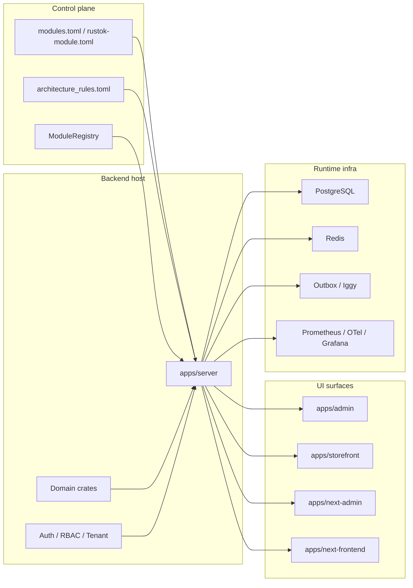
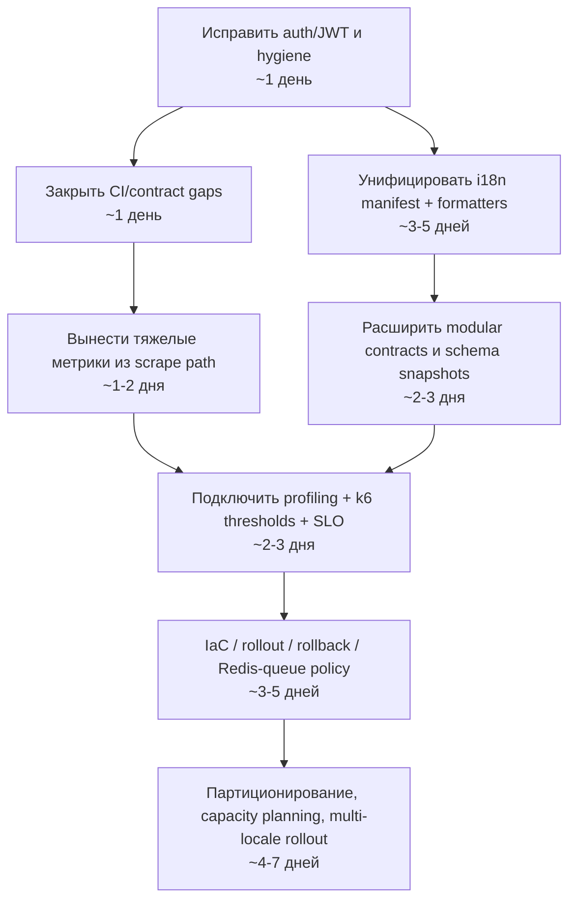

# Аудит RusTok и план доведения платформы до промышленного уровня

## Executive summary

Репозиторий выглядит как сильный фундамент для большой модульной платформы: это Rust-workspace с сервером, Leptos-поверхностями, отдельными доменными crate-модулями, manifest-driven валидацией модулей, правилами архитектурных зависимостей, встроенной телеметрией и довольно зрелой CI-цепочкой с `fmt`, `clippy`, `check`, `audit`, `deny`, `nextest`, `coverage` и сборкой фронтенда. В коде уже есть защита от dev-secret в release-сборке, `/metrics` endpoint и отдельный observability stack для Prometheus/Jaeger/Grafana. fileciteturn72file0L1-L1 fileciteturn88file0L1-L1 fileciteturn67file0L1-L1 fileciteturn69file0L1-L1 fileciteturn74file0L1-L1 fileciteturn76file0L1-L1

Но до “идеальной платформы” сейчас мешают несколько системных разрывов. Самый опасный — контур JWT/RS256: серверная сборка auth-конфига фактически зажимает систему в HS256, а encoder в `rustok-auth` использует `Header::default()`, который по документации `jsonwebtoken` по умолчанию выставляет `HS256`; это означает, что заявленная поддержка RS256 в текущем виде внутренне противоречива и может работать неверно или ломаться при включении асимметричных ключей. Второй блокер — i18n: backend уже умеет нормализованные locale tags и проверяет i18n bundle contracts, включая сложные локали вроде `zh-Hant` и `es-419`, а frontend-поверхности и build-скрипты по-прежнему жестко зашиты на `en`/`ru`. Третий блокер — качество поставки: CI строит только `apps/next-frontend`, но не `apps/next-admin`, и не запускает кастомные i18n/contract scripts из корневого `package.json`. Четвертый — `/metrics` строится частично через запросы к БД на каждый scrape, а один из SQL-вызовов вообще захардкожен под `DbBackend::Postgres`, хотя у приложения есть SQLite fallback. Наконец, в репозитории виден tracked build-artifact `.next`, несмотря на запрет в `.gitignore`, а корневой `Cargo.toml` содержит устаревший repository URL. fileciteturn15file0L1-L1 fileciteturn79file0L1-L1 fileciteturn80file0L1-L1 citeturn6search1turn6search2turn6search7 fileciteturn23file0L1-L1 fileciteturn32file0L1-L1 fileciteturn29file0L1-L1 fileciteturn86file0L1-L1 fileciteturn87file0L1-L1 fileciteturn74file0L1-L1 fileciteturn73file0L1-L1 fileciteturn67file0L1-L1 fileciteturn71file0L1-L1 fileciteturn6file1L1-L1 fileciteturn72file0L1-L1

Итоговая оценка: **фундамент сильный, но production-ready зрелость пока средняя**. Для one-region/controlled rollout проект уже близок к хорошему состоянию; для действительно многоязычной, изолированной и highload-готовой платформы нужны целевые исправления в auth, i18n, observability, CI и эксплуатационном контуре. fileciteturn65file0L1-L1 fileciteturn74file0L1-L1

## Что уже выглядит сильным

С архитектурной стороны у проекта правильный вектор: workspace разбит на сервер, UI-поверхности и доменные crate-модули; модульные контракты валидируются через `modules.toml` и `rustok-module.toml`; есть правила допустимых domain-edge зависимостей и запрет на прямой доступ backend-приложения к внутренним `entities/repositories/adapters`, кроме явно разрешенных путей. Это именно тот тип управляемой модульности, который обычно нужен для роста платформы без архитектурной деградации. fileciteturn72file0L1-L1 fileciteturn87file0L1-L1 fileciteturn88file0L1-L1

С точки зрения эксплуатационной дисциплины задел тоже хороший: в приложении есть runtime bootstrap, release-guardrails для секретов и sample credentials, health/metrics routes, registry-only host mode и набор contract-like тестов на серверные HTTP-контракты. В CI уже есть качественные базовые ворота: форматирование, clippy, audit, deny, unused deps, docs, nextest и coverage. fileciteturn65file0L1-L1 fileciteturn67file0L1-L1 fileciteturn74file0L1-L1

Набор observability-инструментов тоже не декоративный: есть собственный telemetry crate, Prometheus output, OpenTelemetry hooks и отдельный docker-compose для локального observability стека. Значит, проект уже мыслит категориями метрик, трассировки и runtime guardrails, а не только категориями “собралось/не собралось”. fileciteturn67file0L1-L1 fileciteturn69file0L1-L1 fileciteturn76file0L1-L1 citeturn7search7turn7search11

## Матрица критериев

| Критерий | Текущее состояние | Приоритет | Ключевое основание | Рекомендация | Оценка трудозатрат |
|---|---|---|---|---|---|
| Статический анализ кода | База хорошая, но есть несколько concrete defects | **Высокий** | RS256-путь противоречив между `apps/server/src/auth.rs` и `crates/rustok-auth/src/jwt.rs`; корневые npm scripts Windows-only; в репозитории есть tracked `.next` artifact; repository metadata устарела. fileciteturn15file0L1-L1 fileciteturn79file0L1-L1 fileciteturn73file0L1-L1 fileciteturn71file0L1-L1 fileciteturn6file1L1-L1 fileciteturn72file0L1-L1 | Починить JWT path, сделать scripts cross-platform, удалить build artifacts из VCS, нормализовать metadata | 1–2 дня |
| Архитектурный обзор | Модульность сильная | **Средний** | Есть `modules.toml`/`rustok-module.toml`, валидация UI/i18n wiring и `architecture_rules.toml`, но часть enforcement еще heuristic/script-based. fileciteturn87file0L1-L1 fileciteturn88file0L1-L1 fileciteturn37file0L1-L1 | Усилить архитектурные границы machine-checked контрактами и CI-gates | 2–4 дня |
| Международная поддержка | Backend сильнее frontend | **Высокий** | Frontend и build-слой зашиты на `en`/`ru`, при том что backend уже валидирует нормализованные locale tags и bundle directories. fileciteturn23file0L1-L1 fileciteturn32file0L1-L1 fileciteturn29file0L1-L1 fileciteturn86file0L1-L1 fileciteturn87file0L1-L1 | Вынести единый locale-manifest и общие formatters для дат/чисел/денег | 3–5 дней |
| Модульная изоляция и контрактное тестирование | Основа есть | **Средний** | Manifest validation очень подробная, но verify scripts не встроены в CI как обязательные проверки. fileciteturn87file0L1-L1 fileciteturn85file0L1-L1 fileciteturn74file0L1-L1 | Добавить schema snapshots, consumer-driven контракты и mandatory CI execution | 2–3 дня |
| Готовность к highload | Есть хорошие примитивы, но не весь контур | **Высокий** | Есть metrics/telemetry/guardrails, однако `/metrics` делает запросы к БД на scrape и часть логики завязана на runtime snapshots; явного контура шардирования/репликации в просмотренных артефактах не видно. fileciteturn67file0L1-L1 fileciteturn69file0L1-L1 fileciteturn76file0L1-L1 | Вынести тяжелые агрегаты из scrape path, сделать Redis/queue mandatory для hot paths, подготовить партиционирование/идемпотентность | 4–7 дней |
| Безопасность | Есть guardrails, но auth-контур требует исправления | **Высокий** | Release guard against dev secrets уже есть, но auth builder игнорирует RS256 config, а JWT encoder использует default header. fileciteturn65file0L1-L1 fileciteturn15file0L1-L1 fileciteturn80file0L1-L1 fileciteturn79file0L1-L1 | Починить алгоритм/ключи, вынести секреты в Vault/KMS, включить rotation и policy-based access | 1–2 дня |
| CI/CD и IaC | CI сильная, delivery-контур неполный | **Высокий** | `next-apps` в CI покрывает только `apps/next-frontend`; кастомные verify scripts не запускаются; явного аппликативного IaC/deploy-контура в просмотренных артефактах нет. fileciteturn74file0L1-L1 fileciteturn73file0L1-L1 fileciteturn29file0L1-L1 | Добавить `next-admin`, contract jobs, image build, Helm/Terraform и progressive delivery | 3–5 дней |
| Тестирование | Хорошо для unit/integration, слабо для perf/contract gates | **Средний** | Есть nextest, doc-tests, coverage и много server contract tests, но отсутствует обязательный load/perf gate. fileciteturn74file0L1-L1 fileciteturn65file0L1-L1 | Ввести perf budget и k6 threshold gate в CI/CD | 2–3 дня |
| Производительность | Есть наблюдаемость, но hotspot-ы уже видны | **Высокий** | `/metrics` считает backlog/retries/search snapshot по живой БД; SQL для outbox metric захардкожен под Postgres; HTTP metrics schema содержит label `path`, что требует контроля cardinality. fileciteturn67file0L1-L1 fileciteturn69file0L1-L1 citeturn7search8turn7search10 | Кешировать/агрегировать метрики фоном, использовать route templates вместо raw paths, ввести профилирование | 2–4 дня |
| Стандарты и лучшие практики | В целом неплохо, но есть дрейф | **Средний** | Namespace метрик неоднороден (`rustok_*`, `auth_*`, `outbox_*`), metadata drift в `Cargo.toml`, артефакты затесались в VCS. fileciteturn67file0L1-L1 fileciteturn72file0L1-L1 fileciteturn71file0L1-L1 fileciteturn6file1L1-L1 citeturn7search10 | Привести naming/SLO/logging conventions к единому стандарту | 1–2 дня |

## Детальные рекомендации

### Безопасность и статический анализ

**Текущее состояние.** В проекте уже есть зрелая защита от части “операционных” ошибок: release-build не стартует с известными dev-secrets и sample credentials. Это правильно. Но crypto/auth-слой сейчас содержит реальный high-priority дефект конфигурационной целостности. `AuthConfig` в `rustok-auth` поддерживает и `HS256`, и `RS256`, однако `auth_config_from_ctx` в сервере собирает конфиг через `AuthConfig::new(secret)` и применяет только expiration/issuer/audience, не прокидывая algorithm/RSA keys. Параллельно все `encode_*` функции в `jwt.rs` используют `Header::default()`, а `jsonwebtoken` явно документирует, что default header = `HS256`, и что `encode` подписывает токен согласно `alg` из header. То есть RS256 заявлен интерфейсом, но с большой вероятностью не проходит end-to-end корректно. fileciteturn65file0L1-L1 fileciteturn15file0L1-L1 fileciteturn80file0L1-L1 fileciteturn79file0L1-L1 citeturn6search1turn6search2turn6search7turn10search0

**Конкретные проблемы.**
- `apps/server/src/auth.rs`, функция `auth_config_from_ctx`: алгоритм и RSA-ключи теряются на app boundary. **Приоритет: высокий.**
- `crates/rustok-auth/src/jwt.rs`: `encode_access_token`, `encode_oauth_access_token`, `encode_password_reset_token`, `encode_email_verification_token` используют `Header::default()`. **Приоритет: высокий.**
- `package.json`: корневые скрипты используют `prettier.cmd`, то есть ведут себя как Windows-only и ломают ожидаемую кроссплатформенность dev tooling. **Приоритет: средний.**
- `.gitignore` запрещает `.next/`, но в репозитории виден `apps/next-frontend/.next/required-server-files.js`, что говорит о нарушении hygiene-процесса. **Приоритет: средний.** fileciteturn73file0L1-L1 fileciteturn71file0L1-L1 fileciteturn6file1L1-L1

**Рекомендация.** Исправление должно быть не “точечным”, а end-to-end: один источник истины для JWT algorithm/key material, один helper для header/key selection, обязательные tests на HS256 и RS256. Дополнительно секреты надо вынести в нормальный secret manager с rotation/audit policy — именно это рекомендует entity["organization","OWASP","security guidance"] для production-grade секретов. citeturn6search0

```rust
use jsonwebtoken::{Algorithm, Header};

fn jwt_header(config: &AuthConfig) -> Header {
    match config.algorithm {
        JwtAlgorithm::HS256 => Header::new(Algorithm::HS256),
        JwtAlgorithm::RS256 => Header::new(Algorithm::RS256),
    }
}

pub fn encode_access_token(
    config: &AuthConfig,
    user_id: Uuid,
    tenant_id: Uuid,
    role: UserRole,
    session_id: Uuid,
) -> Result<String> {
    let claims = /* ... */;
    encode(&jwt_header(config), &claims, &encoding_key(config)?)
        .map_err(|_| AuthError::TokenEncodingFailed)
}
```

На серверной границе логика должна выглядеть так: если в runtime settings указан `RS256`, приложение обязано получить private/public PEM из секретного хранилища и собрать `AuthConfig::with_rs256(...)`; если ключей нет — fail fast при boot, а не silent fallback на HS256.

### Архитектура, изоляция модулей и контрактное тестирование

**Текущее состояние.** Здесь у проекта, пожалуй, самый сильный фундамент. `modules.toml` и `rustok-module.toml` валидируют зависимости, конфликты, UI wiring, i18n bundle layout, supported locales, schema значений модульных настроек и даже surface classification. Плюс есть отдельные architecture rules для допустимых внутренних зависимостей. Это очень хорошая база для platform engineering. fileciteturn87file0L1-L1 fileciteturn88file0L1-L1

**Проблема.** Enforcement пока не везде machine-checked одинаково строго. Часть правил живет в shell/node scripts, а не в обязательных CI-gates. Это снижает надежность: архитектурная дисциплина зависит не только от кода, но и от того, не забыли ли вызвать конкретный script. fileciteturn37file0L1-L1 fileciteturn85file0L1-L1 fileciteturn74file0L1-L1

**Рекомендация.**
- Оставить текущую manifest-модель как основу.
- Добавить schema snapshot tests на все публичные REST/GraphQL contracts.
- Для cross-module интеграции ввести consumer-driven contracts либо snapshot-based compatibility tests.
- Все verify scripts сделать mandatory в CI.

Целевой контур модульности выглядит так:



Практичный шаблон contract test для Rust-части:

```rust
#[test]
fn registry_catalog_schema_does_not_drift() {
    let schema = schemars::schema_for!(RegistryCatalogResponse);
    insta::assert_json_snapshot!(schema);
}
```

Такой подход хорошо ложится на уже существующий стиль серверных contract-like tests в `apps/server/src/app.rs`, но делает drift видимым не только на уровне HTTP smoke, а и на уровне формальных схем. fileciteturn65file0L1-L1

### Многоязычность и локализация

**Текущее состояние.** На backend слой i18n в целом уже спроектирован правильно: `manifest.rs` валидирует `supported_locales`, `default_locale`, проверяет наличие locale bundles и принимает нормализованные locale tags. Но frontend-поверхности пока живут в более узком мире: `apps/next-frontend/src/i18n.ts`, `apps/next-admin/src/i18n/request.ts`, `apps/admin/build.rs` и `apps/storefront/build.rs` явно привязаны к `en` и `ru`. Это не просто “неполная локализация”; это архитектурный разрыв между control plane и delivery plane. fileciteturn87file0L1-L1 fileciteturn23file0L1-L1 fileciteturn32file0L1-L1 fileciteturn29file0L1-L1 fileciteturn86file0L1-L1

**Конкретные проблемы.**
- Локали зашиты в код и build-слой, а не генерируются из единого источника.
- Нет единого shared formatting layer для дат, чисел, валют и relative time.
- Следовательно, добавление 3-й/4-й локали сейчас требует ручных правок сразу в нескольких приложениях.

**Рекомендация.** Сделать `modules.toml`/generated manifest источником истины для supported locales и surface bindings. Для Next-поверхностей использовать locale-aware routing, localized pathnames и единый format layer; для JS-форматирования — стандартные `Intl.DateTimeFormat`/`Intl.NumberFormat`. Это соответствует best practices next-intl и стандартному Intl API. citeturn11search7turn11search11turn8search1

```ts
// generated/i18n-manifest.ts
export const supportedLocales = ['en', 'ru', 'de', 'es-419'] as const;
export const defaultLocale = 'en';

// apps/next-frontend/src/i18n.ts
import {getRequestConfig} from 'next-intl/server';
import {supportedLocales, defaultLocale} from './generated/i18n-manifest';

export default getRequestConfig(async ({locale}) => {
  const resolved =
    supportedLocales.includes(locale as any) ? (locale as typeof supportedLocales[number]) : defaultLocale;

  return {
    locale: resolved,
    messages: (await import(`../messages/${resolved}.json`)).default
  };
});

export const formatCurrency = (locale: string, currency: string, value: number) =>
  new Intl.NumberFormat(locale, {style: 'currency', currency}).format(value);

export const formatDate = (locale: string, value: Date) =>
  new Intl.DateTimeFormat(locale, {dateStyle: 'medium', timeStyle: 'short'}).format(value);
```

Критически важно, чтобы locale routing, translation resources и formatting policy генерировались из одного контракта. Иначе backend “умеет больше”, чем реально могут отрисовать UI-поверхности.

### Highload, производительность, логирование и метрики

**Текущее состояние.** У проекта уже есть нужные кубики: telemetry crate, `/metrics`, runtime guardrails, rate-limit related hooks, observability compose, outbox/search/rbac/auth metrics. Это отличный знак. Но часть реализации сегодня опасна именно для highload-эксплуатации. В `metrics.rs` несколько значений вычисляются по живой БД на каждый scrape, включая backlog/failures/retries и search snapshot; кроме того, для `render_outbox_metrics` используется `Statement::from_string(DbBackend::Postgres, ...)`, хотя приложение умеет fallback на SQLite. На небольшой системе это переживаемо; на highload и частом scrape Prometheus это превращается в постоянный фоновой шум по БД и риск ложной деградации самого observability path. fileciteturn67file0L1-L1 fileciteturn65file0L1-L1 citeturn7search8turn7search10

**Дополнительный риск.** Схема HTTP metrics в telemetry crate содержит label `path`; если туда попадут raw paths с id/slug, легко словить metric cardinality explosion. Prometheus прямо рекомендует осторожность с label cardinality и единым metric namespace. Сейчас часть метрик имеет префикс `rustok_*`, а часть — просто `auth_*` или `outbox_*`, что делает картину неоднородной. fileciteturn69file0L1-L1 fileciteturn67file0L1-L1 citeturn7search8turn7search10

**Рекомендация.**
- Убрать тяжелые SQL-агрегаты из scrape path; обновлять их в фоне и отдавать как gauge.
- Везде использовать backend-aware SQL.
- В HTTP metrics писать route template (`/v1/catalog/:slug`), а не raw path.
- Стандартизовать namespace: `rustok_*` для всего приложения.
- Формально зафиксировать SLI/SLO: `p95` для catalog/auth/search, error rate, backlog limits.
- Для event/outbox hot paths — обязательные idempotency keys, retries with backoff и отдельный DLQ policy.

Минимальное исправление для backend-aware SQL и namespace уже дает быструю пользу:

```rust
async fn render_outbox_metrics(ctx: &AppContext) -> String {
    let backlog_size = /* ... */;
    let dlq_total = /* ... */;

    let backend = ctx.db.get_database_backend();
    let retries_total = ctx
        .db
        .query_one(Statement::from_string(
            backend,
            "SELECT COALESCE(SUM(retry_count), 0) AS total FROM sys_events".to_string(),
        ))
        .await
        .ok()
        .flatten()
        .and_then(|row| row.try_get::<i64>("", "total").ok())
        .unwrap_or(0);

    format!(
        "rustok_outbox_backlog_size {backlog_size}\n\
         rustok_outbox_dlq_total {dlq_total}\n\
         rustok_outbox_retries_total {retries_total}\n"
    )
}
```

С точки зрения observability-стека в будущем лучше опираться на единый vendor-neutral контур трейсинга/метрик через OpenTelemetry, а Prometheus оставить системой сбора/алертов для application/runtime metrics. Именно так и рекомендуют официальные OTel docs. citeturn7search7turn7search11

### CI/CD, тесты и инфраструктура

**Текущее состояние.** CI у проекта уже лучше среднего по open-source-репозиториям на Rust: есть compile/test/audit/deny/coverage/doc gates. Но если смотреть глазами platform team, то delivery-контур пока не симметричен: в матрице Next.js строится только `apps/next-frontend`; `apps/next-admin` присутствует в дереве и имеет свои i18n/config артефакты, но в обязательные CI проверки не входит. Аналогично корневые verify scripts (`verify:i18n:contract`, `verify:i18n:ui`, `verify:flex:contract`) есть, но в workflow не вызваны. Это означает, что часть самых полезных контрактных проверок сейчас — “добровольная”. fileciteturn74file0L1-L1 fileciteturn73file0L1-L1 fileciteturn29file0L1-L1 fileciteturn85file0L1-L1

**Рекомендация.**
- Добавить `apps/next-admin` в matrix.
- Сделать contract scripts mandatory.
- Ввести отдельный job для perf smoke и k6 thresholds.
- Добавить build OCI image и deployment manifests/IaC.
- Для release pipeline — progressive rollout + rollback hooks.

Пример минимального усиления workflow:

```yaml
jobs:
  next-apps:
    name: Next.js (${{ matrix.app }})
    runs-on: ubuntu-latest
    strategy:
      fail-fast: false
      matrix:
        app:
          - apps/next-frontend
          - apps/next-admin
    steps:
      - uses: actions/checkout@v4
      - uses: actions/setup-node@v4
        with:
          node-version: 20
      - name: Install dependencies
        working-directory: ${{ matrix.app }}
        run: npm install
      - name: Lint
        working-directory: ${{ matrix.app }}
        run: npm run lint
      - name: Typecheck
        working-directory: ${{ matrix.app }}
        run: npm run typecheck
      - name: Build
        working-directory: ${{ matrix.app }}
        run: npm run build

  contracts:
    runs-on: ubuntu-latest
    steps:
      - uses: actions/checkout@v4
      - uses: actions/setup-node@v4
        with:
          node-version: 20
      - run: npm install
      - run: node scripts/verify/verify-i18n-contract.mjs
      - run: node scripts/verify/verify-ui-i18n-parity.mjs
      - run: node scripts/verify/verify-flex-multilingual-contract.mjs
```

Для нагрузочного контура лучше использовать k6 thresholds как автоматические pass/fail критерии SLO, а не просто “ручные прогоны по желанию”; это соответствует официальной документации k6. citeturn9search0

Ниже — рекомендуемый базовый набор команд для ежедневной инженерной дисциплины:

```bash
# Rust: стиль и статический анализ
cargo fmt --all -- --check
cargo clippy --workspace --all-targets --all-features -- -D warnings -W clippy::pedantic -W clippy::nursery
cargo deny check --all-features
cargo audit
cargo udeps --workspace --all-targets --all-features

# Rust: тесты и покрытие
cargo nextest run --workspace --all-targets --all-features
cargo test --workspace --doc --all-features
cargo llvm-cov --workspace --all-features --lcov --output-path lcov.info

# Контрактные проверки
node scripts/verify/verify-architecture.sh
node scripts/verify/verify-i18n-contract.mjs
node scripts/verify/verify-ui-i18n-parity.mjs
node scripts/verify/verify-flex-multilingual-contract.mjs

# Next.js поверхности
npm -C apps/next-frontend install
npm -C apps/next-frontend run lint
npm -C apps/next-frontend run typecheck
npm -C apps/next-frontend run build

npm -C apps/next-admin install
npm -C apps/next-admin run lint
npm -C apps/next-admin run typecheck
npm -C apps/next-admin run build
```

Минимальный k6 smoke/load сценарий для автоматизации:

```javascript
import http from 'k6/http';

export const options = {
  scenarios: {
    catalog_read: {
      executor: 'constant-vus',
      vus: 100,
      duration: '5m'
    }
  },
  thresholds: {
    http_req_failed: ['rate<0.01'],
    http_req_duration: ['p(95)<200', 'p(99)<400']
  }
};

export default function () {
  http.get(`${__ENV.BASE_URL}/v1/catalog?limit=20`);
  http.get(`${__ENV.BASE_URL}/health/ready`);
}
```

## План улучшений

Ниже — практический план, в котором задачи выстроены по зависимостям, а не по “красоте списка”.

| Этап | Задача | Зависит от | Трудозатраты | Ожидаемый эффект |
|---|---|---|---|---|
| Немедленно | Починить JWT path: server config propagation + правильный `Header::new(Algorithm::...)` + tests на HS256/RS256 | — | 6–10 часов | Устраняет самый опасный security/config drift |
| Немедленно | Убрать tracked `.next`, починить root scripts, обновить repository metadata | — | 3–6 часов | Улучшает build hygiene и кроссплатформенность |
| Сразу после | Добавить в CI `apps/next-admin` и обязательный запуск verify scripts | Немедленно | 6–8 часов | Снижает риск скрытого дрейфа UI/i18n контрактов |
| Сразу после | Вынести единый generated locale-manifest и shared formatters | CI contract gates | 2–4 дня | Делает многоязычность расширяемой без ручного рассыпания правок |
| Далее | Перевести `/metrics` на backend-aware SQL и фоновые агрегаты; унифицировать metric namespace | Немедленно | 1–2 дня | Уменьшает нагрузку на БД и делает observability production-safe |
| Далее | Ввести schema snapshots и consumer-driven contract tests для публичных API/GraphQL/module contracts | CI contract gates | 2–3 дня | Усиливает модульную изоляцию и безопасные refactor-ы |
| Затем | Сделать perf pipeline: profiling + k6 threshold job + базовые SLO | Метрики и CI | 2–3 дня | Появляется измеряемая highload readiness |
| Затем | Formalize runtime infra: Redis mandatory for hot paths, outbox/idempotency policy, rollout/rollback scripts, IaC | Метрики и perf pipeline | 3–5 дней | Платформа становится реально эксплуатационной |
| После | Подготовить multi-locale rollout, domain/prefix routing, локализованные pathnames и SEO surface | Generated locale-manifest | 3–5 дней | Появляется настоящая международная платформа |
| После | Подготовить highload milestones: партиционирование крупных таблиц, read-models, очереди, capacity planning | Perf pipeline | 4–7 дней | Готовность к росту трафика без архитектурного долга |

Логика миграции в сжатом виде:



Если нужно выбрать **только три первых действия**, они такие:
1. **JWT/RS256 fix**.
2. **CI-gates for next-admin + contract scripts**.
3. **Единый locale-manifest с отказом от hardcoded `en`/`ru`**.

Именно эти три шага дадут максимальный эффект на единицу времени: безопасность, предсказуемость поставки и реальную многоязычность.

## Источники и ограничения

Основой анализа были файлы репозитория через коннектор entity["company","GitHub","code hosting platform"]: `Cargo.toml`, `apps/server/src/app.rs`, `apps/server/src/auth.rs`, `apps/server/src/controllers/metrics.rs`, `apps/server/src/modules/manifest.rs`, `crates/rustok-auth/src/config.rs`, `crates/rustok-auth/src/jwt.rs`, `crates/rustok-telemetry/src/lib.rs`, `.github/workflows/ci.yml`, `package.json`, `.gitignore`, `docker-compose.observability.yml`, фронтендовые i18n/build файлы. fileciteturn72file0L1-L1 fileciteturn65file0L1-L1 fileciteturn15file0L1-L1 fileciteturn67file0L1-L1 fileciteturn87file0L1-L1 fileciteturn80file0L1-L1 fileciteturn79file0L1-L1 fileciteturn69file0L1-L1 fileciteturn74file0L1-L1 fileciteturn73file0L1-L1 fileciteturn71file0L1-L1 fileciteturn76file0L1-L1

Для рекомендаций по best practices использованы первичные и официальные источники: docs.rs по `jsonwebtoken`, IETF RFC 7519, next-intl, Prometheus instrumentation/naming docs, OpenTelemetry docs, OWASP Secrets Management и Grafana k6 thresholds. citeturn6search1turn6search2turn10search0turn11search7turn8search1turn7search8turn7search10turn7search7turn6search0turn9search0

Ограничения анализа кратко такие. Полноценная компиляция, профилирование и интеграционный запуск окружения в рамках доступа через коннектор не выполнялись, поэтому выводы по runtime/perf основаны на коде, конфигурации и CI-артефактах, а не на измерениях под нагрузкой. Кроме того, GitHub-коннектор в нескольких ответах возвращал содержимое файла как единый блок `L1-L1`; поэтому для части находок указаны **точные файлы и функции/секции**, а не псевдоточные номера строк. На качество выводов по главным рискам это не влияет: ключевые defects и архитектурные разрывы подтверждаются непосредственно просмотренными файлами и официальной документацией.