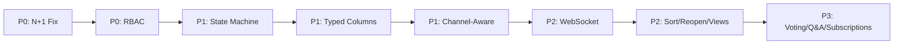

# Улучшения модуля Forum (`rustok-forum`)

Анализ текущего состояния модуля и предложения по улучшению, сгруппированные по приоритету.

---

## Текущее состояние

| Аспект | Статус | Комментарий |
|--------|--------|-------------|
| Domain services | ✅ Phase 2 done | `CategoryService`, `TopicService`, `ReplyService`, `ModerationService` |
| GraphQL | ✅ Admin + Storefront | Полный read/write surface с author profiles |
| REST | ✅ Controllers | CRUD для categories, topics, replies |
| Events | ✅ Outbox | 5 forum-specific `DomainEvent` вариантов |
| i18n | ✅ Locale fallback | `requested → en → first available` |
| Rich-text | ✅ `rt_json_v1` | Валидация + sanitize на сервере |
| Admin UI | ✅ Leptos package | NodeBB-inspired moderation workspace |
| Storefront UI | ✅ Leptos package | Public discussion feed |
| **RBAC** | ❌ **Не enforce** | Permissions объявлены, но не проверяются в сервисах |
| **Собственные миграции** | ❌ **Нет** | Всё хранится в `metadata` JSONB — нет typed columns |
| **Search / Index** | ❌ **Нет** | Нет интеграции с `rustok-search` / `rustok-index` |
| **Real-time** | ❌ **Нет** | Нет WebSocket-уведомлений о новых reply/модерации |
| **Channel-aware** | ❌ **Нет** | В отличие от `blog` и `pages`, forum не channel-aware |

---

## 1 · N+1 запросы в `ReplyService::list_for_topic` (Performance — P0)

### Проблема

В [reply.rs:271-279](file:///c:/%D0%BF%D1%80%D0%BE%D0%B5%D0%BA%D1%82%D1%8B/RusTok/crates/rustok-forum/src/services/reply.rs#L271-L279) после получения списка reply-нод выполняется **последовательный `get_node` для каждого reply**:

```rust
let mut full_nodes = Vec::with_capacity(node_ids.len());
for id in node_ids {
    match self.nodes.get_node(tenant_id, id).await {
        Ok(node) => full_nodes.push(node),
        Err(_) => continue,
    }
}
```

Аналогичная проблема в [list_response_for_topic_with_locale_fallback](file:///c:/%D0%BF%D1%80%D0%BE%D0%B5%D0%BA%D1%82%D1%8B/RusTok/crates/rustok-forum/src/services/reply.rs#L349-L354).

### Предложение

- Добавить в `NodeService` batch-метод `get_nodes_batch(tenant_id, ids: &[Uuid])`, который выполняет один SQL-запрос с `WHERE id IN (...)`.
- Перевести оба `list_*` метода на batch load вместо sequential N+1.
- Ожидаемый результат: **сокращение SQL-вызовов с O(N) до O(1)** на каждую страницу листинга.

> [!WARNING]
> Это самая критичная проблема производительности — на форуме с 50 ответами на странице это 50 лишних SQL-запросов.

**Приоритет:** P0 · **Усилие:** ~2-3 часа

---

## 2 · RBAC enforcement в сервисном слое (Security — P0)

### Проблема

В [lib.rs](file:///c:/%D0%BF%D1%80%D0%BE%D0%B5%D0%BA%D1%82%D1%8B/RusTok/crates/rustok-forum/src/lib.rs#L46-L69) модуль объявляет 17 permissions, но **ни один сервис не проверяет их**:

- `TopicService::create` не проверяет `FORUM_TOPICS_CREATE`
- `ModerationService::pin_topic` не проверяет `FORUM_TOPICS_MODERATE`
- `CategoryService::delete` не проверяет `FORUM_CATEGORIES_DELETE`

GraphQL-слой проверяет только `LIST` / `READ` через `require_forum_permission`, но:
- мутации проверяют минимально
- REST-контроллеры вообще не проверяют
- сервисный слой полностью «доверяет» вызывающему коду

### Предложение

Добавить проверку permissions в сервисный слой (**defense in depth**):

```rust
impl TopicService {
    pub async fn create(
        &self,
        tenant_id: Uuid,
        security: SecurityContext,
        input: CreateTopicInput,
    ) -> ForumResult<TopicResponse> {
        security.require_permission(Permission::FORUM_TOPICS_CREATE)
            .map_err(|_| ForumError::PermissionDenied("forum_topics:create"))?;
        // ... existing logic
    }
}
```

Для этого нужно:
1. Добавить `ForumError::PermissionDenied(String)` в [error.rs](file:///c:/%D0%BF%D1%80%D0%BE%D0%B5%D0%BA%D1%82%D1%8B/RusTok/crates/rustok-forum/src/error.rs)
2. Добавить проверки во все мутирующие методы всех 4 сервисов
3. Покрыть тестами сценарий «вызов без нужного permission → `PermissionDenied`»

> [!CAUTION]
> Без RBAC enforcement в сервисном слое любой код с доступом к `TopicService` может обходить все ограничения.

Блог-модуль уже имеет это в implementation plan как Phase 3 TODO — форум должен следовать тому же паттерну.

**Приоритет:** P0 · **Усилие:** ~3-4 часа

---

## 3 · Type-safe state machine (Quality — P1)

### Проблема

Статусы тем и ответов хранятся и обрабатываются как **строки**:

```rust
pub mod topic_status {
    pub const OPEN: &str = "open";
    pub const CLOSED: &str = "closed";
    pub const ARCHIVED: &str = "archived";
}
```

Нет проверок допустимости переходов. Например:
- `close_topic` в [moderation.rs:130-145](file:///c:/%D0%BF%D1%80%D0%BE%D0%B5%D0%BA%D1%82%D1%8B/RusTok/crates/rustok-forum/src/services/moderation.rs#L130-L145) жёстко указывает `old_status = OPEN`, но реально не проверяет, что тема действительно в статусе `OPEN`.
- Нет перехода `CLOSED → OPEN` (reopen topic)
- Нет перехода `ARCHIVED → OPEN`

### Предложение

Следуя примеру `rustok-blog` (у которого есть [type-safe state machine](file:///c:/%D0%BF%D1%80%D0%BE%D0%B5%D0%BA%D1%82%D1%8B/RusTok/crates/rustok-blog/docs/implementation-plan.md#L113)):

1. Создать `src/state_machine.rs` с enum-based state machine:

```rust
pub enum TopicState { Open, Closed, Archived }

impl TopicState {
    pub fn can_transition_to(&self, target: &TopicState) -> bool {
        matches!(
            (self, target),
            (Open, Closed) | (Open, Archived) |
            (Closed, Open) | (Closed, Archived) |
            (Archived, Open)
        )
    }
}
```

2. Добавить `ForumError::InvalidStateTransition { from, to }` 
3. Валидировать переходы в `ModerationService` перед мутацией
4. Добавить property-based тесты (как в `rustok-blog/src/state_machine_proptest.rs`)

**Приоритет:** P1 · **Усилие:** ~3-4 часа

---

## 4 · Собственные миграции и typed columns (Data integrity — P1)

### Проблема

Все forum-специфичные данные (`is_pinned`, `is_locked`, `forum_status`, `reply_count`, `tags`) хранятся в JSONB `metadata` поле content-нод. Это означает:

- Нет SQL-индексов по `is_pinned`, `forum_status` → медленная фильтрация
- Нет FK-ограничений → невозможно гарантировать ссылочную целостность
- `reply_count` не атомарен → race condition при параллельном создании ответов
- Нет `forum_read_tracking` → невозможно показать "непрочитанные темы"

### Предложение

Реализовать [Phase 3 из implementation-plan](file:///c:/%D0%BF%D1%80%D0%BE%D0%B5%D0%BA%D1%82%D1%8B/RusTok/crates/rustok-forum/docs/implementation-plan.md#L66-L82):

| Таблица | Назначение |
|---------|------------|
| `forum_category_stats` | Денормализованные счётчики (topic_count, reply_count, last_post_at) |
| `forum_topic_votes` / `forum_reply_votes` | Голосование |
| `forum_solutions` | Q&A: пометка «решение» |
| `forum_subscriptions` | Подписки на категории/темы |
| `forum_user_stats` | Статистика по пользователю |
| `forum_moderation_log` | Аудит модерации |
| `forum_read_tracking` | Состояние прочтения per user/topic |
| `forum_tags` / `forum_tag_translations` / `forum_topic_tags` | Локализуемые теги |

Минимальный первый шаг:
1. **Миграция typed columns** — перенести `is_pinned`, `is_locked`, `forum_status`, `reply_count` из `metadata` в typed колонки
2. **Атомарный `reply_count`** — `UPDATE forum_topics SET reply_count = reply_count + 1` вместо read-modify-write через metadata

**Приоритет:** P1 · **Усилие:** ~6-8 часов (typed columns + atomic counter), полный набор таблиц ~3-4 дня

---

## 5 · Channel-aware publishing (Feature parity — P1)

### Проблема

Модули `pages` и `blog` уже являются channel-aware:
- Public read-path учитывает `channel_module_bindings` для runtime gating
- Metadata-based `channelSlugs` allowlist позволяет публиковать контент в определённые каналы

Forum **не имеет** этой интеграции, что означает:
- Нельзя показывать разные форумные категории на разных сайтах/каналах
- Нет возможности ограничить видимость форума конкретным каналом

### Предложение

Сделать forum третьим proof-point для `rustok-channel`:

1. - [x] **Channel-Aware Validation Hooks**: Update storefront read queries to respect channel mappings (e.g., filtering `forums` dynamically using `is_topic_visible_for_channel`, similar to `rustok-blog`).
2. Добавить `channelSlugs` в metadata категорий для publication-level filtering
3. Обновить `rustok-module.toml` для корректного channel binding

Паттерн уже отработан на двух модулях — нужно просто применить его.

**Приоритет:** P1 · **Усилие:** ~3-4 часа

---

## 6 · Real-time уведомления (UX — P2)

### Проблема

Форум — типичный real-time use case:
- Новый ответ в теме → мгновенное уведомление другим участникам
- Действие модератора → обновление UI без перезагрузки
- Изменение статуса темы (locked/closed) → немедленное отражение

Сейчас всё обновляется только через полную перезагрузку / polling.

### Предложение

Интегрировать WebSocket-канал для форумных событий, используя существующую инфраструктуру [WebSocket channels](file:///c:/%D0%BF%D1%80%D0%BE%D0%B5%D0%BA%D1%82%D1%8B/RusTok/docs/architecture/channels.md):

1. Создать `ForumEventHub` по аналогии с `BuildEventHub`
2. Wire-format для событий:
   ```json
   { "type": "new_reply", "topic_id": "...", "reply_id": "...", "author": {...} }
   { "type": "topic_pinned", "topic_id": "...", "is_pinned": true }
   { "type": "reply_moderated", "reply_id": "...", "new_status": "hidden" }
   ```
3. Publish в hub из `ModerationService` и `ReplyService` (параллельно с outbox)
4. Добавить `/ws/forum/{topic_id}` endpoint для подписки на обновления конкретной темы

**Приоритет:** P2 · **Усилие:** ~4-6 часов

---

## 7 · Дополнительные улучшения (P2-P3)

### 7.1 · Сортировка тем

Сейчас `ListTopicsFilter` не имеет поля `sort_by`. Нужно добавить:
- `latest` (по `created_at` DESC) — default
- `most_replies` (по `reply_count` DESC)
- `recently_active` (по `last_reply_at` DESC)

### 7.2 · Reopen topic

Нет метода `reopen_topic` в `ModerationService` — закрытую тему невозможно открыть обратно.

### 7.3 · Просмотр кол-во просмотров

Добавить `view_count` через atomic increment (Redis или SQL counter), аналогично planned view counter в blog.

### 7.4 · Search integration

Интеграция с `rustok-search` / `rustok-index`:
- Индексация тем и ответов при создании/обновлении
- Full-text поиск по содержимому форума
- Forum events уже имеют `affects_index() = true` — нужен consumer

### 7.5 · Голосование и Q&A

- `forum_topic_votes` / `forum_reply_votes` — upvote/downvote 
- `forum_solutions` — пометить ответ как «решение» (для Q&A категорий)

### 7.6 · Подписки и уведомления

- `forum_subscriptions` — подписка на категорию/тему
- Интеграция с email/push notifications через event-driven pipeline

### 7.7 · Moderation log

Создать `forum_moderation_log` для аудита:
- Кто, когда, какое действие выполнил
- Полезно для compliance и разрешения споров

### 7.8 · Улучшение тестового покрытия

- Integration tests (сейчас `#[ignore]` — требуют DB)
- Property-based тесты для state machine
- Contract surface tests для GraphQL schema stability

---

## Сводная таблица приоритетов

| # | Улучшение | Приоритет | Усилие | Категория |
|---|-----------|-----------|--------|-----------|
| 1 | N+1 fix в ReplyService | **P0** | 2-3ч | Performance |
| 2 | RBAC enforcement в сервисах | **P0** | 3-4ч | Security |
| 3 | Type-safe state machine | **P1** | 3-4ч | Quality |
| 4 | Typed columns + atomic counters | **P1** | 6-8ч | Data integrity |
| 5 | Channel-aware publishing | **P1** | 3-4ч | Feature parity |
| 6 | Real-time WebSocket | **P2** | 4-6ч | UX |
| 7.1 | Сортировка тем | **P2** | 1-2ч | UX |
| 7.2 | Reopen topic | **P2** | 1ч | Feature |
| 7.3 | View counter | **P2** | 2-3ч | Feature |
| 7.4 | Search integration | **P2** | 4-6ч | Feature |
| 7.5 | Voting + Q&A | **P3** | 4-6ч | Feature |
| 7.6 | Подписки + notifications | **P3** | 6-8ч | Feature |
| 7.7 | Moderation log | **P3** | 2-3ч | Compliance |
| 7.8 | Тесты | **P1** | 3-4ч | Quality |

---

## Рекомендуемый порядок реализации



Хотите, чтобы я начал реализацию какого-то из этих улучшений?
